

    

 

[![][github-contributors-shield]][github-contributors-link]
[![][github-forks-shield]][github-forks-link]
[![][github-stars-shield]][github-stars-link]
[![][github-issues-shield]][github-issues-link]
[![][github-license-shield]][github-license-link]

[Changelog](./CHANGELOG.md) · [Report Bug][github-issues-link] · [Request Feature][github-issues-link]

[github-release-shield]: https://img.shields.io/github/v/release/chinware/AtomUI?color=369eff&labelColor=black&logo=github&style=flat-square
[github-release-link]: https://github.com/chinware/AtomUI/releases
[github-releasedate-shield]: https://img.shields.io/github/release-date/chinware/AtomUI?color=black&labelColor=black&style=flat-square
[github-releasedate-link]: https://github.com/chinware/AtomUI/releases
[github-contributors-shield]: https://img.shields.io/github/contributors/chinware/AtomUI?color=c4f042&labelColor=black&style=flat-square
[github-contributors-link]: https://github.com/chinware/AtomUI/graphs/contributors
[github-forks-shield]: https://img.shields.io/github/forks/chinware/AtomUI?color=8ae8ff&labelColor=black&style=flat-square
[github-forks-link]: https://github.com/chinware/AtomUI/network/members
[github-stars-shield]: https://img.shields.io/github/stars/chinware/AtomUI?color=ffcb47&labelColor=black&style=flat-square
[github-stars-link]: https://github.com/chinware/AtomUI/network/stargazers
[github-issues-shield]: https://img.shields.io/github/issues/chinware/AtomUI?color=ff80eb&labelColor=black&style=flat-square
[github-issues-link]: https://github.com/chinware/AtomUI/issues
[github-license-shield]: https://img.shields.io/github/license/chinware/AtomUI?color=white&labelColor=black&style=flat-square
[github-license-link]: https://github.com/chinware/AtomUI/blob/master/LICENSE

Documentation Language: [English](README.md) | [简体中文](README.zh-CN.md)

#### Introduce

AtomUI is an implementation of Ant Design based on .NET technology, dedicated to bringing the excellent and efficient design language and experience of Ant Design to the Avalonia/.NET cross-platform desktop software development field.

Welcome to communicate and give suggestions to AtomUI, thank you for giving the project a Star.

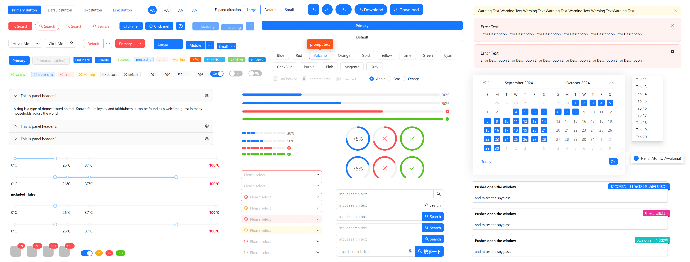

#### Features

- Enterprise-class UI designed from Ant Design system for cross platform desktop applications.
- A set of high-quality Avalonia Controls out of the box.
- Use .NET development to achieve one-stop writing, seamless compilation on mainstream operating system platforms and render a consistent UI experience.
- Based on Avalonia's powerful style system, Ant Design's theme customization capabilities are fully implemented.

#### Some screenshots of the running effect

<table border="0">
    <tbody>
        <tr>
            <td align="center" valign="middle" style="padding: 2px">
                 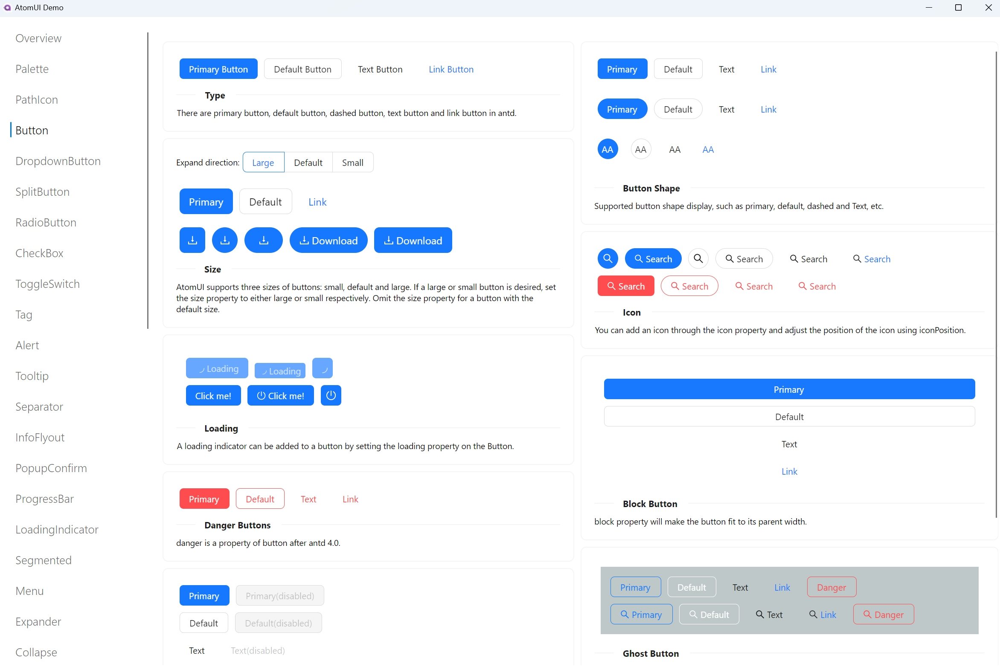
            </td>
            <td align="center" valign="middle" style="padding: 2px">
                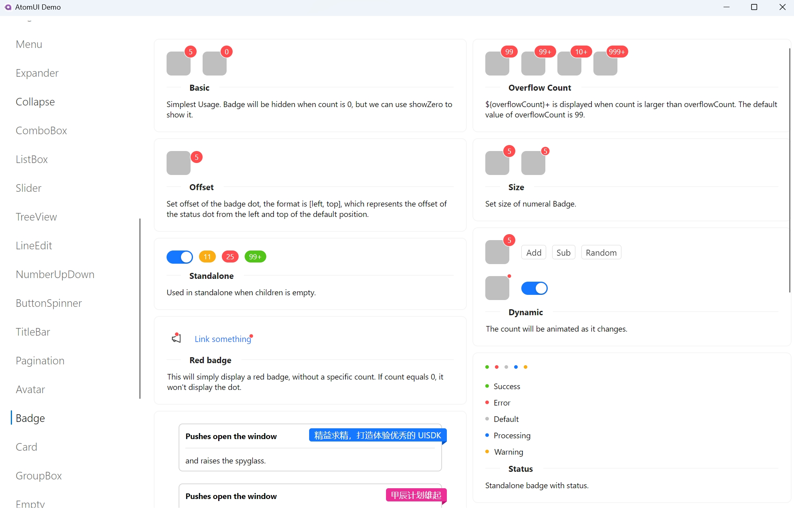
            </td>
        </tr>
        <tr>
            <td align="center" valign="middle" style="padding: 2px">
                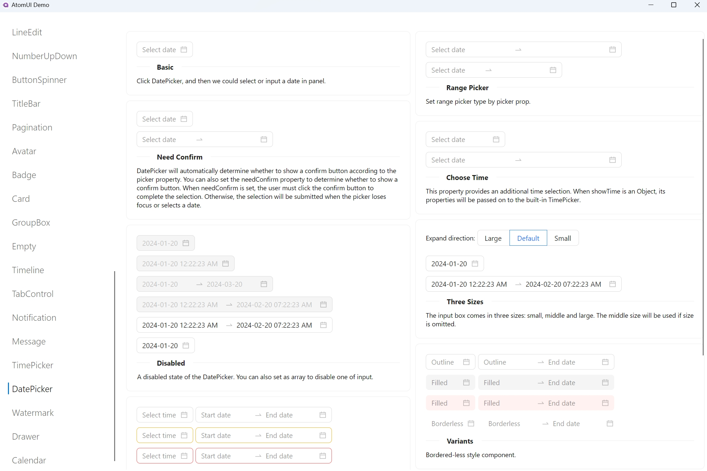
            </td>
            <td align="center" valign="middle" style="padding: 2px">
                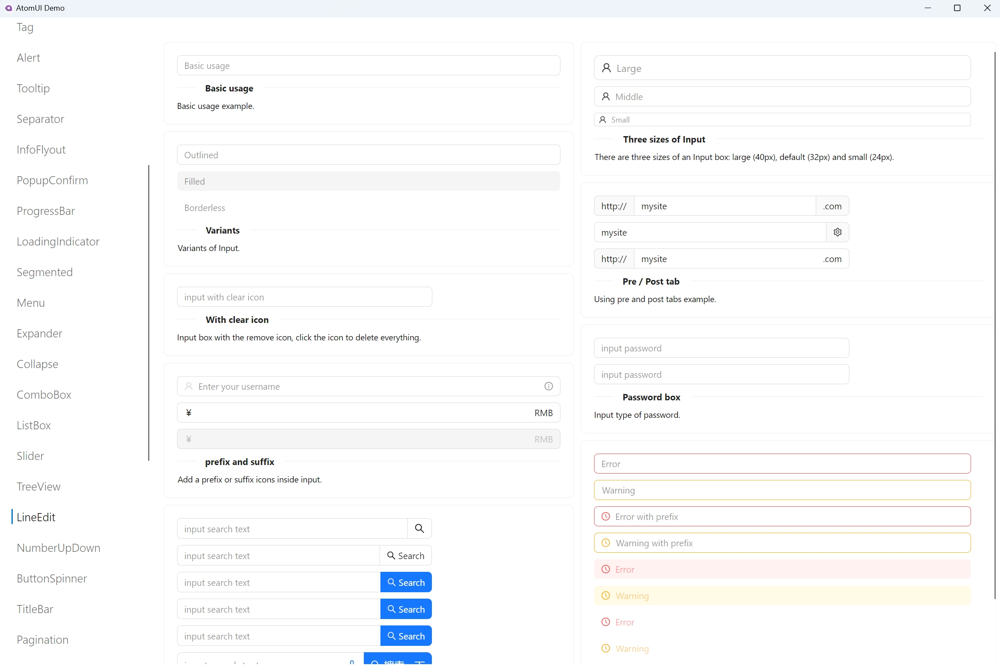
            </td>
        </tr>
        <tr>
            <td align="center" valign="middle" style="padding: 2px">
                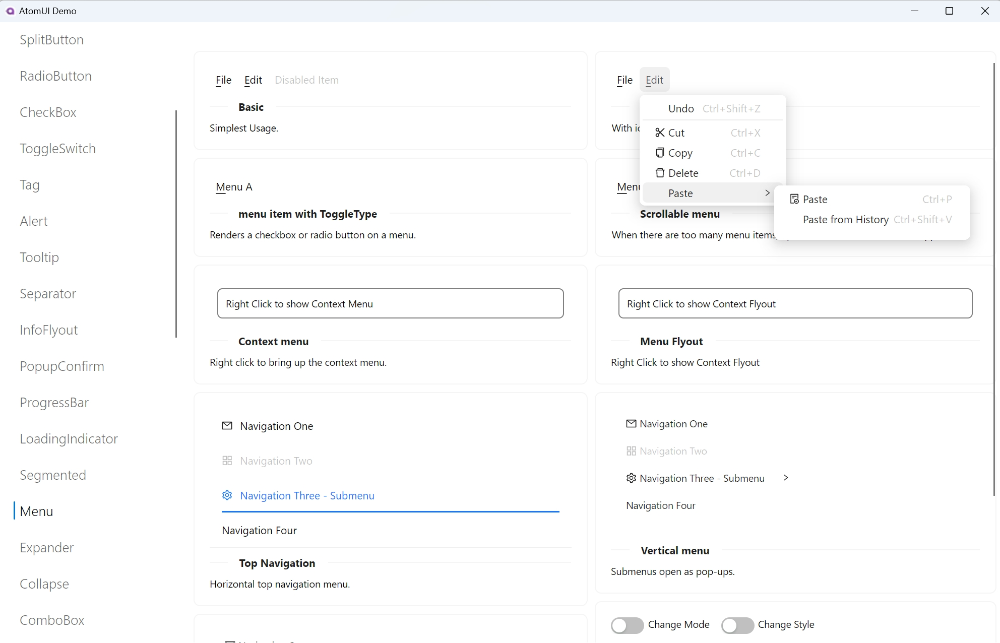
            </td>
            <td align="center" valign="middle" style="padding: 2px">
                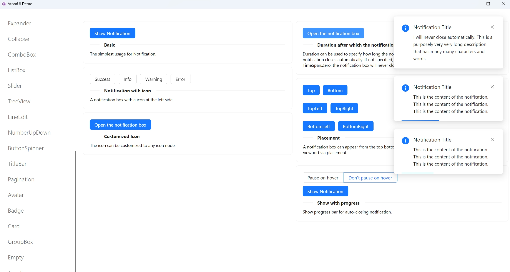
            </td>
        </tr>
        <tr>
            <td align="center" valign="middle" style="padding: 2px">
                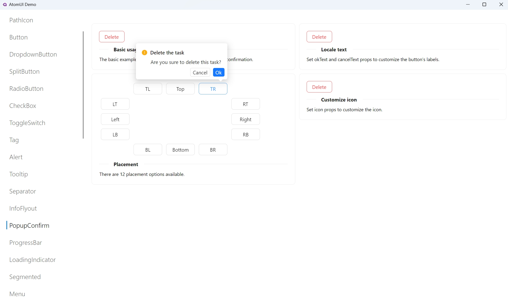
            </td>
            <td align="center" valign="middle" style="padding: 2px">
                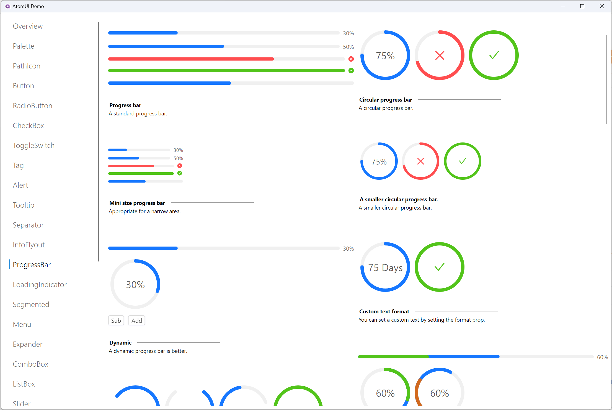
            </td>
        </tr>
        <tr>
            <td align="center" valign="middle" style="padding: 2px">
                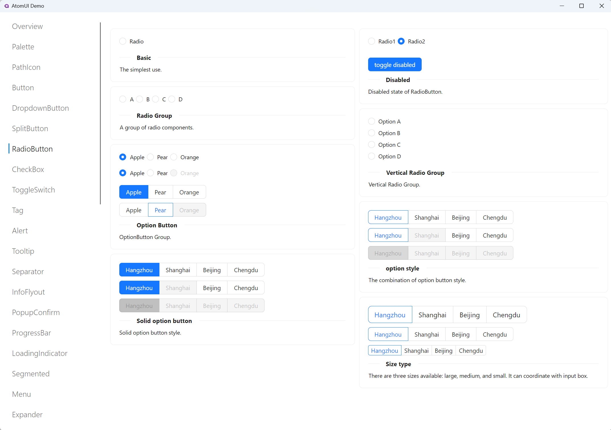
            </td>
            <td align="center" valign="middle" style="padding: 2px">
                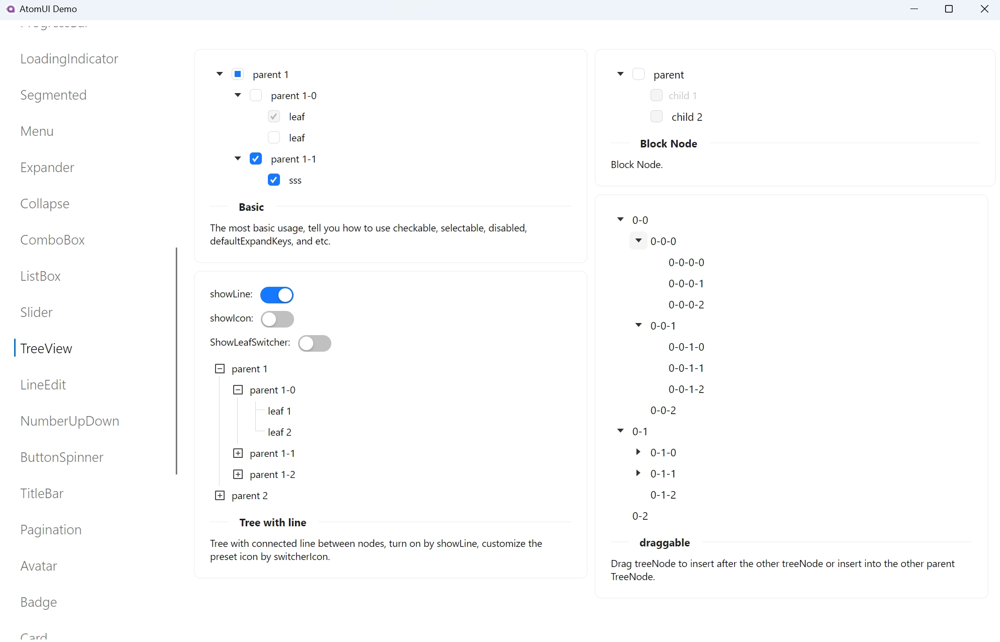
            </td>
        </tr>
    </tbody>
</table>

#### License Description
Projects using AtomUI need to comply with the LGPL v3 agreement. <strong>Commercial applications (including but not limited to internal company projects, commercial projects developed by individuals using AtomUI, and outsourced projects) are free when using binary links</strong>. If you want to customize AtomUI based on source code, you need to modify the open source code or purchase a commercial license. If you need a commercial license, please contact: Beijing Chinware Software Technology Co., Ltd.

#### About the Jiachen Project

    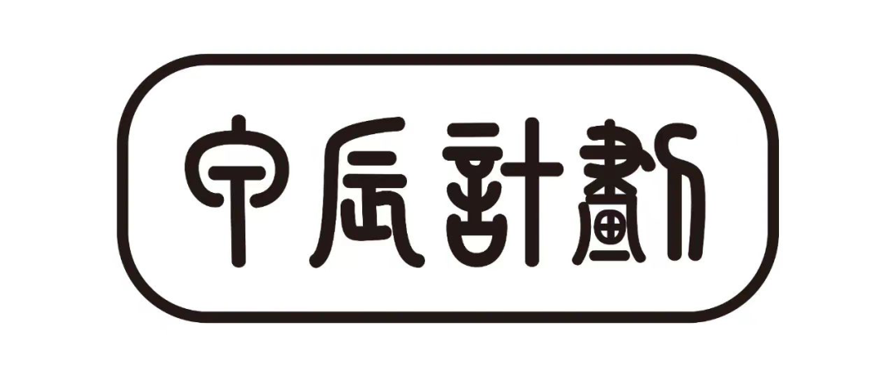

The Jiachen Project (RISC-V Prosperity 2036) was born on New Year's Eve 2024. It was jointly initiated by several domestic RISC-V software and chip teams and has attracted dozens of domestic and foreign companies engaged in RISC-V product and software development to join. We believe that the RISC-V ecosystem is entering the initial stage of unprecedented explosive growth: in 2025, RISC-V may welcome more than 1 million RISC-V application developers, and at the same time RISC-V will enter the world's top 500 supercomputers in 2025 and the top 10 in 2030. We are in a golden age of computer architecture and basic software systems, and the open instruction set architecture has brought a large number of new scientific problems and engineering challenges.

### 🤝 Contributing

Contributions of all types are more than welcome, if you are interested in contributing code, feel free to check out our GitHub [Issues][github-issues-link] to get stuck in to show us what you’re made of.

[![][pr-welcome-shield]][pr-welcome-link]

[![][github-contrib-shield]][github-contrib-link]

[github-issues-link]: https://github.com/chinware/AtomUI/issues
[pr-welcome-shield]: https://img.shields.io/badge/PR%20WELCOME-%E2%86%92-ffcb47?labelColor=black&style=for-the-badge
[pr-welcome-link]: https://github.com/chinware/AtomUI/pulls
[github-contrib-shield]: https://contrib.rocks/image?repo=chinware%2FAtomUI
[github-contrib-link]: https://github.com/chinware/AtomUI/graphs/contributors

#### About Chinware

    

Chinware Technologies Ltd. is a technology company dedicated to the development of productivity tool software. Since its inception, it has been determined to deepen its roots in the field of tool software, practice the spirit of continuous improvement in research and development, and strive to launch high-quality productivity tool software to serve developers at home and abroad, improve developers' work efficiency, and create commercial value and social value.