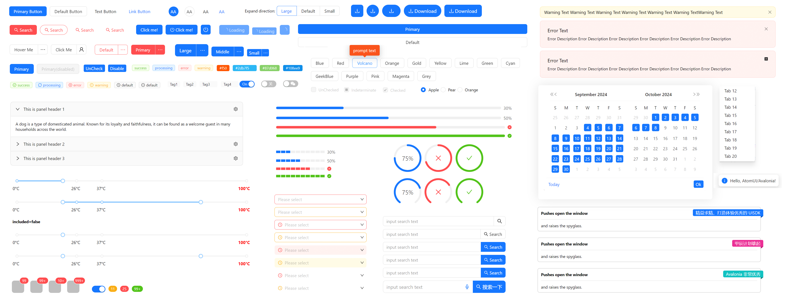
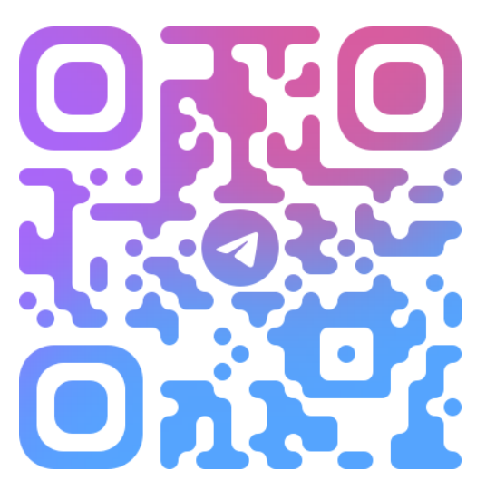
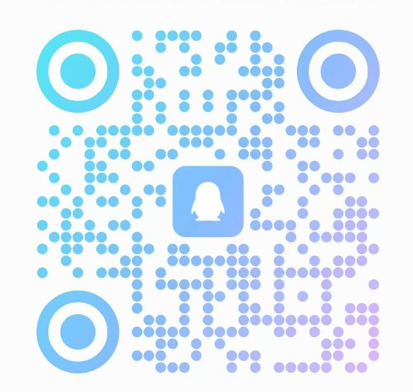

<br/>
<div align="center">

[](https://ant-design.antgroup.com/components/overview)
[](https://www.nuget.org/packages/AtomUI.Desktop.Controls)
[![][github-contributors-shield]][github-contributors-link]
[![][github-stars-shield]][github-stars-link]
[](https://www.nuget.org/packages/AtomUI.Desktop.Controls)
[![][github-license-shield]][github-license-link]

[Changelog](./CHANGELOG.md) · [Report Bug][github-issues-link] · [Request Feature][github-issues-link]

</div>


[github-release-shield]: https://img.shields.io/github/v/release/AtomUI/AtomUI?color=369eff&labelColor=black&logo=github&style=flat-square

[github-release-link]: https://github.com/AtomUI/AtomUI/releases

[github-releasedate-shield]: https://img.shields.io/github/release-date/AtomUI/AtomUI?color=black&labelColor=black&style=flat-square

[github-releasedate-link]: https://github.com/AtomUI/AtomUI/releases

[github-contributors-shield]: https://img.shields.io/badge/contributors-welcome-c4f042?labelColor=black&style=flat-square

[github-contributors-link]: https://github.com/AtomUI/AtomUI/graphs/contributors

[github-forks-shield]: https://img.shields.io/github/forks/AtomUI/AtomUI?color=8ae8ff&labelColor=black&style=flat-square

[github-forks-link]: https://github.com/AtomUI/AtomUI/network/members

[github-stars-shield]: https://img.shields.io/github/stars/AtomUI/AtomUI?color=ffcb47&labelColor=black&style=flat-square

[github-stars-link]: https://github.com/AtomUI/AtomUI/network/stargazers

[github-issues-shield]: https://img.shields.io/github/issues/AtomUI/AtomUI?color=ff80eb&labelColor=black&style=flat-square

[github-issues-link]: https://github.com/AtomUI/AtomUI/issues

[github-license-shield]: https://img.shields.io/badge/license-LGPL--3.0-white?labelColor=black&style=flat-square

[github-license-link]: https://github.com/AtomUI/AtomUI/blob/master/LICENSE

Documentation Language: [English](README.md) | [简体中文](README.zh-CN.md)

#### Overview

AtomUI is an Ant Design 6 component system for Avalonia/.NET desktop applications. It brings Ant Design's enterprise
interaction patterns, visual language, design tokens and theme customization model to native cross-platform apps on
Windows, macOS and Linux.

The project includes production-oriented desktop controls, icon packages, font packages, native window integration,
DataGrid, ColorPicker and source generators for custom controls, tokens and localization. Feedback, issues and pull
requests are welcome.



#### Features

- Ant Design 6 experience adapted for native Avalonia desktop applications.
- A broad set of ready-to-use controls for enterprise software, including layout, navigation, data entry, feedback,
  data display and optional advanced packages.
- Token-driven theming built on Avalonia's style and resource system, with support for consistent customization across
  controls.
- Cross-platform desktop support for Windows, macOS and Linux with a shared .NET/XAML development model.
- Source generators for custom controls, theme tokens and localization to reduce repetitive infrastructure code.

#### Requirements

.NET 8 or later (development supports .NET 10)<br>
Avalonia 12.1.1<br>
Windows, macOS and Linux<br>

#### Latest Release Notes

AtomUI 6.1.4 adds compile-time registration for trimmed and NativeAOT apps, configurable Window caption buttons,
collapsed NavMenu tooltips, and fixes for selection, tab overflow, DataGrid sizing and package delivery. Review the
[Changelog](./CHANGELOG.md) for release details.

#### Incubator

Thanks to Tongming Lake Center for their incubation support of AtomUI OSS

<div style="margin-top: 50px">
  
</div>

#### Community

<div align="center">
    <table>
      <tr>
        <th>Telegram</th>
        <th>WhatsApp</th>
        <th>WeChat Group</th>
        <th>QQ Group</th>
      </tr>
      <tr>
        <td> </td>
        <td> </td>
        <td></td>
        <td></td>
      </tr>
    </table>
</div>

#### Get Started

##### Add NuGet packages

AtomUI is distributed through NuGet. Install the main desktop controls package first, then add optional packages such as
DataGrid, ColorPicker and Extras only when your application needs them. The examples below use the latest project version.

The packages we have released are as follows:

| Package                             | Description                                                                |
|-------------------------------------|----------------------------------------------------------------------------|
| AtomUI.Native                       | Native platform infrastructure                                             |
| AtomUI.Core                         | Core infrastructure — theme system, token system and animations             |
| AtomUI.Fonts.AlibabaSans            | Alibaba Sans font package                                                  |
| AtomUI.Fonts.AlibabaPuHuiTi         | Alibaba PuHuiTi font package                                               |
| AtomUI.Icons.Shared                 | Icon infrastructure                                                        |
| AtomUI.Icons.AntDesign              | Ant Design icon package                                                    |
| AtomUI.Controls.Shared              | Shared interfaces and enums for control development                        |
| AtomUI.Controls                     | Base controls and shared control capabilities                              |
| AtomUI.Desktop.Controls             | Desktop control library — the main package                                 |
| AtomUI.Desktop.Controls.DataGrid    | DataGrid control (opt-in)                                                  |
| AtomUI.Desktop.Controls.ColorPicker | ColorPicker control (opt-in)                                               |
| AtomUI.Desktop.Controls.Extras      | Supplemental desktop controls (opt-in)                                     |
| AtomUI.Generator                    | Source generators for custom controls, tokens and localization             |

```bash
dotnet add package AtomUI.Desktop.Controls --version 6.1.4
dotnet add package AtomUI.Desktop.Controls.DataGrid --version 6.1.4
dotnet add package AtomUI.Desktop.Controls.ColorPicker --version 6.1.4
dotnet add package AtomUI.Desktop.Controls.Extras --version 6.1.4
```

You can also install the packages from your IDE's NuGet package manager. In Rider, open:

NuGet -> Packages

Search for "AtomUI" and install the packages your project needs.

> Before installation, check "Frameworks" and "Dependencies" in the package details to confirm compatibility with your
> target framework and Avalonia version.

##### Enable AtomUI library

###### Project Configure

```xaml
<Project Sdk="Microsoft.NET.Sdk">
    <PropertyGroup>
        <OutputType>WinExe</OutputType>
        <TargetFramework>net8.0</TargetFramework>
        <ImplicitUsings>enable</ImplicitUsings>
        <Nullable>enable</Nullable>
        <BuiltInComInteropSupport>true</BuiltInComInteropSupport>
        <ApplicationManifest>app.manifest</ApplicationManifest>
    </PropertyGroup>

    <ItemGroup>
        <PackageReference Include="AtomUI.Desktop.Controls" Version="6.1.4"/>
        <PackageReference Include="AtomUI.Desktop.Controls.DataGrid" Version="6.1.4"/>
        <PackageReference Include="AtomUI.Desktop.Controls.ColorPicker" Version="6.1.4"/>
        <PackageReference Include="AtomUI.Desktop.Controls.Extras" Version="6.1.4"/>
        <PackageReference Include="AvaloniaUI.DiagnosticsSupport" Version="2.2.1"/>
    </ItemGroup>
</Project>
```

###### Program.cs Configure

```csharp
using Avalonia;
using System;
using AtomUI;
using ReactiveUI.Avalonia;

namespace AtomUIProgressApp;

internal class Program
{
    [STAThread]
    public static void Main(string[] args) => BuildAvaloniaApp()
        .StartWithClassicDesktopLifetime(args);

    public static AppBuilder BuildAvaloniaApp()
    {
        return AppBuilder.Configure<App>()
                         .UseReactiveUI()
                         .UseAtomUIPlatformDetect()
                         .WithAtomUIDefaultOptions()
                         .WithDeveloperTools()
                         .LogToTrace();
    }
}
```

###### Enable `AtomUI` in the `Application` Class

```csharp
using AtomUI;
using AtomUI.Desktop.Controls;
using AtomUI.Localization;
using AtomUI.Theme;
using Avalonia;
using Avalonia.Markup.Xaml;

public partial class App : Application
{
    public override void Initialize()
    {
        AvaloniaXamlLoader.Load(this);

        this.UseAtomUI(builder =>
        {
            builder.UseLanguages(
                LanguageTags.EnUS,
                [LanguageTags.EnUS, LanguageTags.ZhCN, LanguageTags.ZhTW]);
            builder.WithDefaultTheme(IThemeManager.DEFAULT_THEME_ID);
            builder.UseAlibabaSansFont();
            builder.UseDesktopControls();
            builder.UseDesktopColorPicker();   // optional
            builder.UseDesktopDataGrid();      // optional
            builder.UseDesktopExtras();        // optional
        });
    }
}
```

To make the first rendered frame use the dark theme, configure the initial theme algorithm in the builder:

```csharp
this.UseAtomUI(builder =>
{
    builder.WithDefaultTheme(IThemeManager.DEFAULT_THEME_ID, ThemeAlgorithm.Dark);
    builder.UseDesktopControls();
});
```

`SetDarkThemeMode(true)` is intended for runtime theme switching after AtomUI has been initialized.

###### Start building with AtomUI

After AtomUI is registered, you can use AtomUI controls and Ant Design icons directly in XAML.

```xml
<atom:Window xmlns="https://github.com/avaloniaui"
             xmlns:atom="https://atomui.net"
             xmlns:antdicons="https://atomui.net/icons/antdesign">
  <atom:Space Orientation="Horizontal">
    <atom:Button ButtonType="Primary">Get Started</atom:Button>
    <atom:Button Icon="{antdicons:AntDesignIconProvider StarOutlined}">Star on GitHub</atom:Button>
  </atom:Space>
</atom:Window>
```

<div style="height:50px"></div>

#### All Control Gallery

You can launch the gallery project locally to browse the available controls, usage patterns, examples and generated
documentation.

```bash
git clone https://github.com/AtomUI/AtomUI.git
cd AtomUI
dotnet run --project controlgallery/AtomUIGallery.Desktop/AtomUIGallery.Desktop.csproj
```

<div style="height:50px"></div>

#### Simple Examples

The gallery is intentionally comprehensive. If you prefer compact starter projects, visit:

[AtomUI/AtomUI.Examples](https://github.com/AtomUI/AtomUI.Samples)

These samples show smaller application setups that are easier to copy into a new project.

#### Acknowledgements

<div>
    <div align="center">
      <h1>Ant Design</h1>
      
    </div>
Ant Design is an enterprise-level UI design language and React component library launched by Ant Group. It provides a set of high-quality, unified React components with rich preset themes and internationalization support, dedicated to improving the design and development efficiency of enterprise applications. Its elegant design and excellent development experience make it one of the most popular front-end solutions for middle and back-end projects.
</div>

<div style="margin-top: 50px">
    <div align="center">
        <h1>Avalonia OSS</h1>
        
    </div>
Avalonia is a cross-platform .NET UI framework that uses XAML language for interface design. It supports multiple platforms including Windows, macOS, Linux, iOS, and Android, providing a development experience similar to WPF. With its high-performance rendering engine and rich control library, Avalonia helps enterprises quickly build modern desktop and mobile applications.

</div>

#### License Description

Projects using AtomUI OSS must comply with LGPL v3. <strong>Commercial applications, including internal company
software, personal commercial products and outsourced projects, may use AtomUI for free when linking to the published
binaries</strong>. If you customize AtomUI from source code, you must either open source the modified code under the
license terms or purchase a commercial license. For commercial licensing, contact Beijing Qinware Technology Co., Ltd.

#### Special thanks

<div>
    <div align="left">
      <h1>RoutinAI</h1>
       
    </div>
[RoutinAI](https://routin.ai/) is an enterprise-grade unified LLM API gateway that provides a single, type-safe interface to access over 100 leading large language models from the GPT, Claude, and Gemini families, including models such as gpt-5.4, claude-opus-4-6, and gemini-3.1-pro-preview. It eliminates the complexity of managing multiple AI vendors by providing zero-latency edge routing, seamless model switching without code modifications, unified billing, and centralized governance with spending caps and access policies.
</div>

### 🤝 Contributing

Contributions of all types are more than welcome, if you are interested in contributing code, feel free to check out our
GitHub [Issues][github-issues-link] to get stuck in to show us what you’re made of.

[![][pr-welcome-shield]][pr-welcome-link]

[![][github-contrib-shield]][github-contrib-link]

[github-issues-link]: https://github.com/AtomUI/AtomUI/issues

[pr-welcome-shield]: https://img.shields.io/badge/PR%20WELCOME-%E2%86%92-ffcb47?labelColor=black&style=for-the-badge

[pr-welcome-link]: https://github.com/AtomUI/AtomUI/pulls

[github-contrib-shield]: https://contrib.rocks/image?repo=chinware%2FAtomUI

[github-contrib-link]: https://github.com/AtomUI/AtomUI/graphs/contributors
