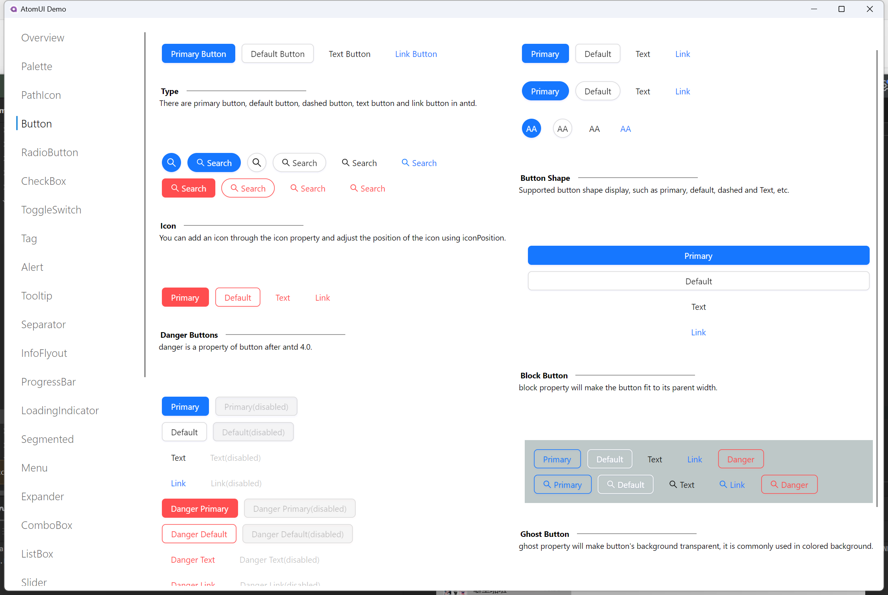
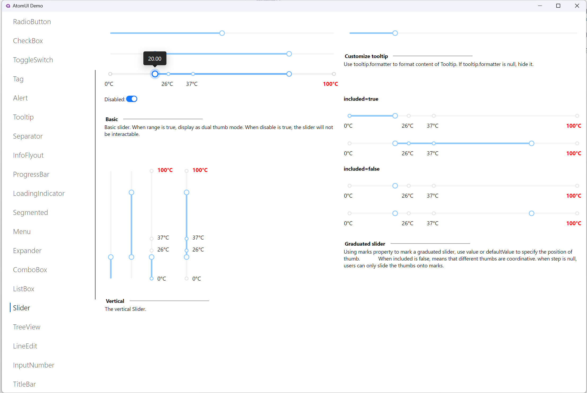

    

基于 Ant Design 5.0 和 Avalonia 技术的企业级跨平台控件库

#### 介绍

AtomUI 是基于 .NET 技术的 Ant Design 实现，致力于将 Ant Design 优秀高效的设计语言和体验带到 Avalonia/.NET 跨平台桌面软件研发领域。

欢迎交流和给 AtomUI 提相关建议，感谢给项目点 Star。

#### 运行环境

.NET 8 及其以上 
Avalonia 11.1.1 及其以上 
PS: AtomUI 目前仅在 Windows 11 平台测试 

#### 当前完成度
##### （导航）Navigation
| 控件名            | 完成情况   |
|:---------------|:-------|
| Breadcrumb 面包屑 | 未完成    |
| Dropdown 下拉菜单  | 未完成    |
| Menu 导航菜单      | 已完成 ✅  |
| Pagination 分页  | 进行中 💪 |
| Steps 步骤条      | 未完成    |

##### （数据录入）Data Entry
| 控件名                 | 完成情况   |
|:--------------------|:-------|
| AutoComplete 自动完成   | 未完成    |
| ComboBox 自动完成       | 进行中 💪   |
| Cascader 级联选择       | 未完成    |
| Checkbox 多选框        | 已完成 ✅  |
| ColorPicker 颜色选择器   | 未完成    |
| DatePicker 日期选择框    | 未完成    |
| Form 表单             | 未完成    |
| Input 输入框           | Completed ✅ |
| InputNumber 数字输入框   | 进行中 💪 |
| Mentions 提及         | 未完成    |
| Radio 单选框           | 已完成 ✅  |
| OptionButtonBox 单选组 | 已完成 ✅  |
| Rate 评分             | 未完成    |
| Select 选择器          | 进行中 💪    |
| Slider 滑动输入条        | 已完成 ✅  |
| Switch 开关           | 已完成 ✅  |
| TimePicker 时间选择框    | 未完成    |
| Transfer 穿梭框        | 未完成    |
| Upload 上传           | 需评估 🤔 |

##### （数据展示）Data Display
| 控件名                    | 完成情况   |
|:-----------------------|:-------|
| Avatar 头像              | 未完成    |
| Badge 徽标数              | 已完成 ✅  |
| Calendar 日历            | 未完成    |
| Card 卡片                | 未完成    |
| Carousel 走马灯           | 进行中 💪    |
| Collapse 折叠面板          | 已完成 ✅ |
| Expander 折叠面板          | 已完成 ✅  |
| Descriptions 描述列表      | 未完成    |
| EmptyIndicator 空状态     | 已完成 ✅  |
| PathIcon 图标            | 已完成 ✅    |
| Image 图片               | 未完成    |
| List 列表                | 进行中 💪   |
| Popover 气泡卡片           | 已完成 ✅  |
| QRCode 二维码             | 未完成    |
| Segmented 分段控制器        | 已完成 ✅  |
| Statistic 统计数值         | 未完成    |
| Table 表格               | 未完成    |
| TabControl 标签页         | 已完成 ✅  |
| Tag 标签                 | 已完成 ✅  |
| MarqueeLabel 跑马灯 Label | 已完成 ✅  |
| Timeline 时间轴           | 进行中 💪 |
| Tooltip 文字提示           | 已完成 ✅  |
| Tour 漫游式引导             | 未完成    |
| Tree 树形控件              | 进行中 💪 |

##### （反馈）Feedback
| 控件名                  | 完成情况   |
|:---------------------|:-------|
| Alert 警告提示           | 已完成 ✅  |
| Drawer 抽屉            | 未完成    |
| Message 全局提示         | 进行中 💪    |
| Modal 对话框            | 进行中 💪    |
| Notification 通知提醒框   | 进行中 💪    |
| Popconfirm 气泡确认框     | 未完成    |
| ProgressBar 进度条      | 已完成 ✅  |
| Result 结果            | 需评估 🤔 |
| Skeleton 骨架屏         | 未完成    |
| LoadingIndicator 加载中 | 已完成 ✅  |
| Watermark 水印         | 未完成        |

#### 运行效果部分截图

#### 按钮控件

#### 进度条控件

#### Slider 控件

#### 许可证说明
项目源码仅对个人学习交流或者遵循 GPLv3 的开源项目免费，<strong>商业应用(包括且不限于公司内部项目、个人使用 AtomUI 开发的商业项目和承接的外包项目)需要购买商业许可证</strong>，联系：秦派软件咨询授权事宜。

#### 关于甲辰计划

    

甲辰计划（RISC-V Prosperity 2036）诞生于2024年除夕，由国内多家 RISC-V 软件及芯片团队联合发起，并已经吸引数十家国内外从事 RISC-V 产品及软件开发的企业加入。我们相信RISC-V 生态正在进入前所未有的爆炸式增长的初期阶段：在2025年，RISC-V或将迎来预计超过100万名RISC-V应用开发者，与此同时RISC-V将在2025年进入世界超算TOP500、并在2030年进入TOP10。我们正处于一个计算机体系架构和基础软件系统的黄金时代，开放指令集架构带来了大量新的科学问题和工程挑战。

#### 关于秦派软件

    

北京秦派软件科技有限公司(Pulsarware® Technologies Ltd.)是一家致力于开发生产力工具软件的技术公司，成立之初立志要在工具软件领域深耕，践行精益求精的研发精神，努力推出优质的生产力工具软件服务国内外的开发者，提升开发者的工作效率，同时创造出商业价值和社会价值。
