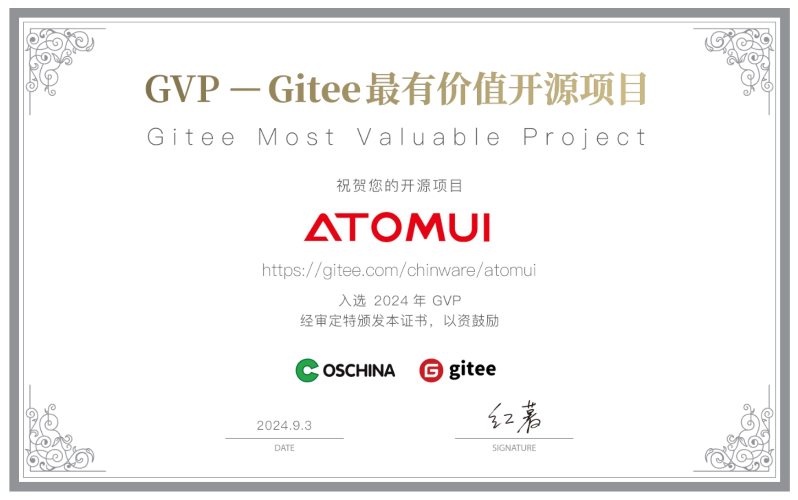

    

 

[![][github-contributors-shield]][github-contributors-link]
[![][github-forks-shield]][github-forks-link]
[![][github-stars-shield]][github-stars-link]
[![][github-issues-shield]][github-issues-link]
[![][github-license-shield]][github-license-link]

[更新日志](./CHANGELOG.md) · [提交Bug][github-issues-link] · [提交需求][github-issues-link]

[github-release-shield]: https://img.shields.io/github/v/release/chinware/AtomUI?color=369eff&labelColor=black&logo=github&style=flat-square
[github-release-link]: https://github.com/chinware/AtomUI/releases
[github-releasedate-shield]: https://img.shields.io/github/release-date/chinware/AtomUI?color=black&labelColor=black&style=flat-square
[github-releasedate-link]: https://github.com/chinware/AtomUI/releases
[github-contributors-shield]: https://img.shields.io/github/contributors/chinware/AtomUI?color=c4f042&labelColor=black&style=flat-square
[github-contributors-link]: https://github.com/chinware/AtomUI/graphs/contributors
[github-forks-shield]: https://img.shields.io/github/forks/chinware/AtomUI?color=8ae8ff&labelColor=black&style=flat-square
[github-forks-link]: https://github.com/chinware/AtomUI/network/members
[github-stars-shield]: https://img.shields.io/github/stars/chinware/AtomUI?color=ffcb47&labelColor=black&style=flat-square
[github-stars-link]: https://github.com/chinware/AtomUI/network/stargazers
[github-issues-shield]: https://img.shields.io/github/issues/chinware/AtomUI?color=ff80eb&labelColor=black&style=flat-square
[github-issues-link]: https://github.com/chinware/AtomUI/issues
[github-license-shield]: https://img.shields.io/github/license/chinware/AtomUI?color=white&labelColor=black&style=flat-square
[github-license-link]: https://github.com/chinware/AtomUI/blob/master/LICENSE

文档语言: [English](README.md) | [简体中文](README.zh-CN.md)

#### 介绍

AtomUI 是基于 .NET 技术的 Ant Design 实现，致力于将 Ant Design 优秀而高效的设计语言和体验带入 Avalonia/.NET 跨平台桌面软件开发领域。
欢迎与 AtomUI 进行交流并提出建议，感谢您为该项目点赞。

#### 特性

- 实现 Ant Design 提炼自企业级中后台产品的交互语言和视觉风格。
- 开箱即用的高质量 Avalonia 组件。
- 使用 .NET 开发，实现一处编写，无缝在主流操作系统平台编译并且渲染出一致的 UI 体验。
- 基于 Avalonia 强大的风格系统，完整实现了 Ant Design 的主题定制能力。

#### 运行环境

.NET 8 及其以上 
Avalonia 11.1.1 及其以上 
PS: AtomUI 目前仅在 Windows 11 平台测试 

#### 感谢 Gitee 对 AtomUI 的认可

    

#### 中文社区
目前我们暂时只创建 QQ 和微信开发者群的交流方式，下面是二维码，有兴趣的同学可以扫码加入：

<table border="0">
    <tbody>
        <tr>
            <td align="center" valign="middle">
                
            </td>
            <td align="center" valign="middle">
                
            </td>
        </tr>
    </tbody>
</table>

> PS：扫码请注明来意，比如：学习`AtomUI`或者`Avalonia`爱好者

#### 运行效果部分截图

<table border="0">
    <tbody>
        <tr>
            <td align="center" valign="middle" style="padding: 2px">
                 
            </td>
            <td align="center" valign="middle" style="padding: 2px">
                
            </td>
        </tr>
        <tr>
            <td align="center" valign="middle" style="padding: 2px">
                
            </td>
            <td align="center" valign="middle" style="padding: 2px">
                
            </td>
        </tr>
        <tr>
            <td align="center" valign="middle" style="padding: 2px">
                
            </td>
            <td align="center" valign="middle" style="padding: 2px">
                
            </td>
        </tr>
        <tr>
            <td align="center" valign="middle" style="padding: 2px">
                
            </td>
            <td align="center" valign="middle" style="padding: 2px">
                
            </td>
        </tr>
        <tr>
            <td align="center" valign="middle" style="padding: 2px">
                
            </td>
            <td align="center" valign="middle" style="padding: 2px">
                
            </td>
        </tr>
    </tbody>
</table>

#### 许可证说明
使用 AtomUI 的项目需要遵循 LGPL v3 协议，<strong>商业应用(包括且不限于公司内部项目、个人使用 AtomUI 开发的商业项目和承接的外包项目)在使用二进制连接的情况下免费</strong>，如果基于源码定制 AtomUI 需要修改的代码开源或者购买商业授权，需要商业授权，欢迎联系：北京秦派软件科技有限公司。

#### 关于甲辰计划

    

甲辰计划（RISC-V Prosperity 2036）诞生于2024年除夕，由国内多家 RISC-V 软件及芯片团队联合发起，并已经吸引数十家国内外从事 RISC-V 产品及软件开发的企业加入。我们相信RISC-V 生态正在进入前所未有的爆炸式增长的初期阶段：在2025年，RISC-V或将迎来预计超过100万名RISC-V应用开发者，与此同时RISC-V将在2025年进入世界超算TOP500、并在2030年进入TOP10。我们正处于一个计算机体系架构和基础软件系统的黄金时代，开放指令集架构带来了大量新的科学问题和工程挑战。

### 🤝 贡献

欢迎各界人士贡献各种资源，如果您对贡献代码感兴趣，请随意查看我们的 GitHub [问题页面][github-issues-link]，让我们见识一下您的实力。

[![][pr-welcome-shield]][pr-welcome-link]

[![][github-contrib-shield]][github-contrib-link]

[github-issues-link]: https://github.com/chinware/AtomUI/issues
[pr-welcome-shield]: https://img.shields.io/badge/PR%20WELCOME-%E2%86%92-ffcb47?labelColor=black&style=for-the-badge
[pr-welcome-link]: https://github.com/chinware/AtomUI/pulls
[github-contrib-shield]: https://contrib.rocks/image?repo=chinware%2FAtomUI
[github-contrib-link]: https://github.com/chinware/AtomUI/graphs/contributors

#### 关于秦派软件

    

北京秦派软件科技有限公司(Pulsarware® Technologies Ltd.)是一家致力于开发生产力工具软件的技术公司，成立之初立志要在工具软件领域深耕，践行精益求精的研发精神，努力推出优质的生产力工具软件服务国内外的开发者，提升开发者的工作效率，同时创造出商业价值和社会价值。
