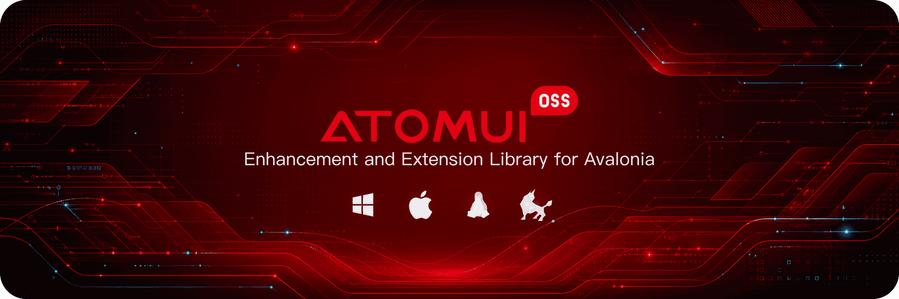
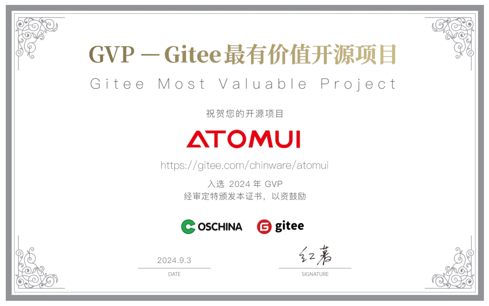

<br/>
<div align="center">

[](https://ant-design.antgroup.com/components/overview-cn)
[](https://www.nuget.org/packages/AtomUI.Desktop.Controls)
[](https://www.nuget.org/packages/AtomUI.Desktop.Controls)
[![][github-license-shield]][github-license-link]

[更新日志](./CHANGELOG.md) · [提交Bug][github-issues-link] · [提交需求][github-issues-link]

</div>


[github-release-shield]: https://img.shields.io/github/v/release/AtomUI/AtomUI?color=369eff&labelColor=black&logo=github&style=flat-square

[github-release-link]: https://github.com/AtomUI/AtomUI/releases

[github-releasedate-shield]: https://img.shields.io/github/release-date/AtomUI/AtomUI?color=black&labelColor=black&style=flat-square

[github-releasedate-link]: https://github.com/AtomUI/AtomUI/releases

[github-contributors-shield]: https://img.shields.io/badge/contributors-welcome-c4f042?labelColor=black&style=flat-square

[github-contributors-link]: https://github.com/AtomUI/AtomUI/graphs/contributors

[github-forks-shield]: https://img.shields.io/github/forks/AtomUI/AtomUI?color=8ae8ff&labelColor=black&style=flat-square

[github-forks-link]: https://github.com/AtomUI/AtomUI/network/members

[github-stars-shield]: https://img.shields.io/github/stars/AtomUI/AtomUI?color=ffcb47&labelColor=black&style=flat-square

[github-stars-link]: https://github.com/AtomUI/AtomUI/network/stargazers

[github-issues-shield]: https://img.shields.io/github/issues/AtomUI/AtomUI?color=ff80eb&labelColor=black&style=flat-square

[github-issues-link]: https://github.com/AtomUI/AtomUI/issues

[github-license-shield]: https://img.shields.io/badge/license-LGPL--3.0-white?labelColor=black&style=flat-square

[github-license-link]: https://github.com/AtomUI/AtomUI/blob/master/LICENSE

文档语言: [English](README.md) | [简体中文](README.zh-CN.md)

#### 介绍

AtomUI 是面向 Avalonia/.NET 桌面应用的 Ant Design 6 组件体系，目标是把 Ant Design 的企业级交互模式、
视觉语言、设计 Token 和主题定制能力带到 Windows、macOS、Linux 原生跨平台应用中。

项目提供面向生产场景的桌面控件、图标包、字体包、原生窗口集成、DataGrid、ColorPicker，以及用于自定义控件、
Token 和本地化开发的源代码生成器。欢迎提交 Issue、PR 和改进建议。


#### 特性

- 将 Ant Design 6 的交互体验和视觉体系适配到原生 Avalonia 桌面应用。
- 提供覆盖布局、导航、数据录入、反馈、数据展示等场景的开箱即用控件，并按需提供 DataGrid、ColorPicker 等高级包。
- 基于 Avalonia 样式与资源系统实现 Token 驱动的主题能力，便于在应用级统一定制视觉风格。
- 使用统一的 .NET/XAML 开发模型支持 Windows、macOS、Linux 跨平台桌面应用。
- 提供自定义控件、主题 Token、本地化相关的源代码生成能力，减少重复基础设施代码。

#### 运行环境

.NET 8 及其以上（开发期支持 .NET 10）<br>
Avalonia 12.0.x<br>
支持 Windows、macOS、Linux 跨平台<br>

#### 感谢通明湖中心孵化 AtomUI OSS

<div style="margin-top: 50px">
  
</div>

#### 感谢 Gitee 对 AtomUI 的认可

<p align="center">
    
</p>

#### 中文社区

目前我们提供 QQ 和微信开发者交流群，欢迎对 AtomUI 或 Avalonia 感兴趣的开发者扫码加入：

<table border="0">
    <tbody>
        <tr>
            <td align="center" valign="middle">
                
            </td>
            <td align="center" valign="middle">
                
            </td>
        </tr>
    </tbody>
</table>

> PS：扫码请注明来意，比如：学习 `AtomUI` 或 `Avalonia` 爱好者。

#### 开始使用

AtomUI 推荐通过 NuGet 安装。先安装主桌面控件包，再根据应用需要按需添加 DataGrid、ColorPicker 等可选包。
下面示例使用当前项目最新版本。

目前我们已经发布的包如下：

| 包名                                  | 描述                              |
|-------------------------------------|---------------------------------|
| AtomUI.Native                       | 原生平台适配基础设施                      |
| AtomUI.Core                         | 核心基础设施 — 主题系统、Token 系统、动画     |
| AtomUI.Fonts.AlibabaSans            | Alibaba Sans 字体包                  |
| AtomUI.Fonts.AlibabaPuHuiTi         | 阿里巴巴普惠体字体包                      |
| AtomUI.Icons.Shared                 | 图标基础设施                          |
| AtomUI.Icons.AntDesign              | Ant Design 图标包                  |
| AtomUI.Controls.Shared              | 面向控件开发的共享接口与枚举                 |
| AtomUI.Controls                     | 基础控件与通用能力                       |
| AtomUI.Desktop.Controls             | 桌面控件库 — 主要安装包                  |
| AtomUI.Desktop.Controls.DataGrid    | DataGrid 数据表格控件（按需引入）          |
| AtomUI.Desktop.Controls.ColorPicker | ColorPicker 颜色选择器控件（按需引入）      |
| AtomUI.Generator                    | 面向自定义控件、Token 与本地化开发的源代码生成器   |

```bash
dotnet add package AtomUI.Desktop.Controls --version 6.0.7
dotnet add package AtomUI.Desktop.Controls.DataGrid --version 6.0.7
dotnet add package AtomUI.Desktop.Controls.ColorPicker --version 6.0.7
```

您也可以在 IDE 的 NuGet 包管理器中安装。以 Rider 为例，可以依次点击：

NuGet -> 软件包

搜索 `AtomUI`，即可找到可用包，并按项目需要安装。

> 安装前请查看包详情中的“框架”和“依赖”，确认目标框架与 Avalonia 版本兼容。

##### 启用 AtomUI 库

###### 配置项目文件

```xaml
<Project Sdk="Microsoft.NET.Sdk">
    <PropertyGroup>
        <OutputType>WinExe</OutputType>
        <TargetFramework>net8.0</TargetFramework>
        <ImplicitUsings>enable</ImplicitUsings>
        <Nullable>enable</Nullable>
        <BuiltInComInteropSupport>true</BuiltInComInteropSupport>
        <ApplicationManifest>app.manifest</ApplicationManifest>
    </PropertyGroup>

    <ItemGroup>
        <PackageReference Include="AtomUI.Desktop.Controls" Version="6.0.7"/>
        <PackageReference Include="AtomUI.Desktop.Controls.DataGrid" Version="6.0.7"/>
        <PackageReference Include="AtomUI.Desktop.Controls.ColorPicker" Version="6.0.7"/>
        <PackageReference Include="AvaloniaUI.DiagnosticsSupport" Version="2.2.1"/>
    </ItemGroup>
</Project>
```

###### 配置程序入口文件

```csharp
using Avalonia;
using System;
using AtomUI;
using ReactiveUI.Avalonia;

namespace AtomUIProgressApp;

internal class Program
{
    [STAThread]
    public static void Main(string[] args) => BuildAvaloniaApp()
        .StartWithClassicDesktopLifetime(args);

    public static AppBuilder BuildAvaloniaApp()
    {
        return AppBuilder.Configure<App>()
                         .UseReactiveUI()
                         .UsePlatformDetect()
                         .WithAtomUIDefaultOptions()
                         .WithDeveloperTools()
                         .LogToTrace();
    }
}
```

###### 在 `Application` 类中启用 `AtomUI`

```csharp
using System.Globalization;
using AtomUI;
using AtomUI.Desktop.Controls;
using AtomUI.Theme;
using Avalonia;
using Avalonia.Markup.Xaml;

public partial class App : Application
{
    public override void Initialize()
    {
        AvaloniaXamlLoader.Load(this);

        this.UseAtomUI(builder =>
        {
            builder.WithDefaultCultureInfo(CultureInfo.CurrentUICulture);
            builder.WithDefaultTheme(IThemeManager.DEFAULT_THEME_ID);
            builder.UseAlibabaSansFont();
            builder.UseDesktopControls();
            builder.UseDesktopColorPicker();   // 可选
            builder.UseDesktopDataGrid();      // 可选
        });
    }
}
```

###### 开始使用 AtomUI

注册 AtomUI 后，可以直接在 XAML 中使用 AtomUI 控件和 Ant Design 图标。

```xml
<atom:Window xmlns="https://github.com/avaloniaui"
             xmlns:atom="https://atomui.net"
             xmlns:antdicons="https://atomui.net/icons/antdesign">
    <atom:Space Orientation="Horizontal">
        <atom:Button ButtonType="Primary">开始使用</atom:Button>
        <atom:Button Icon="{antdicons:AntDesignIconProvider StarOutlined}">在 GitHub 上点赞</atom:Button>
    </atom:Space>
</atom:Window>
```

<div style="height:50px"></div>

#### 体验所有控件

您可以在本机启动 Gallery 项目，浏览 AtomUI 控件、典型用法、设计 Token 和 API 表格。

```bash
git clone https://github.com/AtomUI/AtomUI.git
cd AtomUI
dotnet run --project controlgallery/AtomUIGallery.Desktop/AtomUIGallery.Desktop.csproj
```

<div style="height:50px"></div>

#### 小的示例项目

Gallery 项目覆盖面较完整。如果您希望先看更小的入门项目，可以前往：

[AtomUI/AtomUI.Examples](https://github.com/AtomUI/AtomUI.Samples)

这些示例展示了更紧凑的应用搭建方式，更适合作为新项目起点。

#### 致谢

<div>
    <div align="center">
      <h1>Ant Design</h1>
      
    </div>
Ant Design 是由蚂蚁集团推出的企业级 UI 设计语言和 React 组件库。它提供了一套高质量、统一的 React 组件，包含丰富的预设主题与国际化支持，致力于提升企业级应用的设计和开发效率。其优雅的设计和出色的开发体验，使其成为中后台项目中最流行的前端解决方案之一。
</div>

<div style="margin-top: 50px">
    <div align="center">
        <h1>Avalonia OSS</h1>
        
    </div>
Avalonia 是一个跨平台的 .NET UI 框架，使用 XAML 语言设计界面。它支持 Windows、macOS、Linux、iOS 和 Android 等多个平台，提供与 WPF 相似的开发体验。凭借其高性能的渲染引擎和丰富的控件库，Avalonia 能够帮助企业快速构建现代化的桌面和移动应用程序。
</div>

#### 许可证说明

使用 AtomUI OSS 的项目需要遵循 LGPL v3 协议。<strong>商业应用，包括公司内部项目、个人商业项目和外包项目，
在使用已发布二进制包链接的情况下可以免费使用</strong>。如果基于源码定制 AtomUI，则需要按协议开放修改代码，
或购买商业授权。商业授权请联系：北京秦派软件科技有限公司。

#### 特别感谢

<div>
    <div align="left">
      <h1>RoutinAI</h1>
       
    </div>
[RoutinAI](https://routin.ai/) 是一个企业级统一 LLM API 网关，提供单一、类型安全的接口，可访问来自 GPT、Claude 和 Gemini 系列的 100 多个主流大语言模型，包括 gpt-5.4、claude-opus-4-6 和 gemini-3.1-pro-preview 等模型。它通过提供零延迟边缘路由、无需修改代码即可无缝切换模型、统一计费以及带有消费上限和访问策略的集中治理，消除了管理多个 AI 供应商的复杂性。
</div>

### 🤝 贡献

欢迎各界人士贡献各种资源，如果您对贡献代码感兴趣，请随意查看我们的 GitHub [问题页面][github-issues-link]，让我们见识一下您的实力。

[![][pr-welcome-shield]][pr-welcome-link]

[![][github-contrib-shield]][github-contrib-link]

[github-issues-link]: https://github.com/AtomUI/AtomUI/issues

[pr-welcome-shield]: https://img.shields.io/badge/PR%20WELCOME-%E2%86%92-ffcb47?labelColor=black&style=for-the-badge

[pr-welcome-link]: https://github.com/AtomUI/AtomUI/pulls

[github-contrib-shield]: https://contrib.rocks/image?repo=chinware%2FAtomUI

[github-contrib-link]: https://github.com/AtomUI/AtomUI/graphs/contributors
