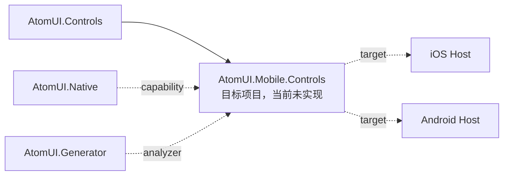

# 项目依赖关系

本文档记录 `AtomUI.slnx` 中项目的主要引用关系。它描述源码维护视角下的依赖方向，不等同于 NuGet 包的最终依赖闭包。

## 当前解决方案项目

`AtomUI.slnx` 当前包含核心库、控件库、图标字体、Gallery 宿主：

- `src/AtomUI.Native`
- `src/AtomUI.Localization`
- `src/AtomUI.Core`
- `src/AtomUI.Controls.Shared`
- `src/AtomUI.Controls`
- `src/AtomUI.Desktop.Controls`
- `src/AtomUI.Desktop.Controls.DataGrid`
- `src/AtomUI.Desktop.Controls.ColorPicker`
- `src/AtomUI.Desktop.Controls.Extras`
- `src/AtomUI.Generator`
- `src/AtomUI.Build.Tasks`
- `src/AtomUI.LanguagePack.Template`
- `src/AtomUI.Icons.Shared`
- `src/AtomUI.Icons.AntDesign`
- `src/AtomUI.Icons.AntDesign.Generator`
- `src/AtomUI.Fonts.AlibabaSans`
- `src/AtomUI.Fonts.AlibabaPuHuiTi`
- `src/AtomUI.Toolkits.GalleryBase`
- `controlgallery/AtomUIGallery`
- `controlgallery/AtomUIGallery.Desktop`
- `controlgallery/AtomUIGallery.Browser`

## 主要项目引用

| 项目 | 直接引用 | 说明 |
|---|---|---|
| `AtomUI.Native` | `Avalonia`, `NWayland` | 内部原生平台能力层；封装 Win32、Objective-C、Xlib/XCB、Wayland protocol 等底层调用 |
| `AtomUI.Localization` | `AtomUI.Generator`, `Avalonia` | BCP 47、Catalog、Snapshot、Manager、Localizer 和 Avalonia 资源桥 |
| `AtomUI.Core` | `AtomUI.Localization`, `AtomUI.Generator` | 框架入口、主题、Token、动画基础设施 |
| `AtomUI.Build.Tasks` | 构建期共享源码、`Microsoft.Build.Framework` | XLIFF 校验、模板导出和静态语言包构建，不进入运行时 |
| `AtomUI.LanguagePack.Template` | 无运行时引用 | `dotnet new atomui-language-pack` 模板包 |
| `AtomUI.Controls.Shared` | `AtomUI.Core`, `AtomUI.Generator` | 控件共享契约和协调器 |
| `AtomUI.Controls` | `AtomUI.Core`, `AtomUI.Controls.Shared`, `AtomUI.Fonts.AlibabaSans`, `AtomUI.Icons.AntDesign`, `AtomUI.Generator` | 公共控件、Primitives、公共主题 |
| `AtomUI.Desktop.Controls` | `AtomUI.Controls`, `AtomUI.Native`, `AtomUI.Generator`, `Avalonia.Desktop`, `Avalonia.Wayland`, `Avalonia.X11` | 桌面主控件包及 AtomUI 的桌面后端选择入口 |
| `AtomUI.Desktop.Controls.DataGrid` | `AtomUI.Desktop.Controls`, `AtomUI.Generator` | 独立 DataGrid 包 |
| `AtomUI.Desktop.Controls.ColorPicker` | `AtomUI.Desktop.Controls`, `AtomUI.Generator`, `Avalonia.Controls.ColorPicker` | 独立 ColorPicker 包 |
| `AtomUI.Desktop.Controls.Extras` | `AtomUI.Desktop.Controls`, `AtomUI.Generator` | Ant Design 之外的稳定补充控件包 |
| `AtomUI.Toolkits.GalleryBase` | `AtomUI.Desktop.Controls`, `AtomUI.Generator` | 产品中立的 Gallery 展示控件、主题和运行时底座 |
| `AtomUI.Icons.AntDesign` | `AtomUI.Core` | Ant Design 图标注册与生成图标 |
| `AtomUI.Icons.AntDesign.Generator` | `AtomUI.Icons.Shared` | 从 SVG 生成 Ant Design 图标源码 |
| `AtomUI.Fonts.*` | `AtomUI.Core` | 字体集合注册 |
| `AtomUIGallery` | `AtomUI.Toolkits.GalleryBase`, `AtomUI.Desktop.Controls`, `AtomUI.Desktop.Controls.DataGrid`, `AtomUI.Desktop.Controls.ColorPicker`, `AtomUI.Generator` | AtomUI 产品示例主体 |
| `AtomUIGallery.Desktop` | `AtomUIGallery` | 桌面宿主 |
| `AtomUIGallery.Browser` | `AtomUIGallery`, `AtomUI.Fonts.AlibabaPuHuiTi` | 浏览器宿主 |

## 内部可见性

多个包通过 `InternalsVisibleTo` 共享内部实现，维护时需要注意这些不是公开 API：

- `AtomUI.Core` 对 `AtomUI.Controls`、`AtomUI.Controls.Shared`、`AtomUI.Desktop.Controls`、DataGrid、ColorPicker、Extras 开放内部成员。
- `AtomUI.Controls` 对 `AtomUI.Desktop.Controls`、DataGrid、ColorPicker、Extras 开放内部成员。
- `AtomUI.Desktop.Controls` 对 DataGrid、ColorPicker、Extras、性能工具开放内部成员。
- `AtomUI.Native` 对 `AtomUI.Desktop.Controls`、未来 `AtomUI.Mobile.Controls` 开放内部成员。

这些关系说明 DataGrid、ColorPicker 和 Extras 虽然是独立包，但它们不是完全隔离的第三方扩展，而是桌面控件体系的同源扩展。

`AtomUI.Native` 是能力层，不是策略层。上层库可以通过 internal API 启用原生能力，但不应把控件行为、
主题策略或平台默认配置下沉到 Native。反过来，P/Invoke、原生结构体、协议对象和可释放 native hook
也不应散落在控件实现里。

## 统一图片加载职责

统一图片加载不新增项目引用；它使用当前的 `AtomUI.Core -> AtomUI.Controls.Shared -> AtomUI.Controls ->
AtomUI.Desktop.Controls` 方向，其中箭头表示“后者引用前者”的源码依赖：

| 项目 | 当前职责 | 不得新增的反向依赖或重复实现 |
| --- | --- | --- |
| `AtomUI.Core` | 通用 `IAtomUIOwnedService` 收集、Application attach/rollback/逆序 dispose | 不引用 Shared，不定义图片 Source、HTTP、cache 或 codec |
| `AtomUI.Controls.Shared` | 完整应用级图片 engine 与 public contracts | 不引用 Controls，不拥有 Avatar/Previewer 视觉策略 |
| `AtomUI.Controls` | `AsyncImage`、`ImageLoadController`、Avatar 统一 API、受限静态 `SvgImageCodec` 注册与 Avalonia SVG bridge | 不建立第二套 transport/cache/scheduler，不让 renderer 自行访问 URL/File |
| `AtomUI.Desktop.Controls` | Previewer item/entry 与 Current/Cover/Preload 策略 | 不保留 Previewer 私有 loader、HttpClient 或全局并发属性 |
| `AtomUIGallery` | 使用 AtomUI `AsyncImage` | 不引用 `AsyncImageLoader.Avalonia` 包或附加属性 |

Shared 通过 Core 已有的 internal visibility 实现 owned-service 契约；Core 始终不知道具体 service 类型。Controls 的 SVG codec
通过显式 Builder 注册进入 Shared registry，不能让 Shared 反向引用 Controls。该系统的目录、启动和生命周期见
[统一图片加载系统](../systems/image-loading/overview.md)与
[管线、并发与生命周期](../systems/image-loading/pipeline-and-lifecycle.md)。

## 已批准 Mobile 目标依赖

以下关系属于 Mobile Foundation 的目标架构，不是当前 `AtomUI.slnx` 项目或当前直接引用：

- `AtomUI.Mobile.Controls` 直接建立在 `AtomUI.Controls` 上，与 `AtomUI.Desktop.Controls` 平行且不依赖 Desktop。
- `AtomUI.Native` 作为正交能力层，仅在 Avalonia 公共 API 无法表达能力时供 Mobile adapter 使用。
- `AtomUI.Generator` 提供构建期静态 descriptor、Theme 和 Localization 注册，不成为运行时发现机制。
- iOS/Android Host 提供生命周期和 adapter；平台宿主不拥有 Control API、Theme 或跨平台状态机。

目标项目加入解决方案后，必须把真实项目引用补入“解决方案项目”和“主要项目引用”；在此之前不得把本节视为当前构建图。
详细包边界见 [Mobile Controls 模块](../../modules/mobile-controls/overview.md)。
