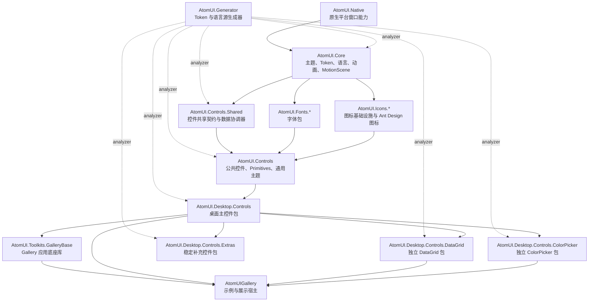

# AtomUI 整体架构

AtomUI 是基于 Avalonia/.NET 的 Ant Design 风格控件库。源码按“基础设施、共享契约、公共控件、桌面控件、可选独立控件包、资源生成器、图标字体资源”组织。

## 架构分层

## 核心运行链路

AtomUI 应用通常分两步接入：

1. 在 `AppBuilder` 上调用 `WithAtomUIDefaultOptions()`，应用平台默认配置。
2. 在 `Application.Initialize()` 内调用 `UseAtomUI(builder => ...)`，注册主题、字体、控件包和可选包。

主题注册链路由 `IThemeManagerBuilder` 收集生成式 Control descriptor、主题 Provider、算法 descriptor、
ControlTheme asset manifest、语言 Provider 和不可变初始 ThemeRequest。构建过程先创建并冻结
ThemeSchemaRegistry、绑定 ThemeCatalog，再同步编译首个 ThemeSnapshot；已经持有有效根 ThemeContext、稳定
ResourceProvider 和全局 TopLevel context style 的唯一 ThemeManager 随后挂载到 Application Styles，并以同一
实例提供 `IThemeManager` 服务。运行期全局与局部主题都经过同一个五阶段事务发布。
完整约束见 [AtomUI 主题系统架构](../modules/core/theme-system.md)。

## 源码包边界

- `AtomUI.Core` 是所有上层项目的基础设施，包含主题、Token、语言、本地资源、动画、MotionScene。
- `AtomUI.Controls.Shared` 不提供完整 UI 控件，主要沉淀跨控件复用的接口、状态、集合视图、异步加载、上传和媒体断点能力。
- `AtomUI.Controls` 提供公共控件和 Primitives，是桌面控件包的基础。
- `AtomUI.Desktop.Controls` 是桌面主包，负责大多数 Ant Design 桌面控件、Popup/Overlay、Window、Browser 兼容主题。
- `AtomUI.Desktop.Controls.DataGrid` 和 `AtomUI.Desktop.Controls.ColorPicker` 是按需引入的独立桌面控件包。
- `AtomUI.Desktop.Controls.Extras` 承载 Ant Design 标准之外、准备作为稳定 API 发布的补充桌面控件。
- `AtomUI.Toolkits.GalleryBase` 是 Gallery 应用底座库，提供产品中立的 ShowCase 控件、Gallery 主题和运行时辅助能力。
- `AtomUI.Generator` 以 Analyzer 方式接入多个项目，生成 Token schema/资源键、Control descriptor、
  ControlTheme asset manifest、稳定 scope identity、语言资源键和语言 Provider 池。

## 横切系统

- 主题与 Token：`ThemeSnapshot` 是唯一 Token 真源；`ThemeManager` 统一提交根/局部事务，稳定
  `ThemeContext` 和 snapshot-backed ResourceProvider 负责作用域资源，源生成器提供 Token schema、Control
  identity、ControlTheme asset manifest 与强类型资源投影。
- 本地化：控件包声明 `LanguageProvider`，源生成器生成 `LanguageProviderPool`，注册时统一交给 `ThemeManager`。
- 平台适配：`RuntimePlatform.Features.SupportsNativeWindow` 决定桌面/浏览器主题 Provider 和部分 Token 注册。
- 控件资源：每个控件通常由 C# 控件类、Token 类、AXAML 主题、主题聚合 Provider 和可选本地化 Provider 构成。
- 边框渲染：控件边框必须遵守 [AtomUI 边框渲染架构](border-rendering.md)，保持 token 设计语义、Avalonia layout rounding 和自绘圆角算法一致。
- 视觉层与覆盖层：跨普通视觉树绘制时必须遵守 [AtomUI 视觉层规范](visual-layer-guidelines.md)，按局部装饰、作用域覆盖、窗口级反馈、Popup overlay 和窗口模板专用层选择宿主。
- AOT 兼容：新增绑定、反射、动态数据、ReactiveUI、source generator 和 NativeAOT 发布相关代码前，应遵守 [AOT 编程规范](../engineering/aot-programming-guidelines.md)。
