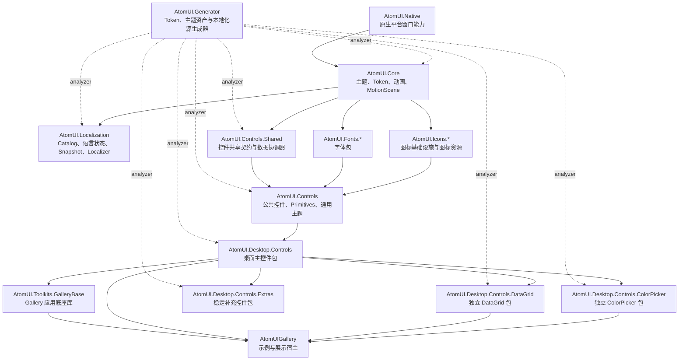
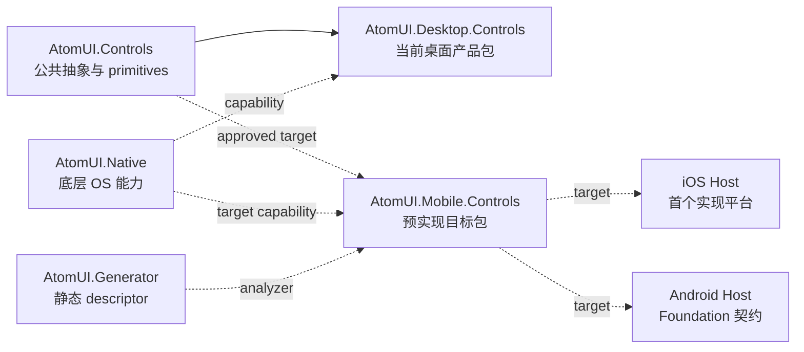

# AtomUI 整体架构

AtomUI 是基于 Avalonia/.NET 的桌面与跨平台控件系统。整体架构按平台能力、运行时基础设施、共享契约、Control 包、
可选扩展包、编译期生成和 Gallery 工具层组织。

## 导航

- [架构基础](foundations/overview.md)：依赖关系、运行平台、启动注册、构建和打包。
- [跨模块系统](systems/overview.md)：主题、本地化、Control 基础设施、渲染和窗口系统的架构入口。
- [字体子系统](systems/typography/overview.md)：字体包注册、字体族回退、字号与行高 Token 派生。
- [Control 基础设施](systems/control-infrastructure/overview.md)：异步加载、过滤与响应式共享契约。
- [渲染系统](systems/rendering/overview.md)：边框渲染与跨 VisualRoot 的视觉层规则。
- [Mobile 系统](systems/mobile/overview.md)：预实现的移动 Runtime、平台能力、Navigation/Overlay、Gesture 和双平台验证契约。

## 当前源码架构

下图只描述当前仓库项目和直接产品关系，不包含尚未创建的 Mobile Controls 或 Mobile Gallery Host。

## 已批准的 Mobile 目标层

> 状态：预实现架构。本文定义已批准的目标契约，不表示当前仓库已经包含或发布 `AtomUI.Mobile.Controls`。

Mobile 与 Desktop 平行，复用稳定基础设施但不依赖 Desktop。iOS 是首个实现平台；Android capability、公共 API 和验证责任
从 Foundation 开始同时存在。

目标依赖、包 ownership 和 Runtime 不变量分别见 [项目依赖关系](foundations/dependency-graph.md)、
[Mobile Controls 模块](../modules/mobile-controls/overview.md)和 [Mobile 系统架构](systems/mobile/overview.md)。

## 核心运行链路

AtomUI 应用通常分两步接入：

1. 在 `AppBuilder` 上调用 `WithAtomUIDefaultOptions()` 应用平台默认配置。
2. 在 `Application.Initialize()` 内调用 `UseAtomUI(builder => ...)` 注册主题、本地化、字体、Control 包和可选包。

根 `IAtomUIBuilder` 组合主题与本地化 Builder。主题链路收集生成式 Control descriptor、主题 Provider、算法
descriptor 和 ControlTheme asset manifest；本地化链路收集 Catalog、编译后 Translation Bundle 与支持语言配置。
启动注册的完整顺序见 [启动与注册链路](foundations/startup-and-registration.md)。

## 源码包边界

- `AtomUI.Native` 提供原生平台窗口能力，不决定上层 Control 和主题策略。
- `AtomUI.Localization` 提供应用级本地化运行时。
- `AtomUI.Core` 提供主题、Token、资源、动画和应用入口基础设施。
- `AtomUI.Controls.Shared` 提供跨 Control 共享契约和数据协调能力。
- `AtomUI.Controls` 提供公共 Control 与 Primitives。
- `AtomUI.Desktop.Controls` 提供桌面主 Control 包、Popup、Overlay 和 Window 能力。
- DataGrid、ColorPicker 和 Extras 是按需引用的独立桌面包。
- `AtomUI.Generator` 以 Analyzer 方式提供静态 descriptor、资源键、注册和本地化输出。
- `AtomUI.Toolkits.GalleryBase` 为 Gallery 应用提供产品中立的工具层。

上述列表是当前源码包。目标 `AtomUI.Mobile.Controls` 在项目实际加入解决方案前只出现在预实现目标层，不作为当前源码包或
发布包列出。

具体项目引用与内部可见性见 [项目依赖关系](foundations/dependency-graph.md)。

## 横切系统

- 主题、Token、Semantic Part 和本地化属于跨模块系统，由 `architecture/systems/` 统一导航。
- 平台差异遵守 [运行平台策略](foundations/runtime-platforms.md)。
- Control 边框遵守 [边框渲染架构](systems/rendering/border-rendering.md)。
- 跨普通视觉树绘制遵守 [视觉层规范](systems/rendering/visual-layers.md)。
- linked publish、Registration Unit、Package fallback 和动态 root 遵守 [AOT 与裁剪架构](foundations/aot-and-trimming.md)；日常 AOT、反射、
  动态数据和生成器规则遵守 [AOT 编程规范](../engineering/development/aot-programming-guidelines.md)。Control Package 的
  Package/Directory 粒度和资源归属遵守
  [AOT Registration Unit 粒度](foundations/aot-registration-unit-granularity.md)；Sidecar、Analyzer 激活和静态计划遵守
  [AOT Linked Registration Pipeline](foundations/aot-linked-registration-pipeline.md)。
