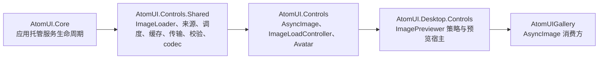

# AtomUI 统一图片加载系统架构

> 状态：当前架构。本文定义仓库中统一图片加载系统的正式契约；源码、Control 文档、Gallery 和测试必须与本目录保持一致。

AtomUI 统一图片加载系统负责把网络、本地文件、Avalonia Asset、Storage、字节、流和调用方已有 `IImage`
投射为具有明确所有权的图片结果，并为 `AsyncImage`、`Avatar`、`ImagePreviewer` 和 Gallery 提供同一套请求、
缓存、取消、安全校验与状态语义。Masonry 仍然只负责布局，不参与图片请求或缓存。

## 设计原则

- 所有 AtomUI 控件只消费 `ImageSource`，不按 URL、Bitmap、Asset、文件和 Stream 分裂公共属性。
- Loader 按 `Application` 隔离，不存在进程级静态 loader、静态可变缓存或控件私有 `HttpClient`。
- `ImageLoadResult` 是解码图片的消费租约；最后一个租约释放后，缓存才可以真正销毁图片。
- 相同来源共享编码数据获取；raster 只在解码尺寸一致时共享，SVG 等尺寸无关 codec 按 codec/security 版本共享矢量结果。
- 每个等待者独立取消；最后一个等待者离开时取消底层操作；应用销毁时取消全部操作。
- 缓存必须同时受字节数和条目数约束，不允许无限持有可释放 Bitmap。
- 网络内容在解码前执行协议、按平台可观测能力的重定向、长度、MIME、Magic Bytes、尺寸、像素数和格式校验；Browser
  不虚构不可观测的中间跳审计。
- 网络和本地 SVG 通过显式注册的 `SvgImageCodec` 进入统一 `Source` API；主文档下载仍只走统一 transport，DTD、script、
  外部资源和超预算内容在 codec 前拒绝。
- 所有 codec、source reader 和应用服务均显式注册，不使用程序集扫描或反射发现，保持 Browser、trimming 和
  NativeAOT 可预测。
- 控件使用 generation 和 per-control cancellation 防止旧请求覆盖新 Source；不使用任意延迟规避滚动加载。
- 统一系统是唯一网络图片入口，不保留旧 Previewer loader、第三方附加属性或 Avatar 多来源兼容 façade。

## 模块职责

| 模块 | 拥有职责 | 明确不拥有 |
| --- | --- | --- |
| `AtomUI.Core` | `IAtomUIOwnedService` 生命周期、Builder 收集、Application 挂载和逆序销毁 | 图片来源、HTTP、缓存、解码和控件状态 |
| `AtomUI.Controls.Shared` | `IImageLoader`、`ImageLoader`、`ImageLoaderStore`、来源模型、请求调度、在途合并、缓存、HTTP、本地读取、raster/SVG 内容安全校验、raster codec | ControlTheme、Avatar fallback、Previewer 当前项策略、SVG Avalonia 渲染桥接 |
| `AtomUI.Controls` | `AsyncImage`、`IImageLoadControl`、`ImageLoadController`、Avatar 来源与 fallback 状态、`SvgImageCodec` 与 Avalonia SVG owned wrapper | Previewer 导航、窗口和 overlay、第二条 SVG 下载通道 |
| `AtomUI.Desktop.Controls` | Previewer item 模型、封面/当前项/邻项预加载策略、桌面预览宿主 | 独立网络栈、独立缓存和独立并发调度器 |
| `AtomUIGallery` | 使用 `AsyncImage` 展示网络图片并绑定公开加载状态 | 第三方图片 loader 或 Gallery 私有下载逻辑 |

## 稳定术语

| 术语 | 含义 |
| --- | --- |
| source key | 如何再次访问来源的规范化身份，包含 partition、variant、请求头摘要和 reader contract，不等同内容身份 |
| source version | 某次来源解析得到的版本证据，例如文件 metadata token、HTTP validator 或调用方 revision |
| content id | 已读取并验证的精确编码字节的 SHA-256 身份；相同字节跨来源复用 |
| decode key | cache partition、content id 和 decode spec 组成的解码结果身份；只有尺寸相关 codec 加入解码尺寸 |
| waiter | 对共享在途操作等待结果的单个调用方，拥有独立 cancellation |
| lease | 控件或直接调用方对解码图片的活动持有；`ImageLoadResult.Dispose()` 释放 |
| fallback | 主 Source 失败后由控件发起的至多一次备用 Source 请求 |
| restricted vector | 通过 AtomUI XML/CSS/资源预算验证并由显式 SVG codec 解析的静态 SVG；无论来源都不能触发外部 I/O |
| cache partition | 把认证用户、租户或业务安全域隔离开的缓存身份组成部分 |

## 已完成的统一边界

| 被替换的分散入口 | 当前统一契约 |
| --- | --- |
| Avatar 使用 `Src`、`BitmapSrc`，Issue 需求提出 `BitmapUrl` | 三者全部由 `Source: ImageSource?` 取代 |
| ImagePreviewer 使用 `IImagePreviewSource`、`Source`、`Sources` 和控件私有 loader/scheduler | 使用 `ItemsSource: IEnumerable<ImagePreviewItem>?`，全部请求进入应用级 loader |
| Gallery Masonry 使用 `AsyncImageLoader.Avalonia` 附加属性 | 使用 AtomUI `AsyncImage` 和 `IsLoading`/`LoadState` |
| Previewer loader 同时识别 Bitmap 和 SVG | raster 由 Shared codec 处理；网络和本地 SVG 由 Controls 显式 `SvgImageCodec` 处理，全部请求复用应用级 loader |

仓库不保留上述旧入口的兼容 shim。后续修改必须原子地同步源码、Control 文档、Gallery API/示例、测试、包引用和 LLMS
输入，不能重新暴露平行来源属性或控件私有加载管线。

## 不属于本系统

- Masonry 的列分配、子项测量和虚拟化。
- 图片编辑、裁剪、滤镜、上传、视频缩略图和动画图片时间轴播放。
- 任意脚本、动态交互 SVG、HTML、非 SVG XML、外部 SVG 资源获取和 SVG 动画时间轴。
- 业务层头像权限、登录状态、Token 刷新和 CDN URL 生成。
- 调用方传入 `IImage` 的销毁；`new BorrowedImageSource(image)` 始终采用 borrowed ownership。

## 文档导航

| 文档 | 所有权 |
| --- | --- |
| [公共契约](public-contracts.md) | Source、Options、Loader、Result、Error、应用配置和 cache maintenance public surface |
| [控件 API](control-apis.md) | AsyncImage、Avatar、ImagePreviewItem、ImagePreviewer 与无兼容删除面 |
| [管线、并发与生命周期](pipeline-and-lifecycle.md) | 目录、owned service、两级 in-flight、调度、取消、generation 和租约 |
| [缓存、HTTP 与内容安全](caching-and-security.md) | memory/file cache、HTTP 重验证、认证分区、重定向和不可信内容限制 |
| [网络 SVG 加载](network-svg.md) | SVG 依赖基线、静态安全子集、XML/CSS 验证、矢量缓存、线程和控件集成 |
| [平台、性能与 AOT 边界](platforms-and-aot.md) | Desktop/Browser 能力、codec、physical-pixel decode、线程与静态注册 |
| [验证与完成门禁](verification.md) | 单元/集成/平台/AOT/泄漏测试和无兼容迁移验收 |

相关模块与启动入口：

- [AtomUI.Controls.Shared 模块](../../../modules/controls-shared/overview.md)
- [AtomUI.Controls 模块](../../../modules/controls/overview.md)
- [启动与注册链路](../../foundations/startup-and-registration.md)
