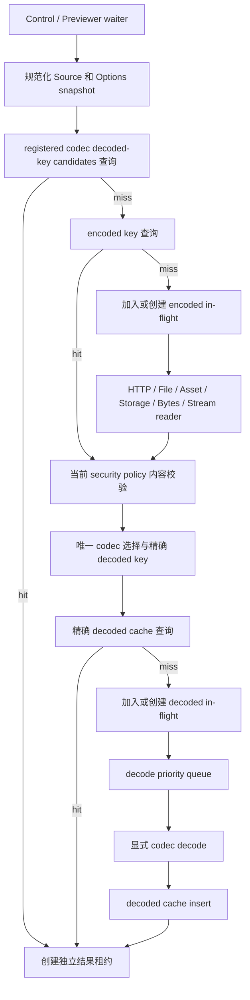

# 图片加载管线、并发与生命周期

> 状态：当前架构。本文定义统一图片加载实现的执行与所有权模型。

## 目录与类型所有权

图片引擎全部放在 `AtomUI.Controls.Shared` 的单层 `ImageLoading/` 目录。`internal` 访问级别仍用于隐藏实现细节，
但不再用 `Internal/` 目录表达访问级别，也不创建 `Application/` 或含义过泛的 `Runtime/` 目录。

```text
src/AtomUI.Controls.Shared/ImageLoading/
├── ImageLoader.cs
├── ImageLoaderStore.cs
├── ImageLoadingOptions.cs
├── ImageLoadingOptionsBuilder.cs
├── SvgImageLoadingOptions.cs
├── SvgImageLoadingOptionsBuilder.cs
├── ImageLoadingBuilderExtensions.cs
├── IImageLoader.cs
├── ImageLoadSource.cs
├── ImageLoadSourceConverter.cs
├── ImageRequestOptions.cs
├── ImageLoadRequest.cs
├── ImageLoadResult.cs
├── ImageLoadError.cs
├── ImageLoadProgress.cs
├── ImageLoadTimingTracker.cs
├── ImageLoadingEnums.cs
├── ImageCacheClearRequest.cs
├── ImageLoaderSnapshot.cs
├── ImageLoaderEventArgs.cs
├── ImageCacheKey.cs
├── ImageRequestScheduler.cs
├── ImageRequestCoordinator.cs
├── ImageLoaderPipeline.cs
├── ImageEncodedCache.cs
├── ImageDecodedCache.cs
├── ImageFileCache.cs
├── ImageFileCacheMetadata.cs
├── ImageEncodedContent.cs
├── ImageDecodedCacheEntry.cs
├── ImageResultLease.cs
├── CallbackProgress.cs
├── HttpImageTransport.cs
├── HttpImageSourceReader.cs
├── ImageContentValidator.cs
├── SvgContentValidator.cs
├── SvgContentMetadata.cs
├── SvgCssReferenceValidator.cs
├── SvgDataImageValidator.cs
├── ImageSecurityPolicy.cs
├── ImageSourceReader.cs
├── FileImageSourceReader.cs
├── AssetImageSourceReader.cs
├── StorageFileImageSourceReader.cs
├── BytesImageSourceReader.cs
├── StreamImageSourceReader.cs
├── BorrowedImageSourceReader.cs
├── ImageCodec.cs
└── RasterImageCodec.cs
```

当单个实现需要 partial class 时仍保持同目录、按职责命名文件；不得重新引入 `ApplicationImageLoader`、
`ApplicationImageLoaderStore`、`ImageLoadingRuntime` 或 `Internal/ImageLoaderPipeline` 等变体。

`AtomUI.Controls/ImageLoading/` 拥有 `AsyncImage`、`ImageLoadController`、`SvgImageCodec` 和 UI-thread-owned SVG wrapper；
Avatar 复用同一个
controller。`AtomUI.Desktop.Controls/ImagePreviewer/` 只保留预览 item/entry、导航和优先级策略，不复制 Shared
中的 scheduler、transport、cache 或 codec。

可见性边界固定为：`IImageLoader`、Source/Options/Request/Result/Error/Progress、cache-clear request 和 Builder 配置是
public contract；`ImageLoader`、`ImageLoaderStore`、pipeline、coordinator、scheduler、cache、transport、reader registry 与
内置 codec implementation 都是 internal。应用通过 interface 和 Builder 工作，不能 new `ImageLoader` 或直接操作 store。

## 应用托管服务

`AtomUI.Core` 增加通用的内部 `IAtomUIOwnedService` 生命周期和 Builder 收集能力。Core 不引用图片类型；Shared 通过
Core 对 `AtomUI.Controls.Shared` 的 internal 可见边界注册 `ImageLoader` factory。

启动顺序是：

1. `UseAtomUI()` 创建根 Builder，用户和包入口收集配置、owned-service factory、Theme 与 Localization 描述。
2. configure callback 返回后冻结并验证图片配置；同一应用只构建一个 `ImageLoader`。
3. Core 构建 Localization、Theme 和 owned services，并把它们交给 `ApplicationScope`。
4. Runtime 先挂载现有资源与 Theme，再按注册顺序 attach owned services；任一步失败时只回滚已经成功的步骤。
5. `ImageLoader.Attach(application)` 只通过 `ImageLoaderStore.Attach()` 发布应用到 loader 的映射。
6. Runtime 销毁时先阻止新服务查询，再按 attach 的逆序 detach/dispose owned services，最后销毁 Theme 与
   Localization；启动失败走同一逆序清理。

`ImageLoaderStore` 只允许 `Attach(Application, ImageLoader)`、`Get(Application)` 和
`Detach(Application, ImageLoader)` 三类操作。它使用 application-keyed weak storage，不创建默认 loader、不持有配置、
不处理请求，也不订阅 Visual 生命周期。重复 attach、错误实例 detach 和已销毁 loader 查询必须有确定行为并由测试覆盖。

`Application.GetImageLoader()` 在未注册时抛出包含接入指引的 `InvalidOperationException`；
`TryGetImageLoader()` 返回 `null`。控件 attach 到 VisualTree 后通过 Avalonia 当前 `Application` 实例查询
application-keyed store；静态入口只用于取得 Application，不保存 loader。不能从 `AvaloniaLocator`、进程静态 loader 字段或
任意首个窗口推断。

`ApplicationScope` 是 loader 的唯一 owner。控件、Previewer、Gallery 和调用方只能释放自己的 `ImageLoadResult`，不能 dispose
loader。Runtime 先调用 service detach，使 `ImageLoaderStore` 立即停止发布该 loader，再调用 dispose。Loader dispose 的顺序
固定为：拒绝新请求、取消 root cancellation、使所有在途完成路径只执行资源释放、清空 coordinator、驱逐并释放缓存、关闭
owned transport/file-cache 资源。没有在途工作时 Dispose 保持同步完成；如果 UI 线程上仍有在途工作，则只执行拒绝新请求和取消 root token，
把剩余管线 drain 转移到后台，不能同步等待 dispatcher、网络或解码 worker。取消 token source、HTTP response、stream
和图片释放不得在持有 coordinator/cache lock 时执行。

## 注册语义

`UseImageLoading()` 由 Shared 提供，`UseCommonControls()` 调用它；Controls 随后把统一 `SvgImageCodec` 添加到同一个图片
Builder。codec 只处理已经由 Shared 通过当前 security policy 验证的静态 SVG，不按 source kind 建立 Asset/HTTP 两套实现。
`UseDesktopControls()` 先调用 `UseCommonControls()`，所以 Desktop 和
Gallery 自然得到同一个应用 loader。

重复注册是同一个构建期 accumulator 的幂等合并，不是多个 singleton：

- 默认调用只补缺省值，不覆盖用户显式配置。
- scalar 显式配置按 configure callback 顺序取最后值，并在冻结时统一校验。
- 内置 source reader 由 pipeline 按 `ImageLoadSourceKind` 静态构造，每个 kind 必须恰好一个；重复或缺失立即失败。
- codec 以稳定 Id 和 Version 去重；Id 相同但实现类型或版本不同立即失败。
- 每个 source kind 必须恰好有一个 reader；每个受支持格式必须有唯一最高匹配 codec，不允许依赖注册顺序碰运气。
- Loader 构建完成后 registry 不可变，不支持运行时插件发现或程序集扫描。

## 请求管线



管线阶段固定为：

1. 对 `ImageLoadSource` 和 `ImageRequestOptions` 做不可变快照、协议校验和身份规范化。
2. 计算 source identity 和 encoded key；registry 为每个显式 codec 生成确定的 decoded-key candidate，先查询 decoded memory。
3. candidate 全部 miss 时加入 encoded in-flight；encoded memory/file 命中和新读取内容都按当前 security policy 验证。
4. encoded miss 时由 source reader 获取拥有明确所有权的编码流或 borrowed image；只有验证成功的 encoded content 可以写缓存。
5. 执行长度、MIME、Magic Bytes、raster header 或 SVG XML/CSS/资源预算、维度、像素和估算解码字节校验。
6. 选择唯一 codec 并生成精确 decoded key；再次查询 decoded cache，miss 时才加入 decoded in-flight 和 decode scheduler。
7. codec 生成 decoded entry；pipeline 在接收 scheduler 结果时先建立 operation reference，随后才检查取消并尝试写 cache；任一
   提交异常都释放该引用。cache hit 在 cache lock 内原子建立 result lease 或 operation reference，成功后再把所有权交给 waiter。
8. 调用方在 UI dispatcher 校验 generation 后提交结果；过期结果立即释放。

`ImageLoaderPipeline` 编排阶段，`ImageRequestCoordinator` 拥有两级 in-flight map 和 waiter，
`ImageRequestScheduler` 拥有 HTTP 下载、本地读取与解码三个独立并发池。慢网络不能占用 Asset/File/Storage/Bytes/Stream
的本地读取槽位；本地读取仍使用独立的有界队列，不能退化为无限并发。Cache 不启动任务，transport 不写 decoded cache，codec 不做
HTTP 或控件状态提交，职责不能重新揉进 `ImageLoader` 巨型类。

## 身份与键

source identity 不包含目标解码尺寸：

- HTTP：scheme/host 小写、IDN 规范化、移除默认端口和 fragment、解析 dot segment；保留 path/query 的语义顺序，
  禁止 URI user-info。
- File：转换为绝对规范路径，使用平台正确的大小写 comparer；不把相对路径当前目录变化带入 key。
- Asset：只接受规范绝对 `avares` URI。
- StorageFile：优先使用显式 `cacheKey + version`；缺失时只在当前对象和应用生命周期内共享，不进入持久缓存。
- Bytes/Stream：有显式 `cacheKey + version` 才跨请求缓存；否则使用实例身份，只允许本次/同实例合并。
- Image：使用对象身份，始终 borrowed，不进入可释放 decoded cache 或持久缓存。

encoded key 由 source identity、`Variant`、`CachePartition`、影响响应内容的请求 header 摘要和 source-reader contract 版本组成。
header 原值不进入 key 的可打印形式。decoded key 在 encoded key 上增加 codec Id/版本、security policy version 和
codec-specific options。raster codec 的 options 包含物理像素尺寸桶；`SvgImageCodec` 是尺寸无关 codec，不把目标尺寸加入 key。
因此不同控件可共享一次下载，64 px Avatar 和原图 Previewer 不会共享错误尺寸的 Bitmap，但同一静态 SVG 可以共享一个矢量
decoded entry。

## 两级在途合并与取消

下载/读取和解码必须分别合并：

- 相同 encoded key 共享编码获取，即使调用方请求不同尺寸。
- 相同 decoded key 共享同一次解码；raster 不同尺寸建立不同 decoded operation，SVG 不因显示尺寸不同重复构建矢量模型。
- cache mode、partition、variant 或内容相关 header 不同的请求不得合并。
- `Reload` 不加入普通缓存读取 operation；兼容的同时 Reload 请求可以彼此合并，但不能把普通 waiter 静默升级为 Reload。
- `NoStore` 可以在同一时刻合并完全相同请求以节省工作，但完成后不写 memory/file cache；无 partition 的认证请求是例外，
  每个请求独立执行。

每个 waiter 有独立 cancellation registration 和 completion source。取消一个 waiter 只移除该 waiter；共享 operation 仍有其他
waiter 时继续。最后一个 waiter 离开后，coordinator 在 lock 内标记 operation 结束并取出底层 CTS，在 lock 外调用
`Cancel()`/`Dispose()`。完成、取消和新 waiter 加入的竞态必须保证一个 waiter 至多完成一次、operation 至多从 map 移除一次。

timeout 也是 waiter-local cancellation，计时从请求接纳而非取得 scheduler slot 开始。底层 operation 不使用最短 waiter timeout
作为共享 deadline；只有 root Application cancellation、transport 自身不可恢复失败或最后 waiter 离开才结束共享工作。

底层操作成功但 waiter 已取消时，不把结果交给该 waiter；若结果已经进入 cache，cache ownership 保持有效。底层操作失败只向
仍在等待的 waiter 发布失败结果，不负缓存错误，也不进行隐式无限重试。

## 调度与优先级

HTTP 下载池、本地读取池和 decode 池各自限制并发，排队项共享以下优先级。`MaxConcurrentDownloads` 只约束 HTTP，
本地 source 不得因远程请求超时、限流或连接失败而发生队首阻塞：

| 场景 | 优先级 |
| --- | --- |
| Previewer 当前完整图片 | `Critical` |
| Previewer cover / 当前缩略图 | `High` |
| 首屏显式高优先级 `AsyncImage` | `High` |
| 普通 `AsyncImage`、Avatar | `Normal` |
| Previewer 邻项和非关键预取 | `Preload` |

优先级只影响尚未开始的工作，不强杀正在进行的共享下载。队列在同优先级内 FIFO，并通过等待时间 aging 防止 Normal/Low
长期饥饿；`Preload` 只在高层级队列为空时启动。Previewer 当前项变化后立即取消离开预加载窗口且无其他 waiter 的任务，再以
Current、Cover、距离当前项从近到远的顺序提交。不得用控件私有 `MaxConcurrentLoads` 绕过应用全局预算。

共享 operation 的有效优先级等于所有 active waiter 中的最高优先级。Preload operation 尚在队列时如果被 Current waiter
复用，scheduler 必须原位提升为 Critical；高优先级 waiter 取消后可以在未启动时降回剩余 waiter 的最高级。运行中的 operation
不因优先级变化重启。

## 控件 generation 与租约

`ImageLoadController` 是 `AsyncImage` 和 Avatar 的单请求状态 owner：

1. Source、FallbackSource、请求选项、有效像素尺寸或 attach 状态变化时递增 generation；启动 generation 时在 UI dispatcher
   一次性快照需要读取的 Avalonia 属性，后台路径不再访问控件对象。
2. 取消上一 generation waiter；来源身份变化时立即释放并清空旧租约。
3. 同一来源只因尺寸桶变化或 `Reload()` 重新加载时，可以保留旧图片显示，直到新结果原子替换；状态仍进入 Loading。
4. 主 Source 终态失败且配置 FallbackSource 时，在同一 generation 内只尝试一次 fallback；调用方取消不触发 fallback。
5. 结果返回后切到 UI dispatcher，再次检查 attach、generation、source identity；不匹配时释放结果并退出。
6. 提交成功时先保存新租约和状态，再释放旧租约，避免 cache entry 在 visual 切换中提前销毁。
7. detach、Source 清空或控件释放时取消 waiter 并释放租约；重新 attach 后按当前 Source 重新请求。

同来源替换最终失败时释放暂存旧租约并提交 Failed；暂存只优化 Loading 过渡，不改变终态语义。主 Source 与
FallbackSource 的规范化身份相同则不发起第二次相同请求。

Previewer 的 `ImagePreviewEntry` 对每个不可变 `ImagePreviewItem` 持有独立 generation、缩略图/完整图租约和状态。集合增删、
CurrentIndex 切换与 host 关闭只操作 entry；配置 item 不订阅 loader、也不持有可释放图片。

任意“等待布局稳定”的固定延迟，包括旧瀑布流场景的 10 ms workaround，都不属于当前实现。Auto decode 由有效 Bounds、
render scaling 和尺寸桶驱动；无有效尺寸时等待一次真实 Arrange/attach 信号，不用 timer 猜测。
