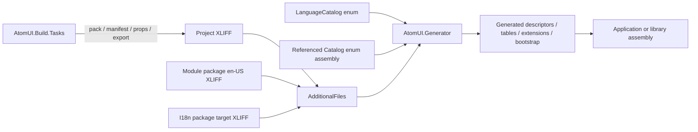

# 本地化生成与构建架构

本文定义 `AtomUI.Generator`、`AtomUI.Build.Tasks` 和 MSBuild targets 如何把 Catalog/XLIFF 转换为 AOT 友好的
运行时代码。运行时设计见 [runtime.md](runtime.md)，语言包协议见
[language-packs.md](language-packs.md)。

## 构建链总览



MSBuild 负责发现文件、项目引用桥接、AdditionalFiles metadata 投影以及 pack/export 副作用；Generator 负责
编译项目中的输入规范化、Catalog/module 绑定、active/dormant 分类、Catalog/Bundle 语义校验和强类型代码生成。
静态语言包项目不生成运行时代码，因此仍由 `PrepareLanguagePackageTask` 在 pack 前完整校验。两条路径共享中立的
XLIFF 解析与文件级校验模型，但普通应用和模块编译不再运行重复的 MSBuild XLIFF 语义校验 Task。

## MSBuild items

`AtomUI.Localization.targets` 自动收集标准目录中的 XLIFF，并排除 `bin/`、`obj/` 和生成目录：

```xml
<AtomUILanguage Include="**/Localization/**/*.xlf" />
<AtomUILanguageOverride Include="Localization/Overrides/**/*.xlf" />
```

targets 将这些 item 作为带元数据的 `AdditionalFiles` 传给 Generator。来源类型、source identity、module ID 和
契约校验级别必须保存在 item metadata 中；`Verified` 输入另外携带 ContractVersion，`Deferred` 输入在 active 后从
实际 Catalog 绑定 ContractVersion。Generator 不从磁盘路径或 NuGet 包名猜测优先级或身份。

普通模块项目使用项目属性 `AtomUILanguageContractVersion` 作为自动发现内置 XLIFF 的默认 metadata，属性默认值为
`1`。一个项目内 Catalog 版本一致时，应把该属性设置为 enum 上的 `ContractVersion`；存在不同版本的 Catalog
时，必须通过 `AtomUILanguage Update="..."` 为对应文件显式覆盖 metadata。该值只是 MSBuild 和 NuGet 的契约
传输副本，Generator 仍会与 Roslyn Catalog symbol 校验，不构成独立身份来源。

静态语言包项目不使用默认值伪造目标 Catalog 的 ContractVersion。targets 自动扫描目标 XLIFF，并以项目级
`AtomUILanguageModuleId` 作为唯一必需归属声明：

- 如果作者期组件引用提供了该 module 的权威 `ModuleBuiltIn` `en-US` assets，Build Tasks 按 XLIFF `file id` 绑定
  Catalog，补全 ContractVersion、package path 和 source fingerprint，并把资产标记为 `Verified`。
- 如果该 module 完全没有权威源 assets，Build Tasks 只从目标 XLIFF 计算 package path 和 source fingerprint，把
  资产标记为 `Deferred`，不填充或猜测 ContractVersion，并输出一次 `ATOMUILOC010` warning。
- 如果已经存在部分权威源 assets，则所有目标 Catalog 必须完整匹配；缺失或未知 Catalog 是 Error，不能逐文件退回
  `Deferred`。

`AtomUIRequireVerifiedLanguageContract=true` 要求所有静态语言包资产为 `Verified`。AtomUI 官方模块语言包必须设置
该属性；第三方社区包默认允许 `Deferred`。

第三方语言包的 `buildTransitive/*.props` 只能追加声明式 item，不能运行初始化代码、修改应用源码或注册运行时
程序集。MSBuild item 层只排除相同文件的重复 Include；不同路径或不同包提供相同 Catalog/语言时，由 Generator
根据 source identity 报告同优先级冲突，不执行按 package identity 合并。

仓库内应用若需要直接消费源码语言包项目，使用显式的 `AtomUILanguagePackProjectReference` item，而不是复制语言包
目录或把 I18n 项目作为运行时 `ProjectReference`：

```xml
<AtomUILanguagePackProjectReference
    Include="../../src/LanguagePacks/pt-BR/AtomUI.Controls.I18n.PtBR/AtomUI.Controls.I18n.PtBR.csproj" />
```

语言包项目通过 `AtomUIGetLanguagePackProjectAssets` target 返回当前可用的权威 `en-US` Catalog 源文件和经过
`PrepareLanguagePackageAssetsTask` 校验并标记契约模式的目标语言文件。该轻量 Task 不扫描最终 NuGet 内容、
不写 manifest，也不生成 props；它只为源码项目引用准备 Generator 所需的编译期资产。消费项目的
`AtomUIResolveLanguagePackProjectReferences` target 在 `GenerateMSBuildEditorConfigFileShouldRun` 和 `CoreCompile` 之前调用
这些项目 target，并把 Generator 所需的 `StaticLanguagePack` source kind、source identity、module ID、
`AtomUILanguageContractValidation` 和 source fingerprint 投影到 `AdditionalFiles`；`Verified` 返回项另外投影
ContractVersion。规范化 package path 只属于语言包 pack、manifest 和审计模型，不是 Generator 输入或 Catalog identity。
该协议只提供编译期输入，不复制 XLIFF、不产生运行时 DLL，也不改变聚合包的 NuGet 依赖图。

`AtomUILanguagePackProjectReference` 不跨普通 `ProjectReference` 传递。源码仓库中的最终应用宿主必须直接声明语言包
项目引用，并直接以 Analyzer 方式引用 `AtomUI.Generator`；具体 `Application` 类型必须是可生成 partial 实现的
`partial` 类型。只有这样最终应用 Generator 才能把外部 Translation Bundle 写入
`IGeneratedApplicationLanguageBootstrap`。把语言包项目引用放在应用类库、Shell 类库或控件类库中，不能替代最终
Desktop、Browser、测试宿主的声明。

产品级聚合语言包不追加 `AtomUILanguage` item。它只通过 NuGet 依赖传递模块语言包，因而同一模块包无论由聚合包
还是应用显式引用，都只产生一组 `buildTransitive` 输入。

## Generator 输入

Generator 使用 Incremental Generator API 组合以下输入：

1. 当前 Compilation 中带 `[LanguageCatalog]` 的 enum symbol。
2. 当前项目 XLIFF `AdditionalText`。
3. 引用项目或 NuGet 程序集中的 `[LanguageCatalog]` enum symbol，以及模块主包携带的权威 `en-US` XLIFF。
4. 静态 I18n 包和应用 Override 提供的目标 XLIFF。
5. AnalyzerConfigOptions 提供的 `AtomUILanguageModuleId`、`PackageId`、`AssemblyName` 和 Generator 无法从 symbol
   推断的最小 source metadata。

输入必须按规范化 Catalog ID、语言标签、来源优先级和 unit Key 排序，确保不同操作系统、文件枚举顺序和增量
构建下生成结果一致。

## Generator 内部架构

`src/AtomUI.Generator/Localization` 只使用三层物理结构。目录表达稳定领域边界，不为每个流水线阶段建立
`Pipeline/`、`Model/`、`Symbols/` 或 `Semantics/` 子目录：

```text
Localization/
├── LocalizationGenerator.cs             # 注册 Incremental Generator 输入
├── LocalizationPipeline.cs              # 只编排阶段
├── LocalizationGenerationResult.cs      # 整体编译计划与诊断
├── LocalizationDiagnosticFactory.cs     # 共享诊断到 Roslyn Diagnostic 的适配
├── LocalizationSourceEmitter.cs         # 唯一源码输出入口
├── *SourceWriter.cs                      # 纯输出组件
├── Catalog/                              # Catalog symbol、索引、规划、语义和 Bundle 编译
└── Xliff/                                # AdditionalFiles 解析、metadata 校验和 typed 输入
```

核心模型使用结构化 `CatalogKey(ModuleId, FileId)`，不得使用拼接字符串作为字典 identity。`CatalogSymbolIndex`
在一次 Generator compilation 中建立一次当前及引用 module/Catalog 索引；Catalog 语义校验器只消费规范化
`CatalogDefinition`，不直接扫描 Roslyn `Compilation`。

Generator 流水线固定为：

1. 解析 AdditionalText XLIFF，保留源文件位置。
2. 校验所有输入都必须满足的语言标签、metadata、ContractVersion/fingerprint 形态和当前文件 fingerprint。
3. 统一解析当前和引用 Catalog symbol，建立 `CatalogSymbolIndex`。
4. 保留 `Verified`/`Deferred` 契约模式，并独立分类 `Active`/`Dormant` 激活状态。
5. 按 `CatalogKey` 建立工作集并选择唯一权威 `en-US` 源契约。
6. 校验来源冲突、unit、source、placeholder、状态、ContractVersion 和权威 fingerprint。
7. 将已验证 unit 编译为 ordinal slot 数组和不可变 `LocalizationCompilationPlan`。
8. `LocalizationSourceEmitter` 调用 Catalog、module 和 application Writer 生成确定性源码。

`LocalizationPipeline` 只能协调这些阶段，不能重新实现具体规则。`CatalogSemanticValidator` 可以在同一文件中用聚焦
方法或内部策略组织规则；只有形成独立复用边界时才增加新 `.cs` 文件。Writer 的唯一输入是验证后的
`LocalizationCompilationPlan`，不得重新查找 Catalog、判断 dormant 或解决 Bundle 冲突。

### 静态语言包激活

Generator 在解析 `StaticLanguagePack` 的 Catalog 前建立当前项目和引用程序集的 Language Module/Catalog 索引。
目标 module 存在且 XLIFF `file id` 能绑定该 module 中唯一 Catalog 时，静态输入为 active，并执行全部严格校验。
module 存在但 Catalog 缺失、Catalog 属于其他 module 或 module identity 冲突都属于 Error，不得退回 dormant。

Generator 必须先解析并校验 XLIFF 2.1 结构、语言标签、校验级别、module ID 和 source fingerprint。
`Verified` 还必须携带正数 ContractVersion；`Deferred` 不允许携带构建系统没有绑定过的伪 ContractVersion。基础输入
有效后，如果 module ID 不存在，该静态输入为 dormant。dormant 输入不进入 Catalog 深层校验、冲突检测、覆盖计算
或生成源码，因此聚合语言包不会要求应用安装所有组件。fingerprint metadata 的存在、64 位小写 SHA-256 格式及其与
当前目标 XLIFF source 内容的一致性仍必须通过；只有它与尚不可见权威 `en-US` fingerprint 的比较延迟到 active。
激活判断必须只依赖 Roslyn symbol 和显式 assembly metadata，不扫描程序集、不读取 NuGet 目录，也不从包名或文件
路径猜测模块。

当 module active 时，`Deferred` 输入按 `file id` 解析唯一 Catalog symbol，并从该 symbol 和模块权威 `en-US` 输入
绑定实际 ContractVersion，再执行与 `Verified` 相同的 Catalog、unit、source、占位符、fingerprint 和完整覆盖校验。
无法唯一解析、模块存在但 Catalog 缺失或源契约不一致时必须报错。延迟的是校验阶段，不是最终应用的校验强度。

ModuleBuiltIn、项目本地 XLIFF 和 ApplicationOverride 不允许 dormant。模块存在但文件 ID、module ID、
ContractVersion 或权威 `en-US` 不匹配时仍产生原有诊断。这样可以跳过真正未安装的模块，同时保留对已安装模块和
损坏包的强校验。

## Generator 输出

对于每个 Catalog，Generator 生成：

```text
XxxLangResourceExtension
独立的 LanguageCatalog registration source
LanguageCatalogDescriptor 与 catalog/unit slot mapping
内置 TranslationBundleDescriptor
编译后的 string 与 CompositeFormat 契约表
```

对于每个 Language Module，Generator 生成：

```text
GeneratedLanguageModuleRegistration
程序集 AtomUILanguageModuleId metadata
```

对于最终应用，Generator 另外生成：

```text
GeneratedApplicationLanguageBootstrap
I18n package TranslationBundle registration
application Override registration
```

`XxxLangResourceKind` 由开发者声明，不再根据三份 C# 翻译类推导。enum 成员名是 Catalog 的唯一 Key，成员不声明
显式数字值；`XxxLangResourceExtension` 保留现有 XAML 形态，但底层改为生成式 descriptor 和 Snapshot 查询。

每个 Catalog 的 descriptor 和内置 Bundle 必须输出到按 Catalog metadata identity 命名的独立 source；模块注册文件
只按 Catalog ID 排序调用这些 registration。这样修改一个 XLIFF 只改变对应 Catalog source，其他 Catalog、模块聚合
注册和不含该外部 Bundle 的应用 bootstrap 保持字节稳定。Generator 的增量测试必须同时验证输入 step 的
`Modified`/`Cached` 状态和最终 source diff，不能只比较一次全量生成结果。

## 应用 bootstrap

当项目存在本地化输入时，Generator 为唯一的具体、顶层、非泛型 `partial` Avalonia `Application` 类型实现一个
受控的生成式 host 契约。抽象 Application 基类不参与唯一性判断；没有 Application 的类库仍只生成模块注册，
不生成应用 bootstrap，也不回退到程序集扫描。`UseAtomUI()` 只做接口判断和直接调用：

```text
Application
  -> generated application module
  -> application Catalogs
  -> language-pack bundles
  -> application overrides
```

这不是程序集扫描：具体 Application 类型、生成类型和调用目标都在编译期可见。应用包含本地化输入但
Application 类型不可扩展时，Generator 必须产生诊断，不能回退到 `Assembly.GetTypes()`。

类库/控件包生成自己的 `GeneratedLanguageModuleRegistration`。包级 `UseXxx()` 入口调用生成注册代码，将该模块的
Catalog 和内置翻译交给 `ILocalizationBuilder`；开发者不手写 descriptor、Catalog ID 或 Provider 列表。打包时
`AtomUIPrepareLanguageModuleAssets` 自动把完整 `en-US` XLIFF 与 `<PackageId>.props` 放入主包，使最终应用可以用
引用程序集的 Catalog enum 校验外部翻译。

语言包没有程序集，其 Translation Bundle 由最终应用 Generator 生成。Bundle 可以早于或晚于目标 Language Module
进入 Builder，Registry 构建阶段统一关联，注册顺序不构成覆盖规则。

dormant 静态输入不生成 Translation Bundle。应用以后增加相应组件引用时，Incremental Generator 将其重新分类为
active，并在同一次编译中完成校验和生成；不需要新增运行时加载 API 或修改应用语言配置。

## AOT 约束

生成代码必须直接包含：

- Catalog enum CLR 类型和生成式 Catalog ID。
- enum member 到 unit slot 的静态 switch，以及 slot 对应的规范 Key 表。
- 每个语言的编译后字符串数组。
- 格式化资源的预验证 `CompositeFormat` 数据或等价静态构造路径。
- Language Module 和应用 bootstrap 的直接注册调用。

正常路径禁止：

- `Assembly.GetTypes()`、`Type.GetFields()`、`Enum.GetNames()`。
- `Enum.GetName()` 或 enum `ToString()` 参与资源 Key 解析。
- 通过 Attribute 反射发现 Catalog。
- `Activator.CreateInstance()` 创建 Provider 或 Markup Extension 注册项。
- 运行时 XML/XLIFF 解析、路径 glob 或 NuGet 包探测。
- 依赖字符串类型名构造资源键。

## AtomUI.Build.Tasks

物理项目位于：

```text
src/AtomUI.Build.Tasks
```

它是内部编译型 MSBuild Task 程序集，不作为应用运行时引用，也不单独发布
`AtomUI.Build.Tasks.LocalizationBuild`。主要 Task 为：

| Task | 职责 |
|---|---|
| `ExportLanguageTemplatesTask` | 按目标语言导出/更新可翻译 XLIFF 模板 |
| `PrepareLanguagePackageAssetsTask` | 为源码项目引用消费准备静态语言包资产，执行 final 状态、Verified/Deferred、fingerprint 和契约绑定校验，但不写 manifest 或扫描 NuGet 内容 |
| `PrepareLanguagePackageTask` | 完整校验静态语言包 XLIFF、单一 module/目标语言和包内容，绑定可用源契约，确定 `Verified`/`Deferred`，生成审计 XML manifest 和 contentFiles 清单 |
| `GenerateLanguagePackagePropsTask` | 为模块主包或静态语言包生成带契约校验级别的声明式 buildTransitive props |

Task 内部协作组件包括：

```text
src/AtomUI.Build.Tasks/LocalizationBuild/
Xliff21Parser
Xliff21Writer
XliffMergeEngine
LanguageFileValidation
LanguagePackageManifestWriter
PackagePropsWriter
```

Generator 与 Build Tasks 对 XLIFF 使用同一规范化模型、fingerprint 和文件级中立诊断。这些共享源码由
`AtomUI.Build.Tasks` 物理拥有，使用 `AtomUI.Build.Tasks.LocalizationBuild` 命名空间，并以源码链接方式编译进
Generator；共享模型不依赖 Roslyn `Diagnostic` 或 MSBuild
`BuildEngine`。Generator 通过 `LocalizationDiagnosticFactory` 映射源位置和诊断描述符，Build Tasks 映射为
MSBuild error/warning。该目录不增加公开运行时包，也不让 MSBuild Task 依赖 Roslyn workspace。

普通应用和模块资源由 Generator 固定要求 publishable `translated`、`reviewed` 或 `final` target。静态语言包的
项目引用消费路径由 `PrepareLanguagePackageAssetsTask` 固定要求 `final`，pack 路径由
`PrepareLanguagePackageTask` 固定要求 `final`，都不暴露可降低要求的 MSBuild 属性。状态顺序为
`initial < translated < reviewed < final`，任何 `needs-review` subState 均不能满足语言包发布门禁。
两个 Prepare task 在完全缺少作者期源契约时报告一次 `ATOMUILOC010` 并生成 `Deferred` 资产；如果
`AtomUIRequireVerifiedLanguageContract=true`，相同情况升级为 Error。

## Generator NuGet 布局

```text
AtomUI.Generator.nupkg
├── analyzers/dotnet/cs/AtomUI.Generator.dll
├── tools/netstandard2.0/AtomUI.Build.Tasks.dll
└── buildTransitive/
    ├── AtomUI.Generator.props
    ├── AtomUI.Generator.targets
    ├── AtomUI.Localization.props
    ├── AtomUI.Localization.targets
    └── AtomUI.ThemeAssets.targets
```

`AtomUI.Build.Tasks` 的依赖必须随 tools 目录完整发布。Generator 项目继续隔离 `PublishAot`、trim、single-file 和
RuntimeIdentifier 等全局发布属性，不能被最终应用当作运行时项目参与 NativeAOT publish。

`AtomUI.Localization.targets` 在 NuGet `_GetPackageFiles` 收集之前准备模块/语言包资产，保证动态加入的 XLIFF、
manifest 和 props 真正进入 `PackTask`。普通应用和模块编译时，targets 只做文件发现、AdditionalFiles metadata
投影和源码项目引用桥接；输入语义由 Generator 校验。静态语言包项目设置 `AtomUIBuildLanguagePackage=true` 后只由
Build Tasks 校验和打包；它自身不运行 Localization Generator 生成 Catalog 或运行时注册。相同 XLIFF 进入消费应用后
才由 Generator 编译为静态字符串表。

纯聚合语言包是单独的普通 pack 项目：`IncludeBuildOutput=false`，不设置 `AtomUIBuildLanguagePackage`，不调用上述
任务。源码项目中的模块语言包 `ProjectReference` 只作为仓库构建顺序边；.NET SDK pack 会把普通项目引用版本写成
最低版本范围，因此不能用它表达官方包要求的精确同版本依赖。聚合包必须使用除 NuGet 包 README 外无文件 payload
的自定义 nuspec 作为依赖图的唯一权威来源，并把每个模块语言包版本写成 `[$version$]`。聚合包自身不得向消费项目
传递 XLIFF、manifest、props、analyzer、AdditionalFiles、build targets、DLL、runtime asset 或组件包依赖。

源码仓库构建中，`AtomUI.Build.Tasks.dll` 可能在消费项目完成 MSBuild 求值之后才由 Generator 的项目依赖生成。
因此 targets 必须无条件登记 `UsingTask`，让 MSBuild 在任务首次执行时延迟加载程序集；不得在 `UsingTask` 上使用
求值期 `Exists(...)` 条件。需要任务的 Target 仍在执行期检查程序集是否存在，这样冷构建、静态图构建和
NativeAOT publish 都不会因“文件已经生成但任务未登记”而产生 `MSB4036`。

## 编译期与启动期校验边界

编译项目中的 XLIFF、Bundle 完整性、Catalog 契约、重复来源和语言包 props metadata 由 Generator 校验；静态语言包
项目的相同文件规则和 pack 契约由 `PrepareLanguagePackageTask` 校验。manifest 由已校验的同一组 XLIFF 确定性生成，
不是另一份编译输入。普通编译不得先运行 Build Task 再由 Generator 重复报告同一语义错误。

`UseLanguages()` 是普通 C# 配置，不属于当前 Generator 的输入。完整支持语言集合、标准/显式
`LanguageDefinition` 和最终 Catalog 覆盖在 Builder 冻结 Registry、预构建所有 Snapshot 时校验，并在首帧前失败。
实现不得为了声称“全部构建期校验”而使用运行时反射或要求应用重复维护字符串语言列表。

## 导出与合并

标准命令使用 MSBuild target，不创建独立 CLI：

```bash
dotnet msbuild \
  -t:AtomUIExportLanguageTemplates \
  -p:AtomUITargetLanguage=ja-JP
```

重复导出必须确定性合并：新增 unit 加入目标文件，删除 unit 标为 obsolete，源文本变化将目标标记为需复核，
已有 target、state 和 notes 保留。工具不得静默删除译文或把旧译文视为新源文本的已确认翻译。导出 target 必须至少
发现一个权威 `en-US` 源资产；没有作者期组件引用时输出“添加 `PrivateAssets=all` 组件 PackageReference”的可操作
提示，而不是从目标 XLIFF 反向伪造模板。
