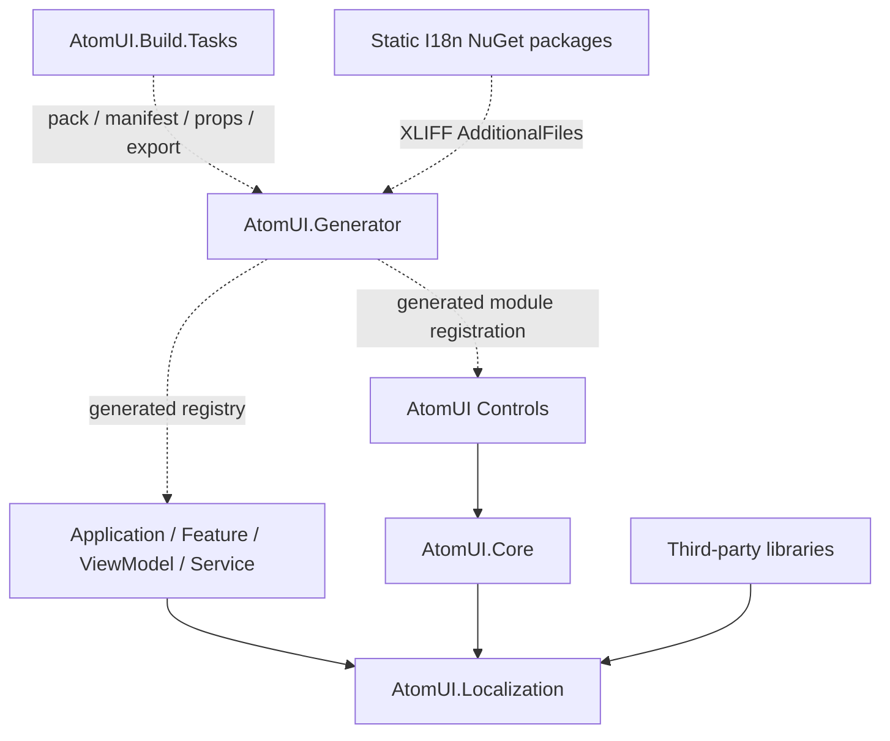

# AtomUI 本地化系统架构

本地化系统是面向整个应用的跨模块基础设施，不只服务 Control。它由 `AtomUI.Localization` 运行时、
`AtomUI.Generator`、`AtomUI.Build.Tasks`、静态语言包和应用构建入口共同组成；语言状态、Catalog、编译后翻译表和
Avalonia 资源桥与主题系统保持独立。

## 设计目标

- 应用、功能模块、页面、ViewModel、服务、AtomUI 控件和第三方类库使用同一套本地化模型。
- 程序中的语言身份、Catalog 和资源键保持强类型；字符串只出现在 XLIFF、包元数据和显式边界解析中。
- XLIFF 2.1 是唯一翻译源格式，运行时不读取或解析 XLIFF。
- 所有内置注册和翻译表在编译期生成，不扫描程序集，不依赖反射构造，兼容 trimming 和 NativeAOT。
- 语言状态和主题状态完全分离；语言切换不进入 ThemeTransaction。
- XAML 保留 `{atom:XxxLangResource Key}` 形态，不引入统一的字符串路径 Markup Extension。
- 翻译覆盖、Catalog 契约和语言包冲突尽量在构建期失败，而不是留到运行时处理。
- 不支持应用启动后下载或动态加载语言包，不定义 `.atomlang` 格式。

## 文档导航

| 文档 | 所有权 |
|---|---|
| [公共 API](../../../reference/localization/public-api.md) | 启动配置、`LanguageTag`、`ILanguageManager`、`ILocalizer`、XAML 与 C# 使用面 |
| [Catalog 与 XLIFF](../../../reference/localization/catalog-and-xliff.md) | Language Catalog 契约、目录约定、XLIFF 2.1、稳定 Key、格式化与覆盖规则 |
| [runtime.md](runtime.md) | Registry、Snapshot、Manager、ResourceProvider、切换、回退、Culture 和 RTL |
| [generation-and-build.md](generation-and-build.md) | Source Generator、应用 bootstrap、AdditionalFiles、`AtomUI.Build.Tasks` 与 NuGet 布局 |
| [language-packs.md](language-packs.md) | 内置语言、官方聚合包、模块包、第三方语言包、模板和消费协议 |
| [verification.md](verification.md) | 构建诊断、运行时不变量、Generator/Task/集成/AOT 验证要求 |
| [AtomUI.Localization 模块](../../../modules/localization/overview.md) | 运行时项目的源码职责、入口和依赖关系 |

## 项目边界

源码和发布边界如下：

| 项目或包 | 职责 | 运行时依赖 |
|---|---|---|
| `src/AtomUI.Localization` / `AtomUI.Localization` | 公共类型、运行时 Registry、Snapshot、Manager、Localizer 和 Avalonia 资源桥 | 是 |
| `src/AtomUI.Core` / `AtomUI.Core` | 主题、Token、动画等基础设施；引用 `AtomUI.Localization` | 是 |
| `src/AtomUI.Generator` / `AtomUI.Generator` | Catalog、翻译表、Markup Extension 和注册代码生成 | 否，Analyzer |
| `src/AtomUI.Build.Tasks` | 静态语言包 pack 前校验、模板导出/合并、manifest/props 和包内容安全 | 否，MSBuild Task |
| `AtomUI.LanguagePack.Template` | 创建静态 I18n NuGet 项目的模板 | 否 |
| `src/LanguagePacks/<language-tag>` | AtomUI 官方附加语言的模块级静态包与纯依赖聚合包 | 否 |

`AtomUI.Localization` 是运行时基础设施包。构建期共享源码位于
`src/AtomUI.Build.Tasks/LocalizationBuild`，使用内部命名空间 `AtomUI.Build.Tasks.LocalizationBuild`，但没有同名项目或
NuGet 包；构建任务物理归属 `AtomUI.Build.Tasks`，Generator 只通过源码链接复用这层无副作用模型。

## 构建期权威边界

多语言构建链有两个互补的权威边界：

- `AtomUI.Generator` 是**编译项目中的 Catalog/Bundle 语义权威**。它负责解析 XLIFF、绑定当前及引用程序集的
  Catalog/module、分类 active/dormant 输入、校验 source fingerprint、unit、源文本、占位符、
  翻译状态和来源冲突，并生成静态 Catalog、Bundle、模块注册和应用 bootstrap。
- `AtomUI.Build.Tasks` 是**静态语言包产物与文件系统副作用权威**。它负责语言包 pack 前校验、包内容安全、
  Verified/Deferred manifest、声明式 `buildTransitive` props 和模板导出；普通应用或模块编译不再重复执行
  MSBuild XLIFF 语义校验 Task。

两边共享不依赖 Roslyn/MSBuild 的 XLIFF parser、规范化文档模型、fingerprint 和文件级中立诊断。共享层不决定
Catalog symbol 绑定，也不直接输出 Roslyn Diagnostic 或 MSBuild 日志。

## 源码职责分组

`AtomUI.Localization` 使用紧凑职责分组，不使用含义宽泛的 `Runtime/`、`Engine/`、`Infrastructure/` 或
`Core/` 目录：

```text
AtomUI.Localization/
├── Catalog/    # Catalog schema、descriptor 和 registry
├── Resources/  # Avalonia resource extension、provider 和 resource key
├── Services/   # bootstrap、builder、host、manager、localizer 和日志入口
├── LanguageData/ # LanguageTags Generator 的固定数据输入，不是源码职责分组
└── *.cs        # LanguageTag、Definition、State、Snapshot、回退和原子发布模型
```

目录只表达源码维护职责，不改变所有类型统一使用的 `AtomUI.Localization` namespace，也不形成新的公共 API
分层。内部应用级组合对象命名为 `LocalizationHost`；共享当前语言的原子状态持有者命名为
`LanguageContext`；同一提交中的 `LanguageSnapshot` 与 `LanguageState` 组合命名为 `LanguageRevision`。
Avalonia 资源键和日志入口分别使用职责明确的 `LanguageResourceKeys` 与 `LocalizationLogger`，不重复附加
`Runtime` 前缀。

## 架构分层



## 核心术语

| 术语 | 含义 |
|---|---|
| `LanguageTag` | 一个规范化的开放 BCP 47 语言标签值 |
| `LanguageTags` | 从固定 CLDR/IANA 数据生成的常用标签强类型入口 |
| Language Catalog | 由稳定 enum 定义的应用级本地化契约 |
| Translation Bundle | 某个 Catalog 在某个语言标签下的完整翻译集合 |
| Language Module | 一个应用或类库贡献的 Catalog 与内置 Translation Bundle 集合 |
| Module Language Pack | 通过静态 NuGet 为一个 Language Module 提供附加 Translation Bundle 的实际翻译载体 |
| Aggregate Language Pack | 不含 XLIFF 或 DLL、仅依赖同语言模块包的产品级 Meta Package |
| `LocalizationHost` | 应用拥有的本地化服务组合和生命周期边界 |
| `LanguageContext` | 原子持有并发布当前 `LanguageRevision` 的共享上下文 |
| `LanguageRevision` | 同一次提交中的不可分割 `LanguageSnapshot` 与 `LanguageState` 组合 |
| `LanguageSnapshot` | 某个当前语言已经完成回退解析的不可变资源快照 |
| `LanguageState` | 当前语言、格式化 Culture、文字方向和 revision |

## 不可违反的不变量

1. `ThemeManager` 不实现 `ILanguageManager`，Control 包的主题 descriptor 不承载翻译 Provider。
2. `LanguageTag` 是开放值类型；不得重新引入只能表达固定语言集合的 locale enum。
3. `LanguageTags.JaJP` 只表示标签已知，不表示日语翻译已经安装。
4. 每个 Catalog 都必须拥有完整 `en-US` 源文本；`zh-CN` 和 `zh-TW` 不互相回退。
5. 运行时只消费生成的 descriptor 和编译后字符串表，不解析 XLIFF、不扫描程序集。
6. 资源 Provider 生命周期稳定；语言切换只发布完整 Snapshot，不暴露半更新状态。
7. 应用支持语言是一项覆盖契约；缺失翻译不能通过最终 `en-US` 回退伪装成完整支持。
8. 翻译包没有运行时 DLL、初始化类或隐式加载代码；重复翻译不按注册顺序覆盖。
9. 官方聚合语言包不得复制模块 XLIFF；一个 Catalog 的附加翻译只由所属模块语言包维护。
10. 未引用 Language Module 的静态包输入保持 dormant；模块一旦存在，Catalog 和源契约仍必须严格校验。
11. `Verified`/`Deferred` 描述语言包的契约来源，`Active`/`Dormant` 描述消费项目的模块可见性；两组状态不得
    合并为一个枚举或互相替代。
12. dormant 只延迟依赖不可见目标 Catalog 的深层校验；XLIFF、语言标签、metadata、fingerprint 格式及其与当前
    文件 source 内容的一致性始终在编译期校验。

## 非目标

- 不提供运行时语言包下载、热更新、文件监听或插件式翻译程序集加载。
- 不替代业务数据国际化、服务端内容翻译、时区数据库或单位换算系统。
- 不强制应用修改进程级 `CurrentCulture` 或 `CurrentUICulture`。
- 不要求应用支持 AtomUI 内置的全部三种语言；应用只对自己声明的支持语言负责。
