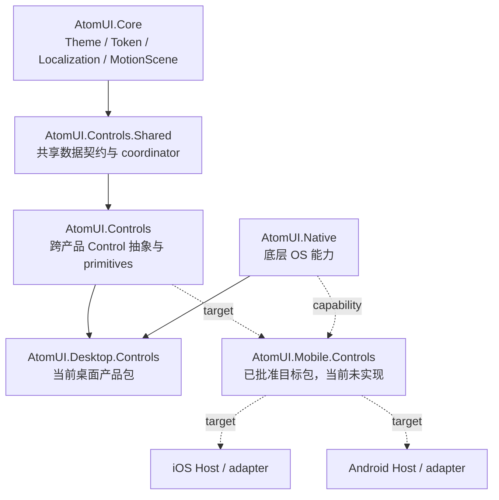

# AtomUI Mobile 系统架构

> 状态：预实现架构。本文定义已批准的目标契约，不表示当前仓库已经包含或发布 `AtomUI.Mobile.Controls`。

AtomUI Mobile 是跨 `AtomUI.Core`、`AtomUI.Controls.Shared`、`AtomUI.Controls`、`AtomUI.Native`、目标
`AtomUI.Mobile.Controls` 包和 iOS/Android Host 的运行时系统。它定义移动应用共同需要的 viewport、平台能力、导航、
覆盖层、手势、主题、本地化和验证不变量；单个包的源码组织与单个 Control 的 Public API 不由本目录拥有。

## 范围

本目录拥有跨模块 Mobile Runtime 契约、平台能力边界和系统级验证不变量。它不拥有：

- `AtomUI.Mobile.Controls` 的包内源码组织、启动注册和发布边界；这些内容进入 Mobile Controls 模块文档。
- 单个 Mobile Control 的 Public API、Theme、Token、状态机和兼容状态；这些内容进入 Mobile Controls 文档。
- iOS/Android 工具链、签名、部署和设备操作；这些内容进入 Engineering Platforms 文档。
- Mobile Gallery Host 的产品结构和 ShowCase 编写规则；这些内容进入 Gallery 文档。

## 架构定位

Mobile 使用“共享基础设施 + 平行产品包 + 平台 adapter”结构。Mobile 与 Desktop 可以复用稳定的 Core、共享模型和
通用 Control primitives，但不互相依赖，也不通过 `MobileMode` 共享具体产品控件。

`AtomUI.Native` 是正交能力层。它可以封装 Avalonia 公共 API 无法表达的原生调用、handle、hook 和确定释放，但不拥有
Mobile Control 行为、Token、默认视觉、Overlay 状态机或平台产品策略。

## 核心运行对象

每个 `TopLevel` 的目标运行时作用域包含：

| 对象 | 唯一职责 |
| --- | --- |
| `MobileViewportContext` | 聚合 Safe Area、system bar、input pane、可用区域、方向、scale、字体缩放和 Reduce Motion |
| `MobileOverlayManager` | 管理共享 Overlay session、z-order、mask、focus、返回、动画和终态释放 |
| `MobileGestureCoordinator` | 仲裁活动 pointer 链、方向锁定、nested scroll、速度、snap 和取消 |
| Platform capability adapter | 把 iOS/Android/Headless 能力投射成统一内部契约 |

这些名称是已批准目标契约。源码落地后，模块文档必须按真实类型和注册入口校准；在此之前不能据此推断项目已经存在。

## 平台策略

- iOS 是首个实现与体验验收平台。
- Android adapter、公共 API 兼容和验证责任从 Foundation 开始存在，不作为 iOS 完成后的补丁。
- Control 只消费 capability 和 platform profile，不读取 OS 名称，也不散布条件编译。
- Headless adapter 用于纯逻辑和生命周期测试，不替代 Simulator、Emulator 或真机证据。
- 公共 API 只有在 iOS 与 Android 对应能力的契约和验证路径明确后才能标记稳定。

## 依赖与职责边界

| 层级 | 拥有 | 不拥有 |
| --- | --- | --- |
| Core | Theme、Token、Localization、资源、MotionScene | Mobile Control、手势产品策略 |
| Controls.Shared | 跨产品稳定 model/coordinator | Mobile VisualTree 和平台 API |
| Controls | 跨产品抽象与 primitives | 为复用而加入的 Mobile 特例 |
| Mobile Controls | Mobile Control、Runtime scope、Theme、平台能力消费 | Desktop Window 行为、底层 P/Invoke |
| Native | 必要的 OS/native 能力和可释放 hook | Control 策略、Token、默认平台体验 |
| iOS/Android Host | 应用生命周期、启动、签名/部署和 adapter 注册 | Control API 与跨平台状态机 |

共享实现只有在两个产品包真实需要、语义稳定一致、不含平台判断并能降低实际重复时才允许下沉。

Control Own Token 的跨 Desktop/Mobile 复用遵循 [Control Design Token 继承](../theming/control-design-token-inheritance.md)：
共享视觉语义只能在出现至少两个真实终端后提取到 `AtomUI.Controls` 中的无 identity、显式标记抽象层；Mobile 产品包中的
具体 Token 始终是 `sealed` 终端。当前 Mobile Controls 尚未实现，因此本架构不预建 Mobile 专用或跨平台空基类。

## 阅读顺序

| 文档 | 职责 |
| --- | --- |
| [Runtime 与平台能力](runtime-and-platform-capabilities.md) | Viewport、Safe Area、IME、生命周期和 capability contract |
| [Navigation 与 Overlay](navigation-and-overlays.md) | 页面事务、系统返回和共享 Overlay session |
| [手势协调](gesture-coordination.md) | Pointer ownership、nested scroll、速度、snap 和取消 |
| [主题、本地化与 API](theming-localization-and-api.md) | 现有主题系统复用、Token 分层和 Web/Avalonia 映射 |
| [验证架构](verification.md) | Contract、Headless、Visual、Platform 和 Release 门禁 |
| [Mobile 文档规范](../../../engineering/contributing/mobile-documentation-guidelines.md) | 预实现状态、证据和文档同步规则 |

## 当前可用性

| 维度 | 当前状态 |
| --- | --- |
| Design | Mobile 系统总体契约已批准 |
| Source | `AtomUI.Mobile.Controls` 未实现 |
| iOS | Mobile Controls 未验证 |
| Android | Mobile Controls 未验证 |
| Release | 未验证 |
| Publication | 未发布 |

当前仓库中的 iOS Gallery 预览经验只能作为工程环境证据，不能证明 Mobile Controls 的实现状态。
