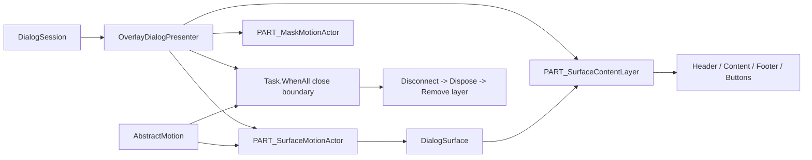

# Modal Dialog 关闭动效设计

本文档定义 `Dialog` 与 `MessageBox` 在 Overlay 宿主中的关闭动效架构、视觉层职责、异步完成边界、Template 协作契约和验证要求。Modal 的公共设计见 [Modal 桌面版架构设计](overview.md)，运行时 owner 与释放规则见 [Modal 桌面版实现原理](implementation.md)，宿主尺寸语义见 [Modal 宿主尺寸与 Resize 设计](host-sizing-design.md)。

## 1. 设计定位

关闭动效由两个相互配合的层次组成：

1. 生命周期层确保一个 `Motion` 在正常情况下等待所有 transition 完成；若某个 transition 没有完成通知，则到达既定安全超时后才报告完成。Presenter 随后才能断开 composition children、释放 `DialogSurface` 并移除 Overlay。
2. 视觉层让 Dialog 外框/阴影与标题、正文、Footer、按钮等前景内容分别承担动效职责。外层保持现有 surface motion，前景内容在相同关闭窗口内独立降低 opacity。

本设计适用于 `Dialog` 和继承它的 `MessageBox` 的 `DialogHostType.Overlay` presentation。它不改变 Dialog 的打开意图、Session 结果、尺寸、位置、焦点或按钮语义，也不把内容替换为快照或从 visual tree 摘出。

`DialogHostType.Window` 仍由 `WindowDialogPresenter` 使用原生 `DialogWindow.Closed` 作为宿主生命周期边界；本专题新增的 Overlay 内容层关闭编排只由 `OverlayDialogPresenter` 调用。

## 2. 设计原则

- 生命周期完成先于视觉树 teardown。所有关闭 motion 的任务结束前，Presenter 必须保持附着。
- 外层表面与前景内容是两个视觉职责。外层负责背景、边框、圆角和阴影；内容层负责标题、正文、Footer、按钮和用户输入控件。
- 关闭期间保持真实控件树、Bounds、Measure、Arrange、RenderTransform、Margin、Width 和 Height 不变；动效只改变既有 motion actor 或内容层的 opacity。
- 所有关闭 motion 在同一个 UI 调度上下文内同时开始，并由一个聚合任务统一决定 teardown 时刻。
- 内容层是内部 Template 协作节点，不是新的 public Semantic Part、主题资源 key 或用户 API。
- duration 继续来自 Dialog scope 的 `MotionDurationMid`，不在关闭路径硬编码时长。
- `IsMotionEnabled=false` 时跳过视觉 motion，但不跳过 presenter 附加、释放、移除和 Session teardown。
- 自定义模板缺少可选内容层时，退化为现有外层关闭 motion；基本关闭流程和生命周期不受影响。
- 异常、取消或复用路径不能留下 opacity=0 的 live Surface；内容层在关闭任务结束时恢复为 `1`。

## 3. 专项模型与 Public API

### 3.1 视觉区域模型

| 术语 | 定义 | Owner |
| --- | --- | --- |
| Surface shell | `DialogSurface` 以及其背景、边框、圆角、阴影和布局边界。 | `DialogSurface` / `PART_SurfaceMotionActor` |
| Surface content layer | `DialogSurfaceTheme.axaml` 中名为 `PART_SurfaceContentLayer` 的现有 `DockPanel`，包围标题、正文和 Footer。 | `DialogSurface` 获取并释放引用；Overlay presenter 驱动关闭 opacity |
| Surface motion actor | `OverlayDialogPresenterTheme.axaml` 中的 `PART_SurfaceMotionActor`，承载整个 `DialogSurface` 的入场/退出 fade 或 anchored zoom。 | `OverlayDialogPresenter` |
| Mask motion actor | modal Overlay 的 `PART_MaskMotionActor`，承载 mask 淡入/淡出。 | `OverlayDialogPresenter` |
| Content foreground | 标题、正文、输入控件、Footer 和按钮等仍附着在 Surface content layer 下的真实视觉子树。 | `DialogSurface` 与用户内容 |

现有模板的组合关系如下：

```text
OverlayDialogPresenter
├── PART_MaskMotionActor (modal)
│   └── PART_DialogMask
└── PART_SurfaceMotionActor
    └── ContentPresenter
        └── DialogSurface
            └── ShadowsAwareContainer
                └── Frame Border
                    └── PART_SurfaceContentLayer (DockPanel)
                        ├── PART_Header
                        ├── FooterFrame / PART_ButtonBox
                        └── ContentFrame / user Content
```

### 3.2 Public API 语义

本设计不新增或修改 Public API、Avalonia property、事件、Template Part、pseudo-class、ControlTheme key 或 Token。

| 既有契约 | 在本设计中的语义 |
| --- | --- |
| `Dialog.IsMotionEnabled` | 继续控制 Overlay mask 与 Surface 外层 motion 是否运行；为 `false` 时不执行内容层 opacity animation。 |
| `Dialog` 的打开/关闭 API 与事件 | `Closing`、结果事件和 `Closed` 的顺序保持不变；关闭任务仍在完整 presenter teardown 后完成。 |
| Shared Token `MotionDurationMid` | 通过 Overlay presenter 的内部 `MotionDuration` 提供 Surface、内容层和 modal mask 的默认 duration。 |

`PART_SurfaceContentLayer` 只属于内置 `DialogSurface` 模板的内部协作契约。调用方不能依赖它的名称、类型或层级；自定义模板可省略该节点并获得外层 motion 的兼容退化。

## 4. 宿主与状态策略

### 4.1 Overlay 宿主

Overlay close 由一个 `OverlayDialogPresenter.CloseAsync` 负责：

- 外层 `DialogSurface` 运行已有的 `FadeOutMotion` 或 anchored `DialogZoomOutMotion`。
- 如果找到 `PART_SurfaceContentLayer`，并行运行从 opacity `1` 到 `0` 的线性内容层动画。
- modal 且存在 mask actor 时，并行运行 `FadeOutMotion`。
- 使用 `Task.WhenAll` 等待所有已创建的关闭任务，然后按统一顺序 teardown。

内容层在这段时间始终保留在 Surface visual tree 中，因此标题、正文、Footer 和按钮不会先于 Presenter 的关闭边界被摘除。Surface 的几何不参与这段动画重新计算。

### 4.2 Window 宿主

Window presenter 不创建 Overlay 的 `PART_SurfaceMotionActor`，也不调用内容层 opacity choreography。Window 的可见边界由原生 `DialogWindow.Opened`/`Closed` 和其既有资源释放流程定义；该差异是宿主模型的稳定边界，不是关闭动效缺失。

### 4.3 状态组合

| 状态/条件 | Overlay 行为 | teardown 边界 |
| --- | --- | --- |
| `IsMotionEnabled=true`、Surface actor 存在 | 外层 motion、内容层 opacity（若存在）、modal mask fade 并行。 | 所有任务完成后断开 composition children、Dispose Surface、移除 layer。 |
| `IsMotionEnabled=true`、自定义模板缺少内容层 | 只执行外层 motion 及 mask fade。 | 外层任务完成后按同一 teardown 顺序执行。 |
| `IsMotionEnabled=false` | 不创建视觉关闭任务。 | 立即进入既有 teardown；不改变内容层 opacity。 |
| 正在 opening | 先取消 opening motion，等待 `ShowAsync` 收敛或报告的失败被关闭路径吸收，再启动 close motion。 | `CloseAsync` 仍拥有完整 teardown。 |
| 强制关闭、owner detach 或异常 teardown | Session 语义决定强制路径；Presenter 保持相同释放顺序。 | 首个异常传播前仍尽力完成所有释放。 |

## 5. 架构、文件职责与 ownership



| 文件/类型 | 稳定职责 | 明确不负责 |
| --- | --- | --- |
| `src/AtomUI.Desktop.Controls/Dialog/Themes/DialogSurfaceTheme.axaml` | 保持 `PART_SurfaceContentLayer` 包围标题、正文和 Footer 的模板结构。 | 不实现关闭状态机，不创建 snapshot，不改变 Surface 尺寸。 |
| `src/AtomUI.Desktop.Controls/Dialog/DialogSurface.cs` | 在 `OnApplyTemplate` 获取当前内容层；重套模板和 `Dispose` 时清空旧引用。 | 不启动 Overlay close animation，不拥有 Session teardown。 |
| `src/AtomUI.Desktop.Controls/Dialog/OverlayHost/OverlayDialogPresenter.cs` | 解析内部 part，编排外层、内容层和 mask 的并行关闭任务，等待聚合边界并执行 teardown。 | 不改变 public Dialog API，不管理 Window host 的原生关闭。 |
| `src/AtomUI.Core/MotionScene/AbstractMotion.cs` | 让一个 Motion 的 transition 集合在全部完成或安全超时后才报告完成，并释放 transition 订阅。 | 不知道 Dialog、Surface 或 mask；不处理具体视觉区域。 |
| `DialogSession` | 拥有 Session 状态、结果、关闭仲裁和 presenter task 边界。 | 不直接操作 Template part 或 opacity。 |
| `WindowDialogPresenter` | 使用原生 Window 生命周期与现有 Surface/资源 teardown。 | 不调用 Overlay 内容层关闭编排。 |
| `tests/AtomUI.Desktop.Controls.Tests/Dialog/DialogMotionAnchorTests.cs` | 证明关闭期间按钮、内容层仍附着，Surface bounds 不变，完成后 presenter 才移除。 | 不替代真实桌面视觉验收。 |
| `tests/AtomUI.Core.Tests/MotionScene/AbstractMotionTests.cs` | 证明不同 transition 时长下 Motion 不会在首个 transition 完成时提前结束。 | 不证明具体 Dialog Template 的渲染效果。 |

Ownership 规则是：获取 part 的 owner 必须负责旧 part 释放；启动动画的 owner 必须等待动画；创建事件、binding、composition link 的 owner 必须在 teardown 中对称清理。

## 6. Template、组合与集成契约

### 6.1 Template 契约

内置 `DialogSurfaceTheme.axaml` 使用以下内部结构：

```xml
<DockPanel Name="PART_SurfaceContentLayer" LastChildFill="True">
    <atom:OverlayDialogHeader ... />
    <Border Name="FooterFrame" DockPanel.Dock="Bottom">
        <atom:DialogButtonBox ... />
    </Border>
    <Border Name="ContentFrame" ClipToBounds="True">
        <atom:Skeleton ... />
    </Border>
</DockPanel>
```

内容层必须是包围这些区域的现有布局节点，而不是新的视觉副本。其 `Opacity` 只用于 Overlay 关闭期间的前景可见度；不绑定到 `Dialog.IsOpen`，也不在 AXAML 中自行维护关闭状态。

### 6.2 自定义模板退化

自定义 `DialogSurface` 模板可以不提供 `PART_SurfaceContentLayer`。`DialogSurface.OnApplyTemplate` 将引用保留为 `null`，Overlay presenter 只加入外层 Surface motion 和必要的 mask motion。自定义模板仍须自行保证基本布局、按钮与内容的视觉语义；本专项不把内部节点升级为外部模板兼容承诺。

### 6.3 与 composition 生命周期的集成

关闭任务结束前不得调用 `DisconnectCompositionChildren`、`DialogSurface.Dispose` 或 `RemoveFromDialogLayer`。顺序固定为：

```text
close requested
  -> Session commits close result
  -> Overlay close motions start together
  -> await all close motions
  -> DialogSurface.DisconnectCompositionChildren()
  -> DialogSurface.Dispose()
  -> DialogOverlayLayer.Remove(presenter)
  -> Session completes Closed/task
```

这样用户内容、按钮和 composition visual 在整个视觉关闭窗口内拥有相同的 parent 链；关闭完成后再释放，避免内容仍可见而主体已被移除，或主体已消失而内容继续绘制。

## 7. 核心算法、数据流与生命周期

### 7.1 Overlay close choreography

输入是当前 `OverlayDialogPresenter`、`DialogSurface`、可选的内容层和 mask actor、`IsMotionEnabled`、`IsModal` 与 `MotionDuration`。输出是一个在 presenter 移除后完成的 `CloseAsync` task。

```text
Show settled
  -> resolve PART_SurfaceMotionActor / PART_MaskMotionActor / PART_SurfaceContentLayer
  -> create surface close motion
  -> create content opacity animation (if part exists)
  -> create modal mask fade (if modal and actor exists)
  -> start all tasks without awaiting any single task first
  -> await Task.WhenAll(tasks)
  -> disconnect composition children
  -> dispose Surface
  -> remove presenter from DialogOverlayLayer
```

内容层动画的固定输入/输出边界如下：

| 参数 | 值 |
| --- | --- |
| target | `PART_SurfaceContentLayer` 当前实例 |
| initial opacity | `1` |
| final opacity | `0` |
| duration | `MotionDuration`，默认来自 `MotionDurationMid` |
| easing | `LinearEasing` |
| changed properties | 仅 `Visual.Opacity` |
| unchanged properties | Bounds、Width、Height、Margin、RenderTransform、布局和 visual parent |

内容层动画使用 `FillMode.Forward` 保持末帧，直到 `Task.WhenAll` 通过；`finally` 将当前层 opacity 恢复为 `1`，随后 Surface 被释放。恢复动作保证模板实例在异常 teardown 或未来复用中不会被遗留的透明状态污染。

### 7.2 Surface Motion 的 transition 边界

`PART_SurfaceMotionActor` 的现有 motion 可能同时改变 opacity 与 transform。`AbstractMotion` 将每个 transition 的完成通知转换为 task，并等待：

```text
await Task.WhenAny(
    Task.WhenAll(allTransitionTasks),
    Task.Delay(maxTransitionDuration + safetyDelta));
```

其中 `safetyDelta` 为最长 transition 时长的 10%，上限 100ms。正常情况下必须等所有 transition 完成；如果某个属性不产生完成通知，安全超时仍然允许 motion 收敛并释放 transition 订阅。同步和异步 Motion 路径保持相同的不变量：不能因为第一个 transition 完成就报告整个 Motion 完成。

### 7.3 失败与取消

- opening 被取消时，Presenter 先取消 opening cancellation source，并等待已有 `ShowAsync` 任务结算；show 失败由 Session 报告，close 仍继续拥有 teardown。
- 任一 close motion 抛出异常时，`CloseAsync` 的 `finally`/dispose 路径仍应断开 composition children、释放 Surface、移除 layer；首次异常按既有 presenter/session 规则传播。
- `IsMotionEnabled` 在关闭开始后不改变当前已创建任务集合；状态切换不会追加第二套动画或重置 Surface 几何。
- 内容层 part 在重套模板后失效时，当前 presenter 只使用最新引用；旧 part 由 `DialogSurface.OnApplyTemplate` 的 release 流程解除拥有关系。

## 8. 资源、性能与 AOT 边界

- 内容层动画只创建一个短生命周期的 `Avalonia.Animation.Animation`，不创建 bitmap、离屏窗口、第二个 Surface 或长期缓存。
- opacity 动画不触发布局重新测量，也不修改 Surface 的位置/尺寸 owner；关闭期间不会进入 drag/resize 几何路径。
- `AbstractMotion` 继续使用静态 transition 类型和已有 completion observable；修复只改变完成聚合边界，不引入反射、动态发现或同步 DispatcherFrame。
- Template part、事件、binding 和 composition children 仍由 `DialogSurface` 或 concrete presenter 对称释放；不增加全局订阅和静态 Session 引用。
- 该设计不新增 NativeAOT trimming root，不依赖运行时类型扫描，不修改 public API 注册或 XAML 动态查找方式。

## 9. 兼容性与定制边界

### 9.1 保持不变的契约

- `Dialog`、`MessageBox` 的 public API、事件顺序、结果和 `IsOpen` 语义保持不变。
- `IsMotionEnabled=false` 的即时关闭语义保持不变。
- Overlay 默认 duration 继续使用 Shared Token `MotionDurationMid`；主题仍可通过既有内部 `MotionDuration` 绑定路径提供值。
- Surface 的测量、排列、placement、drag、resize、maximize/restore 和 focus scope 不因关闭动效改变。
- Window host 继续以原生 Window 生命周期为边界，不受 Overlay 内容层 choreography 影响。

### 9.2 自定义主题责任

自定义 `DialogSurface` 模板若提供 `PART_SurfaceContentLayer`，应让它包围期望同步淡出的前景内容；若省略该 part，则只获得外层 motion。应用不得把 `PART_*` 名称当作稳定 public Semantic Part，也不得依赖关闭期间的中间 opacity 值进行业务逻辑判断。

自定义内容仍负责自己的内部动画、异步取消和资源生命周期。Dialog close motion 不会替用户内容复制或接管这些动画。

## 10. 验证要求

### 10.1 纯 Motion 验证

`AbstractMotionTests.Transition_Motion_Waits_For_All_Transitions_Before_Completing` 必须证明：当 opacity transition 比 transform transition 更短时，Motion task 在首个 transition 完成后仍未完成，直到全部 transition 完成或安全超时；最终 actor opacity 与 motion 状态收敛。

### 10.2 Overlay 行为验证

`DialogMotionAnchorTests` 与 Overlay presenter 回归至少覆盖：

- 关闭任务完成前 presenter 仍属于 `DialogOverlayLayer`。
- Footer button、`PART_SurfaceContentLayer` 和用户内容仍附着在 visual tree。
- Surface bounds 在整个关闭窗口内保持不变。
- 所有关闭 motion 完成后才执行 composition disconnect、Surface dispose 和 layer remove。
- modal mask 与 Surface/content 并行收敛；modeless 不虚构 mask。
- 自定义模板缺少内容层时仍能完成外层关闭和 teardown。
- `IsMotionEnabled=false` 不执行动画且不遗留 opacity 修改。
- opening 取消、motion 异常、owner detach 和重复 close 都不会遗留 presenter、事件或透明 Surface。

### 10.3 主题与人工验证

- 内置 Light/Dark 主题下，标题、正文、输入控件、Footer 和按钮在关闭期间以统一前景淡出，不出现外框先消失而内容滞留的视觉断层。
- anchored zoom 与无 placement target 的 fade 两种 Surface motion 都保持同一内容层同步策略；不发生尺寸放大、位置跳变或右下角漂移。
- Dialog Popup 原语与控件家族回归继续验证关闭和 teardown 后无残留 host；内容 popup 的层级和 light-dismiss 语义不由本专项重新实现。
- Window host 走查原生 `Closed` 生命周期，确认其不误用 Overlay content choreography。

### 10.4 验证边界

Headless 测试可以证明任务边界、视觉树附着、Bounds 稳定和释放顺序；它不能替代真实桌面环境对 opacity 曲线、阴影合成、CSD/native chrome 和输入体验的验收。涉及平台差异时，应分别记录 Windows、macOS、Linux Wayland 和 Linux X11 的实机证据，不从共享代码路径推断未执行平台已通过。
