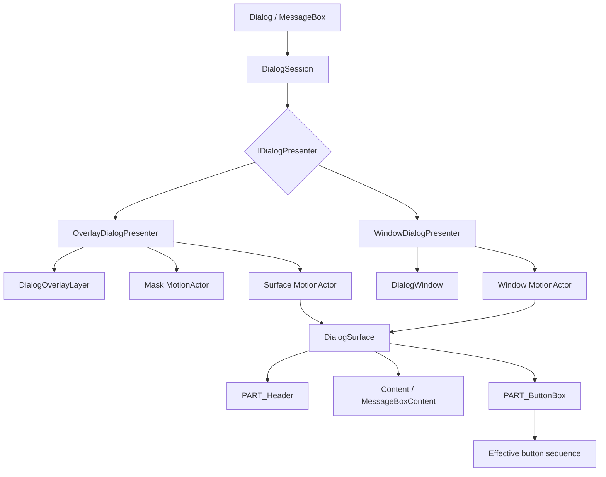

# Modal 桌面版实现原理

本文档描述 `Dialog` 和 `MessageBox` 的当前内部实现、状态所有权、组合结构、资源边界和释放规则。公共契约见 [Modal 桌面版架构设计](overview.md)，Token 语义见 [Modal Token 设计](token.md)。

## 1. 实现定位

实现由一个 Dialog 打开意图、一个当前 `DialogSession`、两种 `IDialogPresenter` 和一个共享 `DialogSurface` 组成。私有方法和具体 AXAML selector 仍以源码为准；本文只记录稳定职责和维护不变量。

## 2. 源码文件结构

| 路径 | 职责 |
| --- | --- |
| `Dialog.cs` | public 属性、事件、内容、按钮和内部协作入口。 |
| `Dialog.Lifecycle.cs` | `IsOpen` reconcile、`OpenAsync`、事件通知和 presenter 选择。 |
| `Dialog.StaticAPI.cs` | 静态 modeless/modal 异步创建入口。 |
| `DialogSession.cs` | 单次展示状态机、关闭仲裁、取消、结果、焦点和 teardown。 |
| `IDialogPresenter.cs` | Overlay/Window 共用的最小异步协议。 |
| `DialogSurface.cs` | 标题、内容、Footer、按钮和 Overlay resize 的共享表面。 |
| `ButtonBox/DialogButtonBox.cs` | 标准按钮生成、唯一有效按钮序列和自定义集合同步。 |
| `OverlayHost/DialogOverlayLayer.cs` | owner scope 内的 presenter stack。 |
| `OverlayHost/OverlayDialogPresenter.cs` | 同时拥有 mask、Surface、placement、drag/resize 和 motion。 |
| `WindowHost/WindowDialogPresenter.cs` | 原生 Window 属性映射、modal owner、尺寸、位置和 motion。 |
| `WindowHost/DialogWindow.cs` | 原生 caption close 仲裁和显式尺寸应用。 |
| `MessageBox/MessageBox.cs` | Dialog 派生的消息语义、静态 API 和按钮配置。 |
| `MessageBox/MessageBoxContent.cs` | MessageBox 的图标与内容组合。 |
| `Dialog/Themes` / `MessageBox/Themes` | 共享 Surface、Overlay presenter 和 MessageBox AXAML 结构。 |

对应回归测试位于 `tests/AtomUI.Desktop.Controls.Tests/Dialog` 和 `tests/AtomUI.Desktop.Controls.Tests/MessageBox`。

## 3. 核心类职责

- `Dialog` 只拥有最新 `IsOpen` 意图和当前 Session 引用，不拥有 presenter 视觉状态。
- `DialogSession` 独占一次展示的状态、取消源、普通关闭策略、结果、owner/target 订阅、前一焦点和完成任务。
- `IDialogPresenter` 只暴露 `ShowAsync`、`CloseAsync`、`FocusScope`、`CloseRequested` 和 `IAsyncDisposable`。
- `DialogSurface` 是两种 presenter 的唯一内容/按钮视觉源。
- `DialogButtonBox` 的 `_effectiveButtons` 是唯一视觉按钮序列。标准按钮来自私有元数据，自定义按钮仍由用户集合拥有。
- `DialogOverlayLayer` 只管理同一 owner scope 内的 presenter 顺序和栈顶键盘路由。
- `OverlayDialogPresenter` 是 Dialog layer 的直接子节点；mask 与 Surface 不拆成独立 popup。
- `WindowDialogPresenter` 包装一个 `DialogWindow` 和一个 `MotionActor`，但仍使用同一个 `DialogSurface`。
- `MessageBox` 不拥有隐藏 Dialog；它覆盖 Surface 内容和按钮配置 hook。

## 4. 状态与数据流

```text
IsOpen / OpenAsync
  -> Dialog reconcile
  -> create DialogSession + concrete presenter
  -> presenter.ShowAsync
  -> focus DialogSurface
  -> Dialog.Opened
  -> one close request
  -> Closing / BeforeCloseAsync
  -> commit result and outcome events
  -> presenter.CloseAsync + DisposeAsync
  -> restore focus
  -> Closed and task completion
```

Session 状态为 `Created -> Opening -> Open -> ClosePending -> Closing -> Closed`。

- 普通关闭只在 `Open` 接受，并在执行 `Closing`/`BeforeCloseAsync` 前进入 `ClosePending`。
- veto 或关闭策略异常返回 `Open`；声明式 `IsOpen=false` 被 veto 时恢复为 `true`。
- 强制关闭取消 pending policy 与 opening motion，从可关闭状态直接进入 `Closing`。
- 一旦结果提交，后续事件或 presenter 异常不允许把 Session 恢复为 Open。
- completion 只有在 presenter close/dispose、焦点恢复和 Session `Closed` 后才完成、取消或 fault。

`Dialog` 的 reconcile 负责区分实例 `OpenAsync` 与声明式重开：实例在活跃 Session 期间拒绝并发打开；声明式 `IsOpen=true` 可等待当前 Closing 完成后重新创建 Session。

`OpenAsync`、静态 Dialog/MessageBox 创建入口以及 `Accept`/`Reject`/`Done` 在读取视觉树或推进 Session 前统一切回 UI Dispatcher；泛型静态入口的 `TView` 也只在 UI Dispatcher 上实例化。`DialogSession` 不承担跨线程状态同步，调用方不需要通过空 Dispatcher 调度或延迟来避开 routed event 时序。

## 5. 组合结构模型



| 节点 | 来源 | 稳定性 | Agent 使用边界 |
| --- | --- | --- | --- |
| `Dialog` / `MessageBox` | public control | public-stable | 用户可直接使用。 |
| `DialogSession` | runtime C# | internal-observable | 只用于理解状态与任务边界。 |
| `OverlayDialogPresenter` / `WindowDialogPresenter` | runtime C# | internal-observable | 只用于维护宿主一致性。 |
| `DialogSurface` | runtime + `DialogSurfaceTheme.axaml` | internal-observable | 两种宿主必须共享，不建议用户直接创建。 |
| `PART_Header`, `PART_ButtonBox`, `PART_Resizer` | `DialogSurfaceTheme.axaml` | template-stable | 变更需同步实现、主题、测试和文档。 |
| `PART_MaskMotionActor`, `PART_SurfaceMotionActor` | `OverlayDialogPresenterTheme.axaml` | template-stable | 变更需保持 mask/Surface 同一 presenter。 |
| `DialogOverlayLayer` | runtime C# | internal-observable | 只管理 scope 内栈，不提供全局 service。 |

Window 和 Overlay 各自拥有一个 Surface 实例，不共享同一个视觉对象；“共享 Surface”指共享类型、主题与行为实现。

## 6. 生命周期与模板接入

| 获取 | Owner | 释放 |
| --- | --- | --- |
| presenter `CloseRequested` | `DialogSession` | `BeginClosing` |
| placement target detach / owner closed | `DialogSession` | `BeginClosing` |
| pending close CancellationTokenSource | `DialogSession` | veto、commit 或 forced close |
| presenter opening cancellation | concrete presenter | `CloseAsync` / `DisposeAsync` |
| Dialog property bindings | `DialogSurface` / presenter | `Dispose` / `DisposeAsync` |
| custom button Click handlers | `DialogButtonBox` | collection change、template release、Surface dispose |
| Overlay mask/header/resize handlers | `OverlayDialogPresenter` | re-template 或 `DisposeAsync` |
| Window events and property bindings | `WindowDialogPresenter` | `DisposeAsync` |
| Surface composition child links | concrete presenter | closing motion 后、移除 layer/window 前同步断开 |
| inheritance/resource parent | presenter | 从 layer/window 移除后清空 |
| MessageBox default button content cache | `MessageBox` 当前 Surface | `ReleaseSurfaceButtons` |

`DialogSurface.OnApplyTemplate` 先释放旧 Header/ButtonBox/Resizer 订阅，再接入新 parts。`DialogButtonBox` 在 template 为空或重套用时立即清空旧 panel 和视觉父级。

Presenter 在永久 teardown 时先断开 `DialogSurface` 子树的 composition children，再释放 Surface 并移除 Overlay layer 或关闭 Window。该顺序防止调用方保留 Content/CustomButton 等子控件时，其旧 `CompositionVisual.Parent` 链反向保留 Presenter 和 Surface。Overlay presenter 移除后，空的 `DialogOverlayLayer` 也从 `ScopeAwareOverlayLayer` 删除并解绑 size 事件。Window presenter 即使 close motion 或 Window.Closing 抛出，也会继续清空 bindings、Surface、Window.Content 和 MotionActor.Content，再传播首个异常。

## 7. 交互与事件处理

- DialogSurface 把标准/自定义按钮点击转成 `DialogPresenterCloseRequestedEventArgs`，Session 决定是否关闭。
- Enter/Escape 由栈顶 Overlay presenter 或当前 Window 转发给 Surface 的有效按钮序列。
- modal mask 只在左键、真实 mask visual subtree、且 presenter 为栈顶时请求关闭。
- modeless presenter 在 Surface 外不阻断 pointer hit-test；点击 Surface 会把整个 presenter 激活到栈顶。
- Overlay 标题栏拖动和 resize 修改 Dialog offset 或 Surface 尺寸；maximize 使用整个 Dialog layer bounds。
- Window caption close 先请求 Session 关闭；Session commit 后 `DialogWindowCloseState.Closing` 放行一次真实 native close。`OwnerWindowClosing` 始终放行，随后由 owner closed 强制 teardown。
- Window presenter 禁用 Surface 内隐藏 header 的 `TitleIcon`，由原生 Window 标题栏唯一承载该图标，避免两个 presenter 争用同一个 `PathIcon` visual parent。
- Session 在 Show 前记录当前焦点，Show 后聚焦可聚焦的 DialogSurface，Close 后优先恢复原焦点，其次恢复 placement target。

## 8. 内部算法与关键流程

### 8.1 有效按钮序列

`DialogButtonBox` 使用一张私有标准按钮定义表创建标准按钮，再与 `CustomButtons` 组合成 `_effectiveButtons`。每次 Add/Remove/Replace/Move/Reset/Clear 都重建视觉分组并对称同步自定义按钮 Click 订阅。Surface 对有效序列取快照，用于键盘查找、confirm loading binding 和 MessageBox 配置。

标准按钮默认文案使用 `Template` priority binding；MessageBox 的显式 OK/Cancel 文案使用 local value 覆盖，清空后自动恢复最新语言资源。MessageBox 的样式、默认按钮和启动位置也只写入 `Template` priority，调用方 local 配置始终优先。MessageBox 语义配置运行时变化后重新执行现有 `ButtonsConfigure`，维持调用方配置最后生效的顺序。

### 8.2 自然尺寸

- Overlay 将 `HostWidth/Height=NaN` 保留为 auto，先应用 min/max，再测量 Surface 的 `DesiredSize` 并计算 placement。
- Window 将 NaN 映射到 Avalonia `SizeToContent`；运行时显式尺寸变化通过 `DialogWindow.ApplyRequestedSize` 更新 ClientSize。
- 不存在固定 `520x240` fallback 或额外像素补偿。

### 8.3 Motion

Overlay 的 mask 和 Surface motion 并行等待。Window 的 Surface 在 `Opened` 和初始 placement 后执行 opening motion，closing motion 完成前 Window 保持可见。duration 来自 Dialog scope 的 `MotionDurationMid`。关闭期间会取消 opening token，避免旧入场继续决定 Session 完成时点。

## 9. 资源、性能与 AOT 边界

- Overlay presenter 在 Dialog 已附加时以 Dialog 为 inheritance parent，否则以 placement target 为 parent。
- Window 在 `Show()` 后把 DialogSurface inheritance parent 指向已附加 Dialog 或 owner，避开 TopLevel 的全局 styling parent；dispose 前清空。
- runtime binding 只用于动态 presenter/Surface/按钮关系，并由 owning presenter、Surface 或 ButtonBox 对称释放。
- 不使用反射修改 TemplatedParent，不扫描程序集发现 Dialog API，不使用同步 DispatcherFrame。
- Session、Presenter、Surface 和 Content 的关闭回收由 Overlay/Window WeakReference 测试覆盖。
- 状态机、按钮表和 presenter 选择都是静态类型路径，保持 NativeAOT 友好。

## 10. 维护不变量

- `Dialog` 打开意图与一个当前 Session 是唯一生命周期 owner。
- 所有关闭来源最终执行同一个 `CompleteCloseAsync` teardown。
- 普通 veto 发生在结果提交前；结果提交后只允许完成 teardown 和传播异常。
- Overlay 与 Window 的 `ShowAsync`/`CloseAsync` 都等待真实 presentation 边界。
- mask 与 Surface 必须保留在同一个 Overlay presenter 中。
- MessageBox 继续作为 Dialog 派生类，不增加平行 host/session/button cache 生命周期。
- 新增 binding、事件、资源 parent、motion source 或内容引用时，必须在同一个 owner 中增加释放点和回归测试。

## 11. 测试与验证

重点测试：

- `DialogSessionTests`: 状态转换、veto、forced close、异常和 presenter failure。
- `DialogLifecycleTests`: 实例/声明式打开、取消、detach、重开、嵌套焦点和 WeakReference。
- `OverlayDialogPresenterTests`: mask ownership、modal/modeless 输入、栈顶路由、尺寸、拖动、resize 和 motion。
- `WindowDialogPresenterTests`: Opened/motion 时序、原生关闭、owner close、SizeToContent、placement 和资源 parent。
- `DialogButtonBoxTests` / `DialogSurfaceTests`: 有效按钮集合、template 生命周期、内容和配置。
- MessageBox tests: 派生结构、语义样式、motion anchor、重入和按钮引用释放。

迭代先运行 Dialog/MessageBox filter，再运行完整 `AtomUI.Desktop.Controls.Tests`、Gallery tests/build、NativeAOT publish 和 `git diff --check`。
