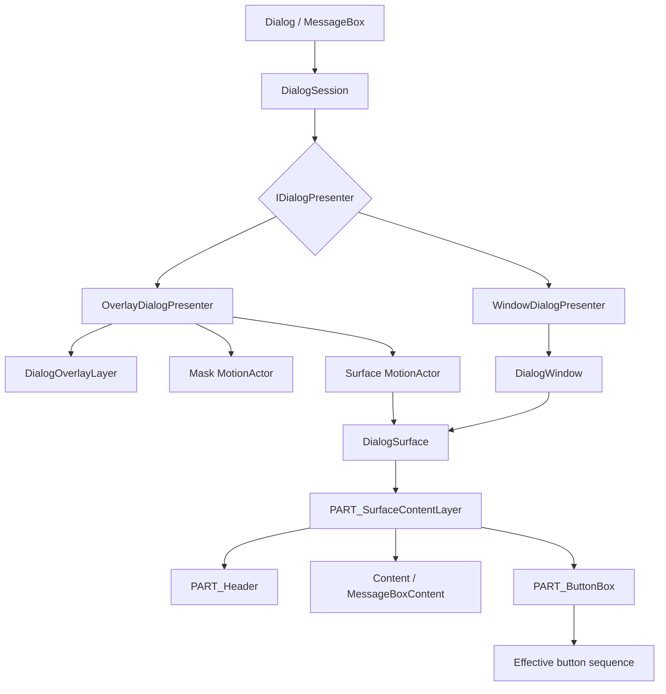

# Modal 桌面版实现原理

本文档描述 `Dialog` 和 `MessageBox` 的当前内部实现、状态所有权、组合结构、资源边界和释放规则。公共契约见 [Modal 桌面版架构设计](overview.md)，关闭动效编排见 [Modal Dialog 关闭动效设计](dialog-close-motion-design.md)，宿主尺寸算法见 [Modal 宿主尺寸与 Resize 设计](host-sizing-design.md)，内容区弹层叠放见 [Modal 内容弹层叠放设计](popup-layering-design.md)，Token 语义见 [Modal Token 设计](token.md)。

## 1. 实现定位

实现由一个 Dialog 打开意图、一个当前 `DialogSession`、两种 `IDialogPresenter` 和一个共享 `DialogSurface` 组成。私有方法和具体 AXAML selector 仍以源码为准；本文只记录稳定职责和维护不变量。

## 2. 源码文件结构

| 路径 | 职责 |
| --- | --- |
| `Dialog.cs` | public 属性、事件、内容、按钮和内部协作入口。 |
| `Dialog.Lifecycle.cs` | `IsOpen` reconcile、`OpenAsync`、事件通知和 presenter 选择。 |
| `Dialog.StaticAPI.cs` | 静态 modeless/modal 异步创建入口。 |
| `DialogSession.cs` | 单次展示状态机、关闭仲裁、取消、结果、焦点和 teardown。 |
| `IDialogPresenter.cs` | Overlay/Window 共用的最小异步协议。 |
| `DialogSurface.cs` | 标题、内容、Footer、按钮和 Overlay resize 的共享表面；负责 `PART_SurfaceContentLayer` 的 template part 生命周期。 |
| `ButtonBox/DialogButtonBox.cs` | 标准按钮生成、唯一有效按钮序列和自定义集合同步。 |
| `OverlayHost/DialogOverlayLayer.cs` | 解析 owning TopLevel 的 Avalonia `OverlayLayer` 或局部 scope fallback，并管理 owner scope 内的 presenter stack。 |
| `OverlayHost/OverlayDialogPresenter.cs` | 同时拥有 mask、Surface、placement、drag/resize 和 Overlay close motion choreography。 |
| `WindowHost/WindowDialogPresenter.cs` | 原生 Window 属性映射、modal owner、尺寸、位置和生命周期。 |
| `WindowHost/DialogWindow.cs` | 原生 caption close 仲裁和显式尺寸应用。 |
| `MessageBox/MessageBox.cs` | Dialog 派生的消息语义、静态 API 和按钮配置。 |
| `MessageBox/MessageBoxContent.cs` | MessageBox 的图标与内容组合。 |
| `Dialog/Themes` / `MessageBox/Themes` | 共享 Surface、Overlay presenter 和 MessageBox AXAML 结构。 |
| `src/AtomUI.Core/MotionScene/AbstractMotion.cs` | 共享 Motion 的 transition completion boundary；等待全部 transition 或安全超时后才报告完成。 |

对应回归测试位于 `tests/AtomUI.Desktop.Controls.Tests/Dialog` 和 `tests/AtomUI.Desktop.Controls.Tests/MessageBox`。

## 3. 核心类职责

- `Dialog` 只拥有最新 `IsOpen` 意图和当前 Session 引用，不拥有 presenter 视觉状态。
- `DialogSession` 独占一次展示的状态、取消源、普通关闭策略、结果、owner/target 订阅、前一焦点和完成任务。
- `IDialogPresenter` 只暴露 `ShowAsync`、`CloseAsync`、`FocusScope`、`CloseRequested` 和 `IAsyncDisposable`。
- `DialogSurface` 是两种 presenter 的唯一内容/按钮视觉源。
- `DialogButtonBox` 的 `_effectiveButtons` 是唯一视觉按钮序列。标准按钮来自私有元数据，自定义按钮仍由用户集合拥有。
- `DialogOverlayLayer` 解析当前 owner 的视觉宿主，并管理同一 owner scope 内的 presenter 顺序、可用尺寸和栈顶键盘路由。
- `OverlayDialogPresenter` 是 Dialog layer 的直接子节点；mask 与 Surface 不拆成独立 popup。
- `WindowDialogPresenter` 拥有一个 `DialogWindow`，并将同一个 `DialogSurface` 作为原生 Window 内容。
- `MessageBox` 不拥有隐藏 Dialog；它覆盖 Surface 内容和按钮配置 hook。

## 4. 状态与数据流

```text
IsOpen / OpenAsync
  -> Dialog reconcile
  -> create DialogSession + concrete presenter
  -> presenter.ShowAsync
  -> focus DialogSurface
  -> Dialog.Opened
  -> one close request
  -> Closing / BeforeCloseAsync
  -> commit result and outcome events
  -> presenter.CloseAsync + DisposeAsync
  -> restore focus
  -> Closed and task completion
```

Session 状态为 `Created -> Opening -> Open -> ClosePending -> Closing -> Closed`。

- 普通关闭只在 `Open` 接受，并在执行 `Closing`/`BeforeCloseAsync` 前进入 `ClosePending`。
- veto 或关闭策略异常返回 `Open`；声明式 `IsOpen=false` 被 veto 时恢复为 `true`。
- 强制关闭取消 pending policy 与 opening motion，从可关闭状态直接进入 `Closing`；它仍触发 `Closing`，但忽略 `Cancel`、跳过 `BeforeCloseAsync`，并忽略 `IsConfirmLoading`。
- 一旦结果提交，后续事件或 presenter 异常不允许把 Session 恢复为 Open。
- completion 只有在 presenter close/dispose、焦点恢复和 Session `Closed` 后才完成、取消或 fault。

`Dialog` 的 reconcile 负责区分实例 `OpenAsync` 与声明式重开：实例在活跃 Session 期间拒绝并发打开；声明式 `IsOpen=true` 可等待当前 Closing 完成后重新创建 Session。

`OpenAsync`、静态 Dialog/MessageBox 创建入口以及 `Accept`/`Reject`/`Done` 在读取视觉树或推进 Session 前统一切回 UI Dispatcher；泛型静态入口的 `TView` 也只在 UI Dispatcher 上实例化。`DialogSession` 不承担跨线程状态同步，调用方不需要通过空 Dispatcher 调度或延迟来避开 routed event 时序。

## 5. 组合结构模型



| 节点 | 来源 | 稳定性 | Agent 使用边界 |
| --- | --- | --- | --- |
| `Dialog` / `MessageBox` | public control | public-stable | 用户可直接使用。 |
| `DialogSession` | runtime C# | internal-observable | 只用于理解状态与任务边界。 |
| `OverlayDialogPresenter` / `WindowDialogPresenter` | runtime C# | internal-observable | 只用于维护宿主一致性。 |
| `DialogSurface` | runtime + `DialogSurfaceTheme.axaml` | internal-observable | 两种宿主必须共享，不建议用户直接创建。 |
| `PART_Header`, `PART_ButtonBox`, `PART_Resizer` | `DialogSurfaceTheme.axaml` | template-stable | 变更需同步实现、主题、测试和文档。 |
| `PART_MaskMotionActor`, `PART_SurfaceMotionActor` | `OverlayDialogPresenterTheme.axaml` | template-stable | 变更需保持 mask/Surface 同一 presenter。 |
| `PART_SurfaceContentLayer` | `DialogSurfaceTheme.axaml` | internal template collaboration | 关闭时承载前景 opacity；重套模板时由 `DialogSurface` 释放旧引用。 |
| `DialogOverlayLayer` | runtime C# | internal-observable | 只管理 scope 内栈，不提供全局 service。 |
| Avalonia `OverlayLayer` / `PopupOverlayLayer` | runtime infrastructure | internal-observable | 分别承载 Dialog presentation 与内容 popup，保留中间 light-dismiss 层。 |

Window 和 Overlay 各自拥有一个 Surface 实例，不共享同一个视觉对象；“共享 Surface”指共享类型、主题与行为实现。

## 6. 生命周期与模板接入

| 获取 | Owner | 释放 |
| --- | --- | --- |
| presenter `CloseRequested` | `DialogSession` | `BeginClosing` |
| placement target detach / owner closed | `DialogSession` | `BeginClosing` |
| pending close CancellationTokenSource | `DialogSession` | veto、commit 或 forced close |
| presenter opening cancellation | concrete presenter | `CloseAsync` / `DisposeAsync` |
| Dialog property bindings | `DialogSurface` / presenter | `Dispose` / `DisposeAsync` |
| custom button Click handlers | `DialogButtonBox` | collection change、template release、Surface dispose |
| Overlay mask/header/resize handlers 与 pointer capture | `OverlayDialogPresenter` / `OverlayDialogResizer` | release、capture lost、re-template 或 `DisposeAsync` |
| Window events and property bindings | `WindowDialogPresenter` | `DisposeAsync` |
| Dialog-to-Window resource bridge | `WindowDialogPresenter` | 从 Window resources 移除并在 `DisposeAsync` 退订 |
| Surface composition child links | concrete presenter | Overlay 在退出 motion 后、移除 layer 前断开；Window 在原生关闭后于 dispose 中断开 |
| inheritance/resource parent | presenter | 从 layer/window 移除后清空 |
| MessageBox default button content cache | `MessageBox` 当前 Surface | `ReleaseSurfaceButtons` |

`DialogSurface.OnApplyTemplate` 先释放旧 Header/ButtonBox/Resizer 订阅，再接入新 parts。`DialogButtonBox` 在 template 为空或重套用时立即清空旧 panel 和视觉父级。

Overlay presenter 在外层 Surface、内容层和 modal mask 的关闭任务全部完成后，先断开 `DialogSurface` 子树的 composition children，再释放 Surface 并移除 Overlay layer；空的 `DialogOverlayLayer` 随后从实际 host 删除并解绑 size 事件。Window presenter 先等待原生 Window 关闭，再在 dispose 中断开 composition children、释放 Surface、bindings、资源 bridge 和 `Window.Content`。两条路径都防止调用方保留 Content/CustomButton 等子控件时，其旧 `CompositionVisual.Parent` 链反向保留 Presenter 和 Surface；原生关闭或后续释放抛出时仍继续 teardown，最后传播首个异常。

## 7. 交互与事件处理

- DialogSurface 把标准/自定义按钮点击转成 `DialogPresenterCloseRequestedEventArgs`，Session 决定是否关闭。
- Enter/Escape 由栈顶 Overlay presenter 或当前 Window 转发给 Surface 的有效按钮序列。
- modal mask 只在左键、真实 mask visual subtree、且 presenter 为栈顶时请求关闭；`IsMaskClosable=false` 时该输入被吞掉且不发起任何关闭请求。该门控只存在于 Overlay presenter 的 mask 输入路径，不复制到 mask 控件或 Session veto 层。
- modeless presenter 在 Surface 外不阻断 pointer hit-test；点击 Surface 会把整个 presenter 激活到栈顶。
- Overlay 标题栏拖动通过复用的 render-only translation 更新 Surface，并同步 Dialog offset 作为持久化状态；resize 修改 offset 或 Surface 正文尺寸。resize handle 按下后捕获 pointer，即使指针离开细小 handle，release/capture lost 仍会清理 origin 与 dragging state。Surface 正文受 Window visible frame 与有效 drawn frame thickness 共同约束，BoxShadow 不参与定位。
- Window caption close 先请求 Session 关闭；Session commit 后 `DialogWindowCloseState.Closing` 放行一次真实 native close。`OwnerWindowClosing` 始终放行，随后由 owner closed 强制 teardown。
- Window presenter 禁用 Surface 内隐藏 header 的 `TitleIcon`，由原生 Window 标题栏唯一承载该图标，避免两个 presenter 争用同一个 `PathIcon` visual parent。
- Session 在 Show 前记录当前焦点，Show 后聚焦可聚焦的 DialogSurface，Close 后优先恢复原焦点，其次恢复 placement target。

## 8. 内部算法与关键流程

### 8.1 有效按钮序列

`DialogButtonBox` 使用一张私有标准按钮定义表创建标准按钮，再与 `CustomButtons` 组合成 `_effectiveButtons`。每次 Add/Remove/Replace/Move/Reset/Clear 都重建视觉分组并对称同步自定义按钮 Click 订阅。Surface 对有效序列取快照，用于键盘查找、confirm loading binding 和 MessageBox 配置。

标准按钮默认文案使用 `Template` priority binding；MessageBox 的显式 OK/Cancel 文案使用 local value 覆盖，清空后自动恢复最新语言资源。MessageBox 的样式、默认按钮和启动位置也只写入 `Template` priority，调用方 local 配置始终优先。MessageBox 语义配置运行时变化后重新执行现有 `ButtonsConfigure`，维持调用方配置最后生效的顺序。

### 8.2 自然尺寸与启动定位

- Overlay 将 `HostWidth/Height=NaN` 保留为 auto，先应用 min/max，再测量 Surface 的 `DesiredSize` 并计算 placement。
- Window 在 native `Show()` 前应用 managed Window/Surface styling 和 template，并测量 Window tree，使 `ContentPresenter` 附加 `DialogSurface`。Presenter 将自然测量、结构性约束、chrome、owner screen working area 与 render scaling 一次性解析为最终 ClientSize 和初始 placement；首个原生可见帧直接使用这份几何快照，不使用 opacity staging、Dispatcher 延迟或 post-show reposition。打开后只跟踪实际 native resize/state 与相关 capacity/chrome 变化；运行时 finite 值通过 `DialogWindow.ApplyRequestedSize` 更新 ClientSize。
- 不存在固定 `520x240` fallback 或额外像素补偿。

`Dialog` 的水平和垂直 startup anchor 注册默认值均为 `Center`，与 `DialogOptions` 和静态 API 保持一致。显式选择 `Custom` 时，对应轴由 `HorizontalOffset` / `VerticalOffset` 解析；未提供 offset 时该轴从 owner bounds 的起点开始。显式 `Left` / `Right` / `Top` / `Bottom` 的 anchor 计算保持独立。

自然尺寸只提供初始 preferred size，不参与结构性 minimum。用户交互 resize 形成的 actual size 由 presenter 持有，不反向写入 `HostWidth/Height`。

### 8.3 结构性最小尺寸与 Resize

`DialogSurface` 根据当前 Header、Footer、有效按钮和 `DialogToken.MinWidth/MinHeight` 正文 viewport 基线形成 structural minimum。presenter 将 structural minimum、requested `HostMin/Max` 与 host capacity 交给共享纯值解析职责，得到 normal 状态的 effective constraints。

Overlay 直接把 effective constraints 应用于 Surface，并在 resize handler 中只读取缓存约束；handle 捕获 pointer，release 与 capture lost 复用同一个幂等结束路径。自然轴被新约束 clamp 后会提交为 presenter-owned actual geometry，后续放宽约束不回落。Window presenter 按当前 Template 模式把 Surface constraints 加回 chrome：managed/drawn title bar 使用 padding、frame shadow 与有效标题栏高度，CSD 使用 padding 与 `WindowDecorationMargin`；CSD、visible frame、screen、DPI 与相关 frame metrics 变化都会重新解析。Window 的 `CanMaximize` 由 `IsMaximizable` 与两个 `HostMax*` 组合得出，任一 finite maximum 都禁用 native maximize。Surface 的 measure invalidation 会重新比较 structural minimum，只有数值改变才通知 presenter。完整公式、maximize/restore 和 capacity 退化规则见 [Modal 宿主尺寸与 Resize 设计](host-sizing-design.md)。

Overlay 首次 placement 完成前收到 `StructuralMinimumChanged` 时，只重新解析 constraints 和 requested size，不 clamp 尚未解析的 Surface position，也不向 `OffsetX` / `OffsetY` 写回位置差值。首次 placement 完成后，同一路径才允许 clamp actual geometry 并同步 offsets；这样 template 初始布局不会把临时 `(0, 0)` 坐标固化为相对居中位置的负偏移。

### 8.4 Motion

Overlay 的 mask 和 Surface motion 并行等待；关闭时 `OverlayDialogPresenter` 还为 `PART_SurfaceContentLayer` 创建同 duration 的线性 opacity animation，并使用 `Task.WhenAll` 聚合 Surface、内容层和 mask 的任务。全部任务完成后才断开 composition children、Dispose Surface 和移除 presenter。`AbstractMotion` 对一个 Motion 内部的多个 transition 使用 `Task.WhenAll` 作为正常完成条件，并保留最长 duration 加安全余量的 timeout；不能因首个 transition 完成就提前报告 Motion 完成。Window host 不创建 Surface `MotionActor`：它在 native `Show()` 前完成初始尺寸和 placement，首个可见帧直接使用已解析的几何。`DialogWindow.Opened` 和 `DialogWindow.Closed` 是 Window presenter 的原生生命周期边界；关闭流程等待原生 Window 关闭和资源清理，不依赖 Surface close motion。Overlay 的 opening/closing motion 仍由其 presenter 等待，duration 来自 Dialog scope 的 `MotionDurationMid`。详细 choreography 见 [Modal Dialog 关闭动效设计](dialog-close-motion-design.md)。

### 8.5 Overlay 宿主与窗口几何

`DialogOverlayLayer` 优先解析 placement target 所属 `TopLevel` 的 Avalonia `OverlayLayer`；该层高于普通 Window content，低于 `LightDismissOverlayLayer` 与 `PopupOverlayLayer`。无可用 TopLevel overlay 时，使用 placement target 所在的 `ScopeAwareOverlayLayer` fallback。TopLevel host 的 `AvailableSize` 以 `TopLevel.ClientSize` 为真源；局部 scope 使用 scope layer 的可用尺寸。最后一个 presenter 移除后，Dialog layer 从实际 host 删除，并释放 host size 与 TopLevel size 订阅。

`WindowDrawnDecorations` overlay 是 `TopLevelHost` 中与 Window 同级的 chrome 视觉，不参与 Dialog 宿主解析。modal presenter 活跃时获取 Window chrome suppression lease；多个 Dialog 或 Drawer 通过引用计数共享可见性 owner，最后一个 lease 释放后恢复 drawn chrome。

`OverlayDialogPresenter` 分离三套几何：

| 几何 | 真源 | 用途 |
| --- | --- | --- |
| mask bounds | 完整 `DialogOverlayLayer.AvailableSize` | mask、mask motion 和 modal pointer 阻断。 |
| Window visible frame | 完整 layer 按 `FrameShadowThickness` 内缩 | Window 统一外轮廓和透明 shadow buffer。 |
| Dialog body owner bounds | visible frame 按当前有效 drawn `FrameThickness` 内缩 | Surface 正文测量、placement、drag、resize、maximize 和 restore。 |
| Dialog BoxShadow extents | `DialogSurface` 主题绘制 | 仅绘制，不参与正文尺寸和位置约束。 |

AtomUI Window 的 visible frame 统一复用 `WindowVisualLayerClip` 计算，完整 layer bounds 先按 `FrameShadowThickness` 内缩。Dialog 正文 owner bounds 再读取当前 drawn decorations 已按 render scaling 取整的有效 `FrameThickness`；该值通过现有集中反射兼容边界按能力获取，并由 `WindowDecorationMargin`/frame shadow 几何变化驱动缓存刷新，不能在拖动热路径反射，也不能按 OS 硬编码。

`HostWidth` / `HostHeight`、`HostMin*` 和 `HostMax*` 均描述 Surface 正文。普通 TopLevel 和局部 scope 没有 drawn decorations frame 契约，frame thickness 为零。Dialog maximize 继续使用同一正文 owner-bounds 算法；owner Window 自身进入 maximized/fullscreen 后，Avalonia 会把其有效 drawn frame thickness 发布为零。

macOS 原生 caption chrome 位于 Avalonia 客户端 visual tree 外，Overlay 无法对该系统区域绘制 mask；popup overlay 仍覆盖完整 Avalonia client layer，Surface 使用同一 visible-frame 规则。客户端之外的原生 chrome 边界不通过额外原生窗口或第二套 mask 模拟。

mask 始终使用完整 layer bounds，不复用 owner bounds。Window theme 中的 `WindowVisualLayerClip` 是窗口 frame shadow 和 CornerRadius 的统一外轮廓裁剪者；Presenter 不为 mask 复制 margin、圆角或第二套 clip。Window resize、`ClientSize`、frame shadow、drawn frame thickness 和 Window state 变化后，layer 与 presenter 重新解析上述几何。

Dialog 内容区内的 popup 沿 placement target 解析同一 Window `TopLevel`，再由 Avalonia 选择该 manager 的 `PopupOverlayLayer` 或原生 Popup host。Dialog 所在 `OverlayLayer`、`LightDismissOverlayLayer` 与 `PopupOverlayLayer` 使用 Avalonia 固定层序，因此内容弹层位于 presenter 之上且外点关闭有效；AtomUI 不创建嵌套 layer manager，也不接管 Popup host 生命周期。完整契约见 [Modal 内容弹层叠放设计](popup-layering-design.md)。

## 9. 资源、性能与 AOT 边界

- Overlay presenter 在 Dialog 已附加时以 Dialog 为 inheritance parent，否则以 placement target 为 parent。
- Window 保留 DialogSurface 到 Window `ContentPresenter` 的正常 styling parent 链，避免在未附加树中提前实例化的嵌套控件失去 ControlTheme。Dialog/owner 资源由 presenter-owned `DialogResourceBridge` 转发到 Window resources；bridge 对称转发 `ResourcesChanged`，并在 `DisposeAsync` 中移除和退订。
- runtime binding 只用于动态 presenter/Surface/按钮关系，并由 owning presenter、Surface 或 ButtonBox 对称释放。
- Presenter 为 Surface 复用单一 `MatrixTransform` 作为位置 owner。拖动 `PointerMoved` 只更新 Matrix translation 并同步不触发布局的 `Dialog.OffsetX/Y`；位置先按 DPI 取整，再二次 clamp 到 body owner bounds，避免取整重新越界。
- drawn decorations 反射兼容边界只读取 frame/titlebar 几何；Modal 不反射发现业务 host，也不新增 trimming root。实现不使用反射修改 TemplatedParent，不扫描程序集发现 Dialog API，不使用同步 DispatcherFrame。
- Session、Presenter、Surface 和 Content 的关闭回收由 Overlay/Window WeakReference 测试覆盖。
- 状态机、按钮表和 presenter 选择都是静态类型路径，保持 NativeAOT 友好。

## 10. 维护不变量

- `Dialog` 打开意图与一个当前 Session 是唯一生命周期 owner。
- 所有关闭来源最终执行同一个 `CompleteCloseAsync` teardown。
- 普通 veto 发生在结果提交前；结果提交后只允许完成 teardown 和传播异常。
- Overlay 与 Window 的 `ShowAsync`/`CloseAsync` 都等待真实 presentation 边界。
- mask 与 Surface 必须保留在同一个 Overlay presenter 中。
- Overlay 关闭时 Surface 外层、`PART_SurfaceContentLayer` 和 modal mask 的任务必须由同一个 presenter 聚合；所有任务完成前不得断开 composition children、Dispose Surface 或移除 presenter。
- `AbstractMotion` 只能在全部 transition 完成或安全 timeout 后报告 Motion 完成；不能按首个 transition 的完成通知 teardown。
- `PART_SurfaceContentLayer` 是可选内部协作节点；缺失时仅退化为外层 motion，不能阻断基本关闭流程。动画期间不得改变 Surface Bounds、布局或 visual parent。
- 所有平台的 Overlay presenter 必须保留在 owning `TopLevel` 的 `OverlayLayer`；drawn decorations overlay 只绘制 chrome，不能承载业务 presentation。
- Dialog 内容、Popup placement target 与 owning Window 必须解析到同一 `TopLevel`；Popup 使用更高的 Avalonia popup layer，并保留中间 light-dismiss 层。
- mask bounds、Window visible frame、Dialog body owner bounds 和 Dialog BoxShadow extents 必须保持独立。mask 覆盖完整 layer；所有平台的 Surface 正文都可进入 managed/drawn 标题栏但不能覆盖有效 frame；BoxShadow 允许由 Window visual-layer clip 在外轮廓处裁剪。
- Dialog 与 Drawer 共享 Window chrome suppression 的引用计数 owner，但不共享 layer、容器或 presentation 生命周期状态。
- Surface structural minimum、requested Host constraints 和 host capacity 必须由同一纯值规则解析；Overlay 与 Window 不能分别定义默认最小尺寸语义。
- Window presenter 只能在 Surface constraints 解析完成后加回 Window chrome；live resize 热路径不能重新测量结构区域。
- MessageBox 继续作为 Dialog 派生类，不增加平行 host/session/button cache 生命周期。
- mask 外点关闭入口只由 `IsMaskClosable` 在 Overlay presenter 的 mask 输入路径统一门控；不引入第二条 mask 关闭路径，也不在 Session veto 层复制该判断。
- 新增 binding、事件、资源 parent、motion source 或内容引用时，必须在同一个 owner 中增加释放点和回归测试。

## 11. 测试与验证

重点测试：

- `DialogSessionTests`: 状态转换、veto、forced close、异常和 presenter failure。
- `DialogLifecycleTests`: 实例/声明式打开、取消、detach、重开、嵌套焦点和 WeakReference。
- `OverlayDialogPresenterTests` / `DialogContentPopupLayeringTests`: mask ownership、modal/modeless 输入、栈顶路由、`IsMaskClosable` 门控、TopLevel ownership、popup/light-dismiss、chrome suppression 引用计数、完整 mask bounds、平台 body bounds、结构性最小尺寸、拖动 resize、capacity 退化、maximize/restore 和 motion。
- `WindowDialogPresenterTests`: Opened/Closed 原生生命周期、首帧几何、原生关闭、owner close、自然尺寸、Surface/chrome constraints 换算、native resize、placement 和资源 parent。
- `DialogButtonBoxTests` / `DialogSurfaceTests`: 有效按钮集合、template 生命周期、内容和配置。
- MessageBox tests: 派生结构、语义样式、motion anchor、重入和按钮引用释放。
- `tests/AtomUI.Desktop.Controls.TestApp/Scenarios/PopupInDialog`: 永久人工回归入口，覆盖真实窗口中的 Popup 家族、pointer/focus、CSD/native chrome 与可见性。

最终 owning TopLevel/Overlay/Popup 分层已在 Windows CSD、macOS 原生 chrome，以及 Ubuntu GNOME Wayland 环境实机测试；
Wayland 证据仅覆盖 `PopupInDialog` 的 Dialog 内容 Popup 真实窗口人工回归。Linux X11 尚未测试。Headless 测试只能证明
共享 managed 不变量，不能替代缺失平台的实机证据。

迭代先运行 Dialog/MessageBox filter，再运行完整 `AtomUI.Desktop.Controls.Tests`、Gallery tests/build、NativeAOT publish 和 `git diff --check`。
