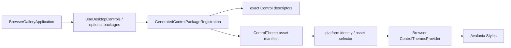

# AtomUI Gallery Browser 主题与宿主架构

本文档记录 AtomUI Gallery Browser 的当前宿主、Control 包注册、平台主题选择和验证边界。它描述最新实现，
不再把迁移期的手工 Token 白名单、聚合主题或最小主题清单作为维护方案。

## 1. 设计结论

Browser Gallery 继续复用 Desktop Gallery 的产品模块、导航、路由和 ShowCase。应用侧使用与 Desktop 相同的
Control 包入口：

```csharp
this.UseAtomUI(builder =>
{
    builder.UseLanguages(
        GalleryLanguageDefaults.Resolve(CultureInfo.CurrentUICulture),
        [LanguageTags.EnUS, LanguageTags.ZhCN, LanguageTags.ZhTW]);
    builder.WithInitialTheme(IThemeManager.DEFAULT_THEME_ID);
    builder.UseAlibabaSansFont();
    builder.UseAlibabaPuHuiTiFont();
    builder.UseDesktopControls();
    builder.UseDesktopExtras();
    builder.UseDesktopColorPicker();
    builder.UseDesktopDataGrid();
    builder.UseGalleryControls();
});
```

平台差异由 Control 包内部处理。Browser 项目不维护 Control Token 类型列表、主题 ResourceInclude 清单或逐
Control 注册调用。

## 2. Browser 宿主

`BrowserGalleryView` 继承 `GalleryBrowserShellView`，只提供产品配置、`WorkspaceWindowViewModel` 工厂、
`CaseNavigation` 工厂和 Browser 字体。导航分组、默认页面、路由、OverlayLayer、media breakpoint、footer 和
ShowCase 生命周期由 `AtomUI.Toolkits.GalleryBase` 与 `AtomUIGalleryModule` 统一维护。

Browser 启动通过 ReactiveUI Avalonia 集成注册同一份 ViewLocator：

```csharp
AppBuilder.Configure<BrowserGalleryApplication>()
    .UseReactiveUI(build =>
        build.ConfigureViewLocator(locator => AtomUIGalleryModule.RegisterViews(locator)))
    .StartBrowserAppAsync("out");
```

Browser 不缓存、预热或手工创建 ShowCase 页面，也不维护独立页面枚举和 `switch` 工厂。

## 3. 生成式 Control 包注册

主题注册主线：



每个包的生成入口一次性注册：

- 每个 public、可主题化 Control 的 exact CLR type、identity 和可选 Own Token descriptor。
- 每个独立 `*Theme.axaml` 叶子的 owner、引用 Control identity、Semantic Part Theme 契约和资产 URI。
- 生成的强类型 `XxxTokenResource` 和主题资源加载包装。

运行时不扫描程序集或 AXAML，不根据 `TargetType`、继承或 `BasedOn` 推断 identity。

### 3.1 Common Controls

`UseCommonControls()` 在 native window 与 Browser 下分别使用 `CommonControlThemesProvider` 和
`BrowserCommonControlThemesProvider`，两者都接收同一份生成 descriptor 和资产 manifest。Common Browser 路径
不再排除 `EmbeddableControlRootTheme.axaml`。

`EmbeddableControlRootTheme.axaml` 曾在 Browser 启动时把 Token 返回的不可变 Brush 直接赋给要求具体
`SolidColorBrush` 的 `TopLevel.SystemBarColorProperty`。当前在 API 边界显式创建 `SolidColorBrush`，因此该主题可由
Common generated resources 正常加载：

```xml
<Setter Property="TopLevel.SystemBarColor">
    <SolidColorBrush Color="{atom:SharedTokenResource ColorBgContainer}" />
</Setter>
```

这个修复保留主题资产完整性，不需要为 Browser 维护 Common 主题例外清单。

### 3.2 Desktop Controls

`UseDesktopControls()` 先注册 Common 包，再按 `RuntimePlatform.Features.SupportsNativeWindow` 选择生成式注册参数：

- Native：注册全部 Control descriptor，排除 `Themes/Browser/` 下的替代资产。
- Browser：按 exact identity 排除确认不支持的 Control，再由 manifest 自动排除引用这些 identity 的资产；最后以
  `Themes/Browser/` 中的同路径资产替换普通资产。

当前 Browser 排除的 identity 是：

```text
AdornerLayer
OtpLineEdit
OtpLineEditCell
SplitView
TreeViewFlyoutPresenter
Window
WindowTitleBar
```

这是平台能力筛选，不是 Token 白名单。其余被选择 Control 仍拥有完整 identity、可选 Own Token 和全部可配置
Global Token。

Button 家族的 Browser 替代资产是三个独立叶子：

```text
Buttons/Themes/Browser/ButtonTheme.axaml
Buttons/Themes/Browser/DropdownButtonTheme.axaml
Buttons/Themes/Browser/IconButtonTheme.axaml
```

Browser selector 通过相对资产路径替换对应普通主题；Native selector 不加载这些 Browser 叶子。不存在
`BrowserButtonThemes.axaml` 或逐 Control 聚合主题。

### 3.3 Optional Packages

Extras、ColorPicker 和 DataGrid 也通过各自的 `GeneratedControlPackageRegistration` 一次性注册 descriptor、主题
叶子和 Provider。Browser Gallery 使用正常的 `UseDesktopExtras()`、`UseDesktopColorPicker()` 和
`UseDesktopDataGrid()`，不维护额外 Token 类型列表。

## 4. Token 边界

Browser 与 Desktop 使用同一 ThemeSchemaRegistry 规则：

```text
Configurable Control Tokens = All registered Global Tokens + Current Control Own Tokens
```

Control 级配置可以覆盖任意已注册 Global Token；合法但没有被当前 Control 消费的 Token 可以没有视觉效果。
Own Token 与 Global Token 禁止同名，未知名称报错。Browser 不维护“这个页面或主题用了哪些 Token”的依赖或
白名单。

AXAML 继续使用统一资源语义：

- `SharedTokenResource` 读取真正的 Global Token。
- `XxxTokenResource` 读取 Xxx Control 的 Effective Global Token 或 Own Token。
- Semantic Part Theme 显式引用 owner 与真实 Part Control 的 TokenResource。

## 5. Runtime 初始化

Desktop Control 包的初始化回调在所有平台注册 `MotionTransformOptionsAnimator`，使 Browser 中 FloatButton 等依赖
`TransformOperations` 的动效不会停留在隐藏起始态。存在 `IInputManager` 时安装 `ToolTipService`；
`MediaBreakPointThemeBootstrapper` 只在 native window 平台挂载。

Window、WindowTitleBar 和其他 native host 能力由 exact identity 筛选与运行时 feature 判断隔离，不能通过减少
全局 Token schema 或手工删主题来规避。

## 6. 调试结论

| 现象 | 根因 | 当前处理 |
| --- | --- | --- |
| Browser 启动出现 `ImmutableSolidColorBrush -> SolidColorBrush` 转换异常 | `TopLevel.SystemBarColorProperty` 是具体类型 API 边界 | 在 `EmbeddableControlRootTheme` 显式构造 `SolidColorBrush`，并保留回归测试。 |
| 新 Control 或主题在 Browser 中容易遗漏 | 迁移期维护了独立 Token/主题清单 | 使用 generated package registration；只维护少量确有平台差异的 identity 和替代资产。 |
| Button Browser 替代主题覆盖不完整或加载到 Native | 多个按钮主题曾通过单个聚合入口选择 | 使用三个独立 Browser 叶子，并测试 Native 排除与 Browser 同路径替换。 |
| FloatButton 展开后子按钮保持隐藏 | Browser 未注册 `TransformOperations` animator | 所有平台注册 Motion animator，native-only 服务继续受 feature 判断保护。 |
| ReactiveUI 页面无法激活 | Browser AppBuilder 未注册 Avalonia activation 和共享 ViewLocator | `UseReactiveUI(...)` 与 `AtomUIGalleryModule.RegisterViews(...)` 统一注册。 |
| DOM 文本为空但页面实际已渲染 | Avalonia Browser 主要绘制到 canvas | 结合 splash error、当前端口 console、canvas 像素和截图验证。 |
| console 出现旧 wasm/端口错误 | 浏览器保留旧页面日志 | 每次 smoke 停止旧宿主并只判断当前 URL 的 console 与画面。 |

## 7. 验证基线

涉及 Browser 主题、包注册或平台筛选时至少执行：

```bash
dotnet build controlgallery/AtomUIGallery.Browser/AtomUIGallery.Browser.csproj -c Debug
dotnet test tests/AtomUI.Desktop.Controls.Tests/AtomUI.Desktop.Controls.Tests.csproj --framework net10.0 --no-restore
dotnet test tests/AtomUIGallery.Tests/AtomUIGallery.Tests.csproj --framework net10.0 --no-restore
git diff --check
```

还必须实际启动 Browser，确认当前端口没有 splash error 或 console error/warn，并检查 canvas 非空、默认 Gallery
页面和受影响 ShowCase 可见。涉及共享主题注册时同时验证 Desktop build；涉及 descriptor、资源包装或裁剪边界时
执行 Gallery NativeAOT publish。

## 8. 扩展规则

1. 新 Control 按标准目录提供 public Control、可选 `[ControlDesignToken]` Own Token 和独立 `*Theme.axaml` 叶子，
   不修改 Browser Token/主题清单。
2. 只有确认 Control 依赖 Browser 不支持的平台能力时，才把 exact identity 加入 Browser 排除集合，并增加 selector
   与运行时测试。
3. 需要 Browser 专用视觉时，在 `Themes/Browser/` 下提供与普通资产相同的相对文件名；Native 和 Browser selector
   必须分别验证排除与替换。
4. Window、Dialog native host、Notification native host、文件系统和平台协议能力必须通过 feature 判断或独立
   host 边界处理，不能污染共享 Token schema。
5. Browser 启动异常优先定位完整异常类型和 API 属性边界；不要先删除主题资产或缩小 Global Token schema。
