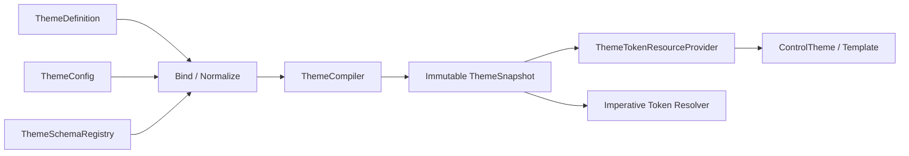
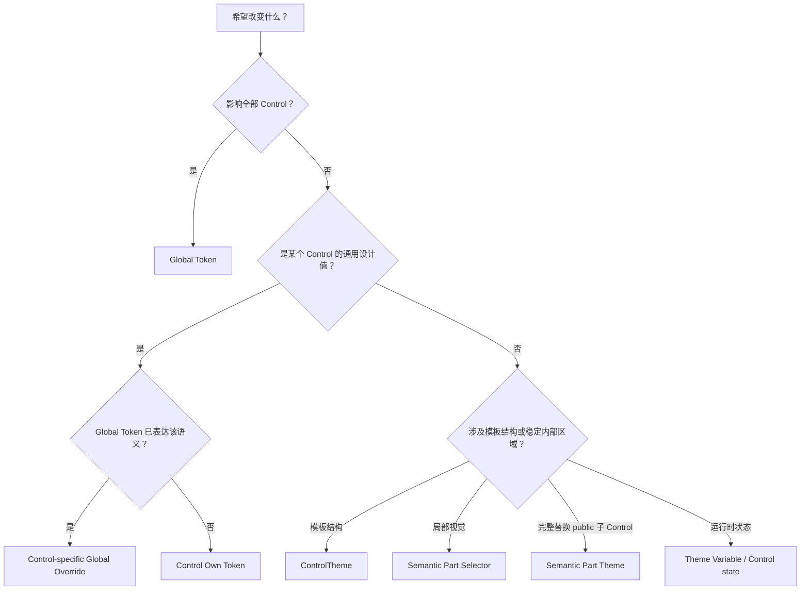
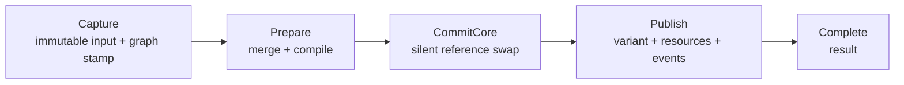

# AtomUI 主题定制指南

AtomUI 的主题系统不是一组可以随意覆盖的 Brush，也不是在每个 ControlTheme 外面再包一层 ResourceDictionary。
它解决的是一个更完整的问题：如何用稳定的设计语言描述全局视觉，允许单个 Control 精确偏离全局规则，又能在
运行时安全切换主题、建立局部主题、支持第三方 Control，并保持 NativeAOT、性能和资源生命周期可控。
本文说明这些能力在 Avalonia、C# 和 AtomUI ControlTheme 中的使用方式与定制边界。

本文面向两类读者：

- 希望为应用定制颜色、尺寸、暗色、紧凑模式和单个 Control 外观的主题作者。
- 希望开发 AtomUI Control、主题包或维护主题运行时的工程师。

本文先建立容易理解的心智模型，再逐步进入 Token 计算、Control identity、主题资产、作用域、事务和 AOT 等
使用边界。稳定运行时契约与验收条件以 [AtomUI 主题系统架构](../../architecture/systems/theming/runtime.md) 为准。

## 1. 先把主题理解成一次编译

最容易误解主题系统的方式，是把它想成一个不断变化的资源字典。这样会自然地产生几个问题：

- 一个颜色变化后，哪些派生颜色应该重新计算？
- Button 可以覆盖 `ColorPrimary`，但为什么不能影响同一棵树里的 DatePicker？
- 一个主题切换过程中，控件会不会短暂读到一半新值、一半旧值？
- 局部暗色主题里的 Popup 和独立 Window 应该从哪里获得资源？
- 第三方 Control 如何注册 Token，而不依赖运行时反射？

AtomUI 采用的心智模型是：

> 主题配置是源代码，ThemeCompiler 是编译器，ThemeSnapshot 是不可变编译产物，ResourceProvider 只是产物的
> Avalonia 投影。



这个模型带来四个直接结论：

1. Token 计算只有一条标准路径，不能在 ControlTheme、Control 实例和服务层各维护一份状态。
2. 主题切换先完整生成新 snapshot，再一次性交换引用，不把中间状态暴露给 UI。
3. AXAML 只按稳定资源 key 读取结果，不在查询时重新计算 Token。
4. schema、identity、Token key 和主题资产都应在构建期确定，运行时不扫描程序集或 AXAML。

## 2. 从 Global Token 到最终视觉

AtomUI 把 Token 分成 Global Token、Effective Global Token、Control Own Token 和 Effective Control Token。

```text
Global Token
    -> Control-specific Global Override
Effective Global Token
    -> calculate Control Own Token defaults
    -> Control Own Token Override
Effective Control Token
    -> ControlTheme
    -> Semantic Part Selector
    -> optional Semantic Part Theme
    -> Template / Runtime visual state
```

### 2.1 Global Token

Global Token 描述整个设计语言，例如主色、通用文字颜色、Control 高度、圆角、排版、间距和动效时长。修改全局
`ColorPrimary` 的含义是改变整个应用的主色体系，而不是只改变某一个 Button。

Global Token 还可以经过 Default、Dark、Compact 等算法派生 Map Token 和 Alias Token。主题作者通常修改少量
Seed Token，再由算法计算完整结果，而不是手工维护每一种状态颜色。

### 2.2 Effective Global Token

有些设计需要“只让 Button 的主色变成绿色，其他 Control 仍使用蓝色”。这不是一个新的 Button Own Token，而是
Button identity 下的 `ColorPrimary` 有效值：

```text
Global ColorPrimary = Blue

Button Effective ColorPrimary = Green
DatePicker Effective ColorPrimary = Blue
```

Control 级 Global Token 覆盖不会修改全局 snapshot，也不会形成一棵新的资源子树。它只是当前 ThemeContext 的
snapshot 中，属于特定 Control identity 的稀疏差量。

### 2.3 Control Own Token

Own Token 只表达某个 Control 独有的稳定设计语义，例如：

- `Button.ContentPaddingInline`。
- `DatePicker.CellHeight`。
- `Rating.StarGap`。

Own Token 不是 Global Token 的副本。如果 `ControlHeight` 已经存在于 Global Token，Rating 不应再次定义一个同名
Own Token。它直接从 Rating 的 Effective Global Token 读取 `ControlHeight`。

Own Token 类型使用无参数 `[ControlDesignToken]` 标记，使生成器可以直接发现 Token 定义。该标记不接收 Control
类型、identity、ID 或主题路径；`[ControlDesignToken<Rating>]` 这类泛型关联不属于设计。

### 2.4 Effective Control Token

ControlTheme 最终消费的是：

```text
Effective Control Token
    = Effective Global Token for this Control
    + Control Own Token
```

Global Token 与 Own Token 在定义和配置层保持分离，但在 AXAML 消费层使用同一个简洁入口。主题作者不需要在每个
Setter 中重复声明它来自 Global 还是 Own。

## 3. Control identity 为什么不能由 TargetType 推断

`ControlTheme.TargetType` 回答的是“这份样式应用到什么类型”，`ControlTokenIdentity` 回答的是“这次 Token 查询
属于哪个公开 Control 的设计契约”。两者经常相同，但不能把它们设计成同一件事。

一个 SearchEdit 可以在模板里使用 Button。这个内部 Button 的 TargetType 是 Button，但它同时处于 SearchEdit
的组合语义中：

- Button 的基础字体、尺寸、背景和交互视觉属于 Button。
- 搜索按钮与输入框的拼接边框、圆角、状态投射和搜索行为属于 SearchEdit。

如果根据 TargetType 自动选择 Token，SearchEdit 无法表达自己的组合语义；如果让内部 Button 借用 LineEdit
identity，又会导致用户不知道应该在 Button、LineEdit 还是 SearchEdit 下配置 Token。

因此 AtomUI 坚持以下边界：

- 每个对外可主题化的 Control 拥有独立 `ControlTokenIdentity`。
- TargetType、Control 继承和 ControlTheme `BasedOn` 都不能推断 Token identity。
- internal Part、Presenter、Decorator 和 Host 不拥有独立 identity。
- Token identity 由显式的 `XxxTokenResource` 表达，不依赖 ambient scope。

这使 ControlTheme 可以自由组合，而 Token 的归属仍然清晰。

## 4. 两种 TokenResource，各自只做一件事

### 4.1 SharedTokenResource

```xml
<Setter Property="FontFamily"
        Value="{atom:SharedTokenResource FontFamily}" />
```

`SharedTokenResource` 永远读取当前 ThemeContext 的全局 Token。它不寻找 Control identity，也不响应 Control 级
覆盖。适合真正要求所有 Control 始终共享的值。

### 4.2 XxxTokenResource

```xml
<Setter Property="MinHeight"
        Value="{atom:RatingTokenResource ControlHeight}" />

<Setter Property="Margin"
        Value="{atom:RatingTokenResource StarGap}" />
```

`RatingTokenResource` 同时读取 Rating 的 Effective Global Token 和 Rating Own Token。`ControlHeight` 来自
Global Token，`StarGap` 来自 Own Token，但语法完全一致。

生成器为它产生强类型 `RatingTokenKey` 和 MarkupExtension 构造参数，因此：

- 输入 `{atom:RatingTokenResource ` 后可以获得 Token 提示。
- 可以选择 Rating Own Token 和当前 registry 中的全部 Global Token。
- Token 写错时在 AXAML 编译期失败。
- 运行时不解析字符串、不反射属性、不推断 TargetType。

这里故意没有 `Global=`、`Own=` 或 ControlTheme scope 配置。定义层负责分类，消费层只表达“读取 Rating 的这个
Token”。

## 5. 每个 Control 都拥有完整 Effective Global Token

Control 配置允许使用的 Token 固定为：

```text
Configurable Control Tokens
    = All Global Tokens
    + Current Control Own Tokens
```

AtomUI 不维护“这个 Control 消费了哪些 Global Token”的白名单。Own Token 计算、AXAML 和 C# Binding 都可以直接
使用任意已注册 Global Token，不需要生成依赖声明。配置绑定时先匹配当前 Control Own Token，未命中时匹配完整
Global Token schema；两处都不存在才报错。Own Token 与任意 Global Token 禁止同名。

一个合法 Global Token 如果没有被当前 Control 直接或间接使用，覆盖后可以没有视觉效果。这是允许的确定行为，
不能因此影响其他 Control identity 或真正的 Global Token snapshot。启用 `Global` 或 `Custom` Control 算法时，
Seed/Map 覆盖可能重新派生其他 Token，因此一个看似未直接使用的 Token 仍可能产生局部间接效果。

### 5.1 AXAML 和 C# 使用同一语义

```xml
<Setter Property="MotionDuration"
        Value="{atom:RatingTokenResource MotionDurationSlow}" />
```

只要 `MotionDurationSlow` 存在于 Global Token schema，这个引用和对应 Rating 配置就始终合法，不扩展 schema。
C# Binding 显式区分普通 Global 与当前 Control Effective Global：

```csharp
TokenResourceBinder.CreateGlobalTokenBinding(
    this, MotionDurationProperty, SharedTokenKind.MotionDurationSlow);

TokenResourceBinder.CreateControlTokenBinding(
    this, MotionDurationProperty, SharedTokenKind.MotionDurationSlow);
```

第二种 API 使用实例 exact CLR type 对应的生成式 identity；基类代码在注册的派生 Control 实例上读取派生
identity。Own Token 不随 CLR 继承替换。内部 part 由公开 owner 使用带 `owner` 的重载绑定，不创建公开 identity。
命令式读取使用 `ControlTokenAccessor.Capture(owner)`，不通过隐藏 StyledProperty 转运 Token。

### 5.2 为什么不保留“仅用于提示”的消费清单

消费清单无法完整证明间接计算、继承代码、C# Binding 和第三方主题行为。一旦它不再参与正确性，却继续出现在
Gallery 或文档中，就容易再次被误认为支持边界。AtomUI 因此彻底删除该清单；Gallery 单独展示 Control Own
Token，并提供统一、可搜索的 Global Token 目录。

## 6. 主题系统的五个运行时边界

理解内部边界有助于判断一项定制应该放在哪里。

| 边界 | 负责什么 | 不负责什么 |
| --- | --- | --- |
| Resolver / Definition | 发现和读取主题来源 | 不计算 Token，不加载 Control 实例 |
| Schema | 描述 Token、Control、算法和主题资产 | 不保存当前主题值 |
| Configuration | 绑定、验证和合并用户输入 | 不访问 Visual Tree |
| Compiler / Snapshot | 计算并冻结完整主题结果 | 不发布 Avalonia 通知 |
| ThemeContext / Resources | 发布 snapshot 并投影为资源 | 不维护第二份 Token 状态 |

### 6.1 ThemeSchemaRegistry

Registry 在应用初始化时由生成 descriptor 构建，包含 Global Token schema、带 exact CLR type 的 Control
descriptor、算法 descriptor 和 ControlTheme asset manifest。首个 snapshot 编译前冻结，之后不能动态追加类型。

### 6.2 ThemeConfig 与 ThemeDefinition

`ThemeDefinition` 是可命名、可发现、可持久化的完整主题来源。`ThemeConfig` 是应用启动、运行时请求或局部作用域
提供的不可变覆盖。两者最终进入同一个规范化和合并管线。

### 6.3 ThemeSnapshot

Snapshot 保存已经计算完成的全局 Token、Control Effective Global Token 差量、Own Token、资源投影、palette
和 appearance。它不保存 Control、Visual、Provider、订阅或可变 Token builder。

### 6.4 ThemeContext

ThemeContext 是稳定的运行时作用域身份，只持有当前 snapshot 的原子引用和唯一 ResourceProvider。主题变化时
替换 snapshot，不替换 Context 或 Provider。

这与 `ControlTokenIdentity` 完全不同：

```text
ThemeContext       = UI 子树当前使用哪个 ThemeSnapshot
ControlTokenIdentity = Snapshot 内查询哪个 Control 的 Effective Token
```

## 7. 选择正确的定制层级

| 需求 | 应使用的入口 |
| --- | --- |
| 修改整个应用的主色、圆角或字体 | Global Token |
| 只修改所有 Button 的主色或高度 | Button 下的 Global Token 覆盖 |
| 修改 Button 独有的内容内边距 | Button Own Token |
| 为页面建立局部暗色或紧凑主题 | ThemeConfigProvider |
| 修改 Control 的模板结构或状态映射 | 自定义 ControlTheme |
| 修改稳定内部区域的局部视觉 | Semantic Part Selector |
| 完整替换 SearchEdit 的搜索按钮 ControlTheme | `SearchButtonTheme` Semantic Part Theme |
| 开发一个全新的 Rating Control | 独立 Control identity、可选 Own Token、主题资产和包级注册 |

一个简单判断原则是：



## 8. 定制一套完整主题

Theme Definition XML 适合声明可命名、可切换、可放入应用资源或用户主题目录的完整主题。下面是一份精简示例：

```xml
<?xml version="1.0" encoding="utf-8"?>
<Theme xmlns="https://atomui.net/schemas/theme/v1"
       Id="AcmeLight"
       Name="Acme Light"
       Appearance="Light"
       IsDefault="false">
  <Algorithms>
    <Algorithm Id="Default" />
  </Algorithms>

  <Tokens>
    <Token Name="ColorPrimary" Value="#0F6CBD" />
    <Token Name="BorderRadius" Value="4" />
    <Token Name="FontSize" Value="14" />
  </Tokens>

  <Controls>
    <Control Catalog="AtomUI" Id="Button" Algorithm="Disabled">
      <Tokens>
        <Token Name="ColorPrimary" Value="#115EA3" />
        <Token Name="ContentFontSize" Value="14" />
      </Tokens>
    </Control>
  </Controls>
</Theme>
```

这份主题表达了三层意图：

1. `ColorPrimary`、`BorderRadius` 和 `FontSize` 改变全局设计语言。
2. Button 在自己的 Effective Global Token 中进一步覆盖 `ColorPrimary`。
3. `ContentFontSize` 覆盖 Button Own Token。

Binder 会根据当前 registry revision 验证 Button identity、Token 名和值类型。Button Own Token 与任意已注册
Global Token 都可以配置；只有名称在这两个 schema 中都不存在时才失败。

完整 XML 协议、算法形态和安全限制见 [主题定义 XML v1 规范](../../reference/theming/theme-definition-xml-v1.md)。

### 8.1 让主题进入 ThemeCatalog

主题定义只有经过 Resolver、Reader 和 Binder 后才会进入 ThemeCatalog。来源分为三类：

- AtomUI 内置主题，由内置 Resolver 显式注册。
- 应用或 Control 包中的 `avares://` 主题资源，由包级注册入口显式提供 URI。
- 用户主题目录中的 `*.theme.xml`，只在应用主动启用后读取。

应用启用用户主题目录时必须提供稳定 Application Id：

```csharp
this.UseAtomUI(builder =>
{
    builder.WithApplicationId("Acme.Editor");
    builder.UseUserThemeDirectory();
    builder.UseDesktopControls();
});
```

默认目录位于 `Environment.SpecialFolder.ApplicationData/{ApplicationId}/Themes`。主题系统不使用
`FileSystemWatcher` 自动监听；用户保存主题文件后，由应用调用 `IThemeManager.ReloadThemesAsync()` 手动刷新。

刷新会整批读取用户目录并原子提交 Catalog。任一用户主题无效时，不提交一半新、一半旧的结果；当前 Catalog、
根 snapshot 和局部 snapshot 全部保持原值。

## 9. 暗色、紧凑和 Control 算法

Global Algorithm 是有序派生链。例如暗色主题可以使用：

```xml
<Algorithms>
  <Algorithm Id="Default" />
  <Algorithm Id="Dark" />
</Algorithms>
```

Compact 算法可以继续追加，并声明为保持当前 appearance。算法不是简单的布尔开关；顺序属于主题语义。
`ThemeAlgorithm` 是算法身份的唯一类型，当前封闭成员为 `Default`、`Dark` 和 `Compact`。C# 配置、运行时状态、
descriptor 和缓存都使用枚举；XML 的 `Id` 只是在 Reader 边界使用的严格序列化文本。

Control 级算法有四种状态：

| 模式 | 含义 |
| --- | --- |
| `Unspecified` | 继承父 ThemeConfig 中同一 Control 的策略 |
| `Disabled` | 应用 Control 级覆盖，但不重新运行派生链 |
| `Global` | 使用当前全局算法链重新派生该 Control 的有效 Token |
| `Custom` | 使用该 Control 配置声明的算法链 |

大多数只调整少量颜色或尺寸的主题应使用 `Disabled`。只有当 Control 级 Seed Token 需要重新生成完整 Map/Alias
关系时，才使用 `Global` 或 `Custom`。

## 10. 在运行时切换主题

应用启动时应在 `UseAtomUI` Builder 阶段配置初始主题，使首个可见帧已经拥有正确 snapshot：

```csharp
this.UseAtomUI(builder =>
{
    builder.WithInitialTheme(
        "AcmeLight",
        new ThemeConfigBuilder()
            .WithAlgorithms(ThemeAlgorithm.Default)
            .Build());

    builder.UseDesktopControls();
});
```

启动后的切换使用 `IThemeManager.ApplyThemeAsync(ThemeRequest)`。`ThemeConfig` 是深度不可变值；更新主题意味着创建
并提交新的 Config，不能修改已经进入 Manager 的集合或 Token entry。

Control 级配置使用生成的强类型 identity 和 Token key。目标 API 形态为：

```csharp
theme.ControlTokens
    .For(ButtonTokens.Identity)
    .Set(GlobalTokens.ColorPrimary, Colors.SeaGreen)
    .Set(ButtonTokens.ContentFontSize, 15);
```

配置入口与 Theme Definition XML 使用同一个 schema，所以两者对 identity、Own/Global Token 分类、值类型和
算法的判断完全一致。

## 11. 为页面建立局部主题

`ThemeConfigProvider` 用于让某个 UI 子树拥有独立 ThemeContext。例如编辑器页面可以使用暗色，应用其余区域仍
使用亮色。Provider 当前 `ThemeConfig.Inherit` 决定是否从父主题的有效配置继续合并。

```text
Root ThemeContext
    +-- ordinary content: inherit root snapshot
    +-- ThemeConfigProvider(Editor Dark)
        +-- editor content: local snapshot
        +-- Popup with logical owner: inherit editor context
```

需要注意：

- Provider 每次更新仍使用同一个 ThemeContext 和 ResourceProvider。
- `Inherit=true` 在父有效配置上叠加本地配置。
- `Inherit=false` 从 AtomUI library baseline 重新开始，不复制父主题。
- 普通 Popup/Flyout 通过逻辑树继承。
- 独立 Window、Dialog、Notification TopLevel 必须从显式 owner 获得 ThemeContextLease。
- 无 owner 的静态 API 只能使用根主题，不能根据焦点或调用栈猜测局部主题。

局部主题是 UI 子树作用域；Control 级 Token 覆盖是 snapshot 内的 Control 域。两者可以组合，但不能混为一谈。

## 12. 自定义 ControlTheme

Token 负责设计值，ControlTheme 负责把设计值映射到 Avalonia 属性、selector 和模板结构。一个标准 Rating 主题
可以这样消费 Token：

```xml
<ControlTheme x:Key="{x:Type local:Rating}"
              TargetType="local:Rating">
  <Setter Property="MinHeight"
          Value="{local:RatingTokenResource ControlHeight}" />
  <Setter Property="Foreground"
          Value="{local:RatingTokenResource ColorText}" />
  <Setter Property="ItemSpacing"
          Value="{local:RatingTokenResource StarGap}" />

  <!-- Template 和 selector 按 Rating 的公开视觉契约定义。 -->
</ControlTheme>
```

这里的关键不是 AXAML 语法，而是职责分配：

- `ControlHeight` 和 `ColorText` 是这个默认 RatingTheme 当前消费的 Global Token；Rating 仍可覆盖其他任意 Global Token。
- `StarGap` 是 Rating Own Token。
- pressed、hover、disabled 等实例状态由 selector 和 Theme Variables 映射。
- 模板节点名称、临时布局值和实例状态不进入 Own Token。

ControlTheme 不声明 Token scope。`RatingTokenResource` 已经明确了 identity。

## 13. 定制 Semantic Part

Control 通过稳定 `.semantic-*` Selector 开放少量公共视觉区域。用户可以在 Application、局部 StyleHost 或单个
Control 的 `Styles` 中定制这些区域，而不依赖 `PART_*`、Name 或 internal 类型。完整契约见
[Semantic Part 系统设计](../../architecture/systems/theming/semantic-parts.md)。

Button 当前开放 `root`、`icon` 和 `content`。`root` 是 Button 本身，不使用 `.semantic-root`；`icon` 与 `content`
分别使用 `.semantic-icon`、`.semantic-content`。

应用级样式：

```xml
<Application.Styles>
    <Style Selector="atom|Button /template/ .semantic-icon"
           x:SetterTargetType="Control">
        <Setter Property="Opacity" Value="0.8" />
    </Style>
</Application.Styles>
```

局部和状态样式：

```xml
<UserControl.Styles>
    <Style Selector="atom|Button:pointerover /template/ .semantic-icon"
           x:SetterTargetType="Control">
        <Setter Property="Opacity" Value="1" />
    </Style>
    <Style Selector="atom|Button /template/ .semantic-content"
           x:SetterTargetType="ContentPresenter">
        <Setter Property="TextBlock.FontWeight" Value="SemiBold" />
    </Style>
</UserControl.Styles>
```

单实例样式放在 owner 的 `Styles` 中，不需要依赖内部 `PART_*`：

```xml
<atom:Button Content="Save">
    <atom:Button.Styles>
        <Style Selector=".semantic-icon"
               x:SetterTargetType="Control">
            <Setter Property="Margin" Value="0,0,8,0" />
        </Style>
    </atom:Button.Styles>
</atom:Button>
```

`.semantic-*` 是 Part 的运行时匹配身份；`x:SetterTargetType` 使用该 Part descriptor 的 `ContractType`，只帮助
AXAML 编译器解析 Setter property。不要把两者合并成 `Control.semantic-icon` 或
`:is(Control).semantic-icon`：前者是精确类型匹配，后者把实现类型条件混入公共 Part selector。

Semantic class selector 会使用 Avalonia 的动态 class 激活机制。应用级规则应始终包含 owner scope，并把同一 Part 的
Setter 合并在一个 Style 中；高密度或虚拟化场景的默认视觉优先通过 Token、控件属性或 container theme 表达。

`IThemeManager.SemanticParts` 可供 Gallery、文档工具和诊断界面读取 descriptor，但正常样式不需要先查询 registry。
Avalonia 12 直接根据 selector 和模板节点 class 完成匹配。

当 Part 是真实 public 子 Control，并且需要允许完整替换其 ControlTheme 时，owner 可以额外使用强类型
public get/set `ControlTheme?` 属性开放 Semantic Part Theme。

SearchEdit 的设计是：

```text
SearchEdit
    +-- SearchEditTokenResource: 输入和组合语义
    +-- real public Button: Button 基础视觉
    \-- SearchButtonTheme: 稳定定制入口
```

用户可以定义一个 TargetType 为 Button 的 ControlTheme，并把它赋给所有 SearchEdit 或单个 SearchEdit 的
`SearchButtonTheme`。该 Part Theme 可以显式读取：

```xml
{atom:ButtonTokenResource ...}
{atom:SearchEditTokenResource ...}
```

前者负责 Button 基础视觉，后者负责 SearchEdit 集成语义。无需创建 SearchButtonToken，也不能让 SearchButton
借用 LineEdit identity。

Semantic Part Theme 是 Selector 的可选扩展，不是 Popup、Overlay 或普通模板节点的默认入口。临时模板节点不进入
公开 descriptor；普通局部视觉差异优先使用 Semantic Selector。

## 14. 开发第三方 AtomUI Control

第三方 Control 使用与 AtomUI 内置 Control 相同的 Control、Own Token 和 Theme 约定。AOT 接入的默认心智模型只有
Package，不要求普通作者理解 Registration Unit：

```text
Acme.Controls Package
+-- Control、可选 Own Token 和 Themes/
+-- AcmeControlThemesProvider
\-- [ControlPackageRegistrationEntry] UseAcmeControls()
```

包项目声明稳定 identity：

```xml
<PropertyGroup>
  <AtomUIRegistrationPackageId>Acme.Controls</AtomUIRegistrationPackageId>
</PropertyGroup>
```

应用在 ThemeManager 构建前显式启用：

```csharp
this.UseAtomUI(builder =>
{
    builder.UseDesktopControls();
    builder.UseAcmeControls();
});
```

默认整个 `Acme.Controls` 是一个安全 Unit。包内任一公开 Control 被使用时，Generator 会一起保留内部 View/Presenter、
descriptor、Own Token 和主题资源。普通作者不写 `AtomUIRegistrationUnit`、Unit dependency、AXAML ownership metadata、
linker XML 或手工 manifest。

只有包含大量独立控件族、并且有真实体积基线和 NativeAOT 测试的大型包，才显式设置
`AtomUIRegistrationGranularity=Directory`。该模式是高级裁剪优化，不是普通 AOT 接入步骤。

完整项目文件、Provider、入口代码和发布检查见
[第三方 AtomUI Control Package 指南](third-party-control-packages.md)。详细注册顺序见
[启动与注册链路](../../architecture/foundations/startup-and-registration.md)。

## 15. 一次主题切换为什么不会暴露半成品

AtomUI 把一次主题更新分成五个阶段：



- Capture 在 UI 线程冻结配置、作用域拓扑和受影响集合。
- Prepare 执行纯合并、缓存查询和完整 snapshot 编译。
- CommitCore 一次性交换全部受影响 Context 的 snapshot 引用，不调用外部代码。
- Publish 更新 Avalonia variant、资源通知和事件。
- Complete 返回 `Committed`、`NoOp`、`Superseded` 或 `Failed`。

Publish 开始前所有相关 Context 已指向完整新 snapshot。即使 Avalonia 在资源通知中同步回调，也不会看到新旧 Token
混合状态。无效配置或编译失败发生在 Commit 前，旧主题保持完整可用。

## 16. 性能与 NativeAOT 不是附加要求

主题资源会被大量 ControlTheme 和模板反复查询，因此热路径必须足够简单：

```text
strongly typed resource key
    -> registry control slot
    -> token slot
    -> immutable table lookup
    -> optional global fallback
```

正常查询不创建对象、不拼接字符串、不运行 LINQ、不反射属性，也不扫描 Visual Tree。Control 级 Global Token 使用
稀疏差量，没有覆盖时直接回退到 global resource。

NativeAOT 约束决定了注册模型：

- generator 产生 Token descriptor、factory、getter、setter 和 resource projector。
- generator 产生 ControlTheme asset manifest、owner 和引用的 Control identities。
- 包级入口显式注册生成结果。
- 运行时不使用 `Assembly.GetTypes()`、`Activator.CreateInstance` 或 PropertyInfo 构建 schema。

这不只是为了消除 analyzer warning。它让 identity、Own Token 和资源 key 在构建期可验证，也让第三方 Control 与内置
Control 使用同一条确定性路径。

## 17. 常见错误及其根因

| 错误做法 | 为什么有问题 | 正确入口 |
| --- | --- | --- |
| 在 ControlTheme 中给 `ControlTokenScope.Identity` 赋值 | 把 Token 归属变成隐式环境状态 | 使用 `XxxTokenResource` |
| 在 RatingToken 中重新定义 `ControlHeight` | 与 Global Token 产生重名和双真源 | 使用 Rating Effective Global Token |
| `NumericUpDownToken : ButtonSpinnerToken` | 配置 identity 与实际消费关系失真 | 定义独立 Own Token，共享值提升到 Global Token |
| 把合法但未消费的 Global Token 当成配置错误 | 重新引入不完整消费白名单 | 接受全部 Global Token，未知名称才失败 |
| 用 `SharedTokenResource` 期待 Rating 局部覆盖 | Shared 始终读取全局值 | 改用 `RatingTokenResource` |
| 为 SearchEdit 创建借用 Button/LineEdit Token 的 SearchButton | 一个类型出现多个 Token 归属 | 组合 public Button + `SearchButtonTheme` |
| 为每个 ControlTheme 写注册代码 | 容易遗漏且破坏第三方开发体验 | 约定目录 + 生成 manifest |
| 运行时扫描第三方程序集 | trimming 后元数据不可靠，启动成本不可控 | 包级生成注册入口 |

## 18. 推荐的主题定制工作流

1. 先确定修改属于全局设计语言、Control 有效 Global Token、Own Token、Semantic Selector、ControlTheme 还是
   Semantic Part Theme。
2. 从 Global Token 开始定制，让算法生成完整派生值。
3. 只有单个 Control 需要偏离时，优先选择已有 Global Token；只有 Control 独有语义才使用 Own Token。
4. Token 能表达的视觉差异不要复制模板。
5. 只有结构、selector 或状态映射需要改变时才创建自定义 ControlTheme。
6. 稳定内部区域优先使用 Semantic Selector；只有完整替换真实 public 子 Control 时才使用 Semantic Part Theme。
7. 新主题资产通过生成 manifest 注册，在 ThemeManager 构建前冻结 owner、引用 identity 和结构契约。
8. 验证 Light/Dark、Control 算法、局部 ThemeContext、Popup/TopLevel 和 NativeAOT 路径。

## 19. 最终心智模型

可以把 AtomUI 主题系统记成下面五句话：

1. Global Token 定义设计语言，Own Token 只表达某个 Control 独有的稳定语义。
2. Control 可以覆盖完整 Global Token schema，但不能修改全局结果或影响其他 Control。
3. `SharedTokenResource` 永远读全局，`XxxTokenResource` 永远读 Xxx 的 Effective Control Token。
4. ControlTheme 负责整体样式和模板，Semantic Selector 负责稳定区域覆盖，Semantic Part Theme 只负责可选的
   public 子 Control 完整替换。
5. 所有输入先编译成不可变 ThemeSnapshot，再由稳定 ThemeContext 原子发布。

## 相关文档

- [AtomUI 主题系统架构](../../architecture/systems/theming/runtime.md)：完整运行时模型、事务、缓存、生命周期和验收标准。
- [Semantic Part 系统设计](../../architecture/systems/theming/semantic-parts.md)：稳定视觉区域、Selector、ContractType、Popup 和兼容性契约。
- [Control Token 设计规范](../../engineering/development/control-token-guidelines.md)：Control 和第三方 Control 的研发约束。
- [主题定义 XML v1 规范](../../reference/theming/theme-definition-xml-v1.md)：主题文件格式、算法和验证规则。
- [启动与注册链路](../../architecture/foundations/startup-and-registration.md)：应用、Control 包和 ThemeManager 的构建顺序。
