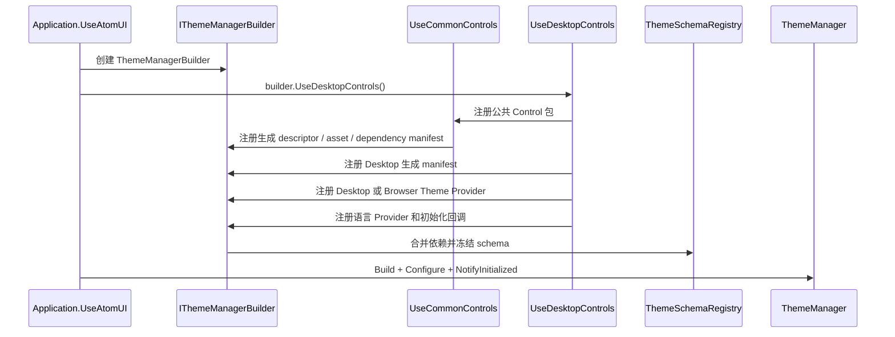

# Desktop Controls 主题注册

`AtomUI.Desktop.Controls` 的包级注册入口是 `UseDesktopControls()`。Control、Token 和主题资产通过约定与生成代码
进入该入口，不逐 Control 手工注册。主题系统完整契约见 [AtomUI 主题系统架构](../core/theme-system.md)，Control
开发规则见 [Control Token 设计规范](../../engineering/control-token-guidelines.md)。

## 注册流程



冻结顺序不可交换。内置、第三方包和应用在构建期生成的 ControlTheme Token dependency manifest 必须先合并，
ThemeConfig 才能根据每个 Control 的 `SupportedGlobalTokens + OwnTokens` 完成校验和规范化。

## 生成注册内容

Control 包注册以下生成结果：

- `ControlTokenDescriptor`：每个对外可主题化 Control 的 identity、可选 Own Token、计算依赖、强类型构造和资源
  投影；没有 Own Token 的 Control 也拥有 descriptor。
- `ControlThemeAssetManifest`：资产 URI、owner identity、Semantic Part Theme 契约和静态校验结果。
- `ControlThemeTokenDependencyManifest`：AXAML 中 `XxxTokenResource` 消费的 Global Token。
- `XxxTokens.Identity`、`XxxTokenKey` 和 `XxxTokenResourceExtension`。
- Language Provider 和其他包级静态注册项。

运行时不扫描程序集、不解析 AXAML 文本，也不通过 TargetType、Control 继承或 ControlTheme `BasedOn` 推断 Token
identity。

## Desktop 与 Browser Provider

`UseDesktopControls()` 根据 `RuntimePlatform.Features.SupportsNativeWindow` 选择：

- `DesktopControlThemesProvider`。
- `BrowserDesktopControlThemesProvider`。

公共 Control 包同样选择 `CommonControlThemesProvider` 或 `BrowserCommonControlThemesProvider`。Provider 只负责把
生成 manifest 中适用于当前平台的主题资产接入 Avalonia Styles；它不维护逐 Control 的手工 merged dictionary
清单，也不提供 Token scope。

## 新增 Control

标准目录：

```text
Rating/
+-- Rating.cs
+-- RatingToken.cs            optional
\-- Themes/
    \-- RatingTheme.axaml
```

只有一个 ControlTheme 时不增加包装层。多个主题资产直接加入 `Themes/`，由同一 manifest 注册。开发者不添加
`ControlThemeAssets` Attribute、Theme Module、聚合 AXAML、手工 identity 或逐 Theme 注册调用。

第三方包遵循同一规则，并只公开一次包级入口，例如 `UseAcmeControls()`。

## 初始化回调

Desktop Control 包在 ThemeManager 初始化后执行：

- 注册 `TransformOperations` 的自定义 Motion Animator。
- Desktop 环境下绑定 `ToolTipService`。
- Desktop 环境下启动 `MediaBreakPointThemeBootstrapper`。

这些回调安装运行时服务，不得承担 Token schema、Control identity 或主题资产的动态发现。
