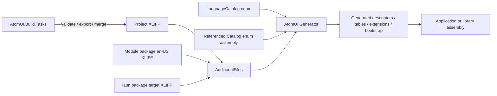

# 本地化生成与构建架构

本文定义 `AtomUI.Generator`、`AtomUI.Build.Tasks` 和 MSBuild targets 如何把 Catalog/XLIFF 转换为 AOT 友好的
运行时代码。运行时设计见 [runtime-architecture.md](runtime-architecture.md)，语言包协议见
[language-packs.md](language-packs.md)。

## 构建链总览



MSBuild 负责发现、分类、校验和传递文件；Generator 负责把文件模型与 Roslyn symbol 结合并生成强类型代码。
两者都不得把 XLIFF 留给运行时处理。

## MSBuild items

`AtomUI.Localization.targets` 自动收集标准目录中的 XLIFF，并排除 `bin/`、`obj/` 和生成目录：

```xml
<AtomUILanguage Include="**/Localization/**/*.xlf" />
<AtomUILanguageOverride Include="Localization/Overrides/**/*.xlf" />
```

targets 将这些 item 作为带元数据的 `AdditionalFiles` 传给 Generator。来源类型、source identity、module ID 和
ContractVersion 必须保存在 item metadata 中，Generator 不从磁盘路径或 NuGet 包名猜测优先级。

第三方语言包的 `buildTransitive/*.props` 只能追加声明式 item，不能运行初始化代码、修改应用源码或注册运行时
程序集。MSBuild item 层只排除相同文件的重复 Include；不同路径或不同包提供相同 Catalog/语言时，由 Generator
根据 source identity 报告同优先级冲突，不执行按 package identity 合并。

## Generator 输入

Generator 使用 Incremental Generator API 组合以下输入：

1. 当前 Compilation 中带 `[LanguageCatalog]` 的 enum symbol。
2. 当前项目 XLIFF `AdditionalText`。
3. 引用项目或 NuGet 程序集中的 `[LanguageCatalog]` enum symbol，以及模块主包携带的权威 `en-US` XLIFF。
4. 静态 I18n 包和应用 Override 提供的目标 XLIFF。
5. AnalyzerConfigOptions 提供的 `AssemblyName`、`PackageId`、RootNamespace 和构建策略。

输入必须按规范化 Catalog ID、语言标签、来源优先级和 unit ID 排序，确保不同操作系统、文件枚举顺序和增量
构建下生成结果一致。

## Generator 输出

对于每个 Catalog，Generator 生成：

```text
XxxLangResourceExtension
独立的 LanguageCatalog registration source
LanguageCatalogDescriptor 与 catalog/unit slot mapping
内置 TranslationBundleDescriptor
编译后的 string 与 CompositeFormat 契约表
```

对于每个 Language Module，Generator 生成：

```text
GeneratedLanguageModuleRegistration
程序集 AtomUILanguageModuleId metadata
```

对于最终应用，Generator 另外生成：

```text
GeneratedApplicationLanguageBootstrap
I18n package TranslationBundle registration
application Override registration
```

`XxxLangResourceKind` 由开发者声明，不再根据三份 C# 翻译类推导。`XxxLangResourceExtension` 保留现有 XAML
形态，但底层改为生成式 descriptor 和 Snapshot 查询。

每个 Catalog 的 descriptor 和内置 Bundle 必须输出到按 Catalog metadata identity 命名的独立 source；模块注册文件
只按 Catalog ID 排序调用这些 registration。这样修改一个 XLIFF 只改变对应 Catalog source，其他 Catalog、模块聚合
注册和不含该外部 Bundle 的应用 bootstrap 保持字节稳定。Generator 的增量测试必须同时验证输入 step 的
`Modified`/`Cached` 状态和最终 source diff，不能只比较一次全量生成结果。

## 应用 bootstrap

当项目存在本地化输入时，Generator 为唯一的具体、顶层、非泛型 `partial` Avalonia `Application` 类型实现一个
受控的生成式 host 契约。抽象 Application 基类不参与唯一性判断；没有 Application 的类库仍只生成模块注册，
不生成应用 bootstrap，也不回退到程序集扫描。`UseAtomUI()` 只做接口判断和直接调用：

```text
Application
  -> generated application module
  -> application Catalogs
  -> language-pack bundles
  -> application overrides
```

这不是程序集扫描：具体 Application 类型、生成类型和调用目标都在编译期可见。应用包含本地化输入但
Application 类型不可扩展时，Generator 必须产生诊断，不能回退到 `Assembly.GetTypes()`。

类库/控件包生成自己的 `GeneratedLanguageModuleRegistration`。包级 `UseXxx()` 入口调用生成注册代码，将该模块的
Catalog 和内置翻译交给 `ILocalizationBuilder`；开发者不手写 descriptor、Catalog ID 或 Provider 列表。打包时
`AtomUIPrepareLanguageModuleAssets` 自动把完整 `en-US` XLIFF 与 `<PackageId>.props` 放入主包，使最终应用可以用
引用程序集的 Catalog enum 校验外部翻译。

语言包没有程序集，其 Translation Bundle 由最终应用 Generator 生成。Bundle 可以早于或晚于目标 Language Module
进入 Builder，Registry 构建阶段统一关联，注册顺序不构成覆盖规则。

## AOT 约束

生成代码必须直接包含：

- Catalog enum CLR 类型和生成式 Catalog ID。
- enum 数字值到 unit slot 的 switch/只读表。
- 每个语言的编译后字符串数组。
- 格式化资源的预验证 `CompositeFormat` 数据或等价静态构造路径。
- Language Module 和应用 bootstrap 的直接注册调用。

正常路径禁止：

- `Assembly.GetTypes()`、`Type.GetFields()`、`Enum.GetNames()`。
- 通过 Attribute 反射发现 Catalog。
- `Activator.CreateInstance()` 创建 Provider 或 Markup Extension 注册项。
- 运行时 XML/XLIFF 解析、路径 glob 或 NuGet 包探测。
- 依赖字符串类型名构造资源键。

## AtomUI.Build.Tasks

物理项目位于：

```text
src/AtomUI.Build.Tasks
```

它是内部编译型 MSBuild Task 程序集，不作为应用运行时引用，也不单独发布
`AtomUI.Localization.Build`。主要 Task 为：

| Task | 职责 |
|---|---|
| `CollectLanguageCatalogsTask` | 收集显式 Catalog 模板 item，规范化 module、contract 和源指纹元数据 |
| `ValidateLanguageFilesTask` | 校验 XLIFF 2.1、BCP 47、unit、状态、占位符和重复来源 |
| `ExportLanguageTemplatesTask` | 按目标语言导出/更新可翻译 XLIFF 模板 |
| `PrepareLanguagePackageTask` | 校验单一目标语言、禁止运行时代码、生成审计 XML manifest 和 contentFiles 清单 |
| `GenerateLanguagePackagePropsTask` | 为模块主包或静态语言包生成声明式 buildTransitive props |

Task 内部协作组件包括：

```text
Xliff21Parser
Xliff21Writer
XliffMergeEngine
XliffValidator
LanguagePackageManifestWriter
PackagePropsWriter
```

Generator 与 Build Tasks 对 XLIFF 使用同一规范化模型和诊断定义。纯 XLIFF 解析/模型代码以构建期内部共享源码
编译进两个程序集，不增加公开运行时包，也不让 MSBuild Task 依赖 Roslyn workspace。

## Generator NuGet 布局

```text
AtomUI.Generator.nupkg
├── analyzers/dotnet/cs/AtomUI.Generator.dll
├── tools/netstandard2.0/AtomUI.Build.Tasks.dll
└── buildTransitive/
    ├── AtomUI.Generator.props
    ├── AtomUI.Generator.targets
    ├── AtomUI.Localization.props
    ├── AtomUI.Localization.targets
    └── AtomUI.ThemeAssets.targets
```

`AtomUI.Build.Tasks` 的依赖必须随 tools 目录完整发布。Generator 项目继续隔离 `PublishAot`、trim、single-file 和
RuntimeIdentifier 等全局发布属性，不能被最终应用当作运行时项目参与 NativeAOT publish。

`AtomUI.Localization.targets` 在 NuGet `_GetPackageFiles` 收集之前准备模块/语言包资产，保证动态加入的 XLIFF、
manifest 和 props 真正进入 `PackTask`。静态语言包项目设置 `AtomUIBuildLanguagePackage=true` 后只由 Build Tasks
校验和打包；它自身不运行 Localization Generator 生成 Catalog 或运行时注册。相同 XLIFF 进入消费应用后才由
Generator 编译为静态字符串表。

## 编译期与启动期校验边界

XLIFF 结构、单个 Bundle 完整性、Catalog 契约、重复来源和语言包 props metadata 在构建期校验；manifest 由已校验
的同一组 XLIFF 确定性生成，不是另一份编译输入。

`UseLanguages()` 是普通 C# 配置，不属于当前 Generator 的输入。完整支持语言集合、标准/显式
`LanguageDefinition` 和最终 Catalog 覆盖在 Builder 冻结 Registry、预构建所有 Snapshot 时校验，并在首帧前失败。
实现不得为了声称“全部构建期校验”而使用运行时反射或要求应用重复维护字符串语言列表。

## 导出与合并

标准命令使用 MSBuild target，不创建独立 CLI：

```bash
dotnet msbuild \
  -t:AtomUIExportLanguageTemplates \
  -p:AtomUITargetLanguage=ja-JP
```

重复导出必须确定性合并：新增 unit 加入目标文件，删除 unit 标为 obsolete，源文本变化将目标标记为需复核，
已有 target、state 和 notes 保留。工具不得静默删除译文或把旧译文视为新源文本的已确认翻译。
