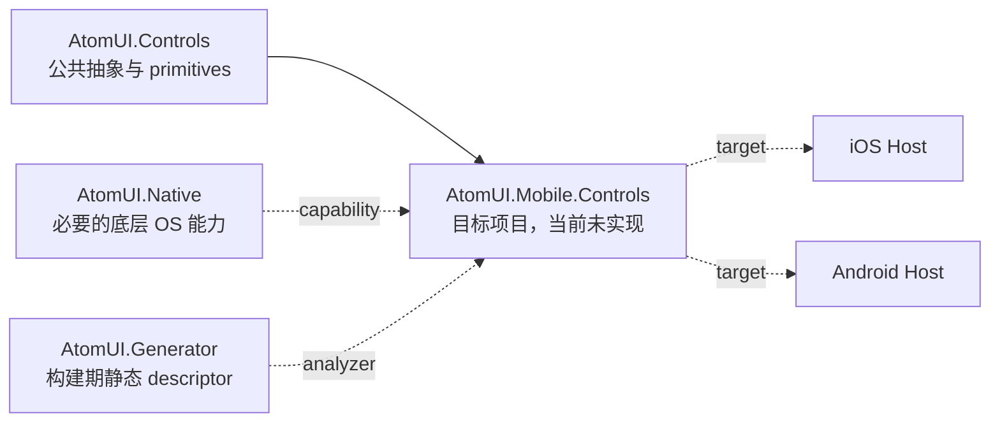

# AtomUI.Mobile.Controls 模块概览

> 状态：预实现架构。本文定义已批准的目标契约，不表示当前仓库已经包含或发布 `AtomUI.Mobile.Controls`。

`AtomUI.Mobile.Controls` 是与 `AtomUI.Desktop.Controls` 平行的目标源码项目和 NuGet 包。它提供移动产品控件、
每 `TopLevel` Runtime scope、移动主题与本地化资产，以及对平台 capability adapter 的统一消费；Mobile 不依赖
Desktop，也不以 `MobileMode` 复用 Desktop 产品控件。

## 模块职责

| 拥有 | 不拥有 |
| --- | --- |
| Mobile Public Controls、ControlTheme、Own Token 和产品文案 | Desktop Window、标题栏、桌面 Popup 默认策略 |
| `MobileViewportContext`、`MobileOverlayManager`、`MobileGestureCoordinator` 的包内实现与装配 | 第二套 Global Token、Theme Algorithm 或 Localization runtime |
| 平台 capability contract 的消费、Runtime scope 生命周期和降级策略 | 可由 Avalonia 公共 API 表达的 Host 工具链职责 |
| `UseMobileControls(...)` 注册、生成式 descriptor 和主题/语言资产接入 | iOS/Android 签名、部署、应用生命周期入口 |
| iOS、Android 与 Headless adapter 的公共内部契约 | P/Invoke、native handle、原生结构体和不可释放 hook |

跨模块 Runtime 不变量由 [AtomUI Mobile 系统架构](../../architecture/systems/mobile/overview.md) 维护；本目录只描述
目标包自身的 ownership、注册、打包和 adapter 边界。

## 目标依赖

- `AtomUI.Controls` 是目标运行时上游，间接提供 Core、Controls.Shared、Theme、Localization 和公共 Control 能力。
- `AtomUI.Native` 是正交能力上游；只有 Avalonia 公共 API 无法表达所需 OS 能力时才进入调用链。
- `AtomUI.Generator` 是构建期基础设施，不通过运行时程序集扫描替代静态注册。
- iOS/Android Host 是下游组合入口，只负责生命周期、平台初始化、签名/部署和 adapter 提供。
- `AtomUI.Desktop.Controls` 不在 Mobile 的依赖闭包中。

Mobile Control Own Token 必须遵循 [Control Design Token 继承](../../architecture/systems/theming/control-design-token-inheritance.md)：
具体 Token 是 `sealed` 终端；只有 Desktop 与 Mobile 已有至少两个真实消费者且共享语义稳定时，才把显式标记的抽象定义层
放入 `AtomUI.Controls`。当前没有 `AtomUI.Mobile.Controls` 源码，因此不能据此创建推测性的共享 Token 基类。

具体当前/目标依赖视图见 [项目依赖关系](../../architecture/foundations/dependency-graph.md)。

## 启动与消费

目标注册入口 `UseMobileControls(...)` 连接现有 `UseAtomUI(...)` Builder，注册 Mobile descriptor、Theme、Localization、
Runtime scope factory 和 Host adapter。该名称属于已批准目标契约，当前仓库没有对应实现；真实签名、程序集和目标框架必须
在 Foundation 源码与测试存在后回写。

应用业务库应依赖 `AtomUI.Controls` 或更低层的稳定公共契约；只有实际承载移动 UI 的应用或 Mobile Gallery Host 才直接
组合 `AtomUI.Mobile.Controls`。同一应用可以在组合根选择 Desktop 或 Mobile 产品包，但不能让两个产品包互相引用。

## 专题导航

| 文档 | 职责 |
| --- | --- |
| [源码职责](source-ownership.md) | Public Controls、Runtime、Theme、Localization、平台能力消费和生成资产的 ownership |
| [启动与打包](startup-and-packaging.md) | `UseMobileControls(...)`、多目标公共 API、NuGet 和 AOT/trimming 边界 |
| [平台 Adapter](platform-adapters.md) | Headless、iOS、Android adapter 的统一 capability contract 与生命周期 |
| [Mobile 系统架构](../../architecture/systems/mobile/overview.md) | 跨模块 Viewport、Navigation、Overlay、Gesture、Theme 和验证不变量 |
| [Mobile Control 文档](../../controls/mobile/overview.md) | 具体能力分类、Public API 和实现证据 |

## 当前证据

| 维度 | 当前状态 |
| --- | --- |
| Design | 能力已纳入总体设计 |
| Source | 未实现 |
| iOS | 未验证 |
| Android | 未验证 |
| Release | 未验证 |
| Publication | 未发布 |

`AtomUI.Native` 中预留的 internal visibility 只是未来集成边界，不是 Mobile 源码、包或平台支持证据。
