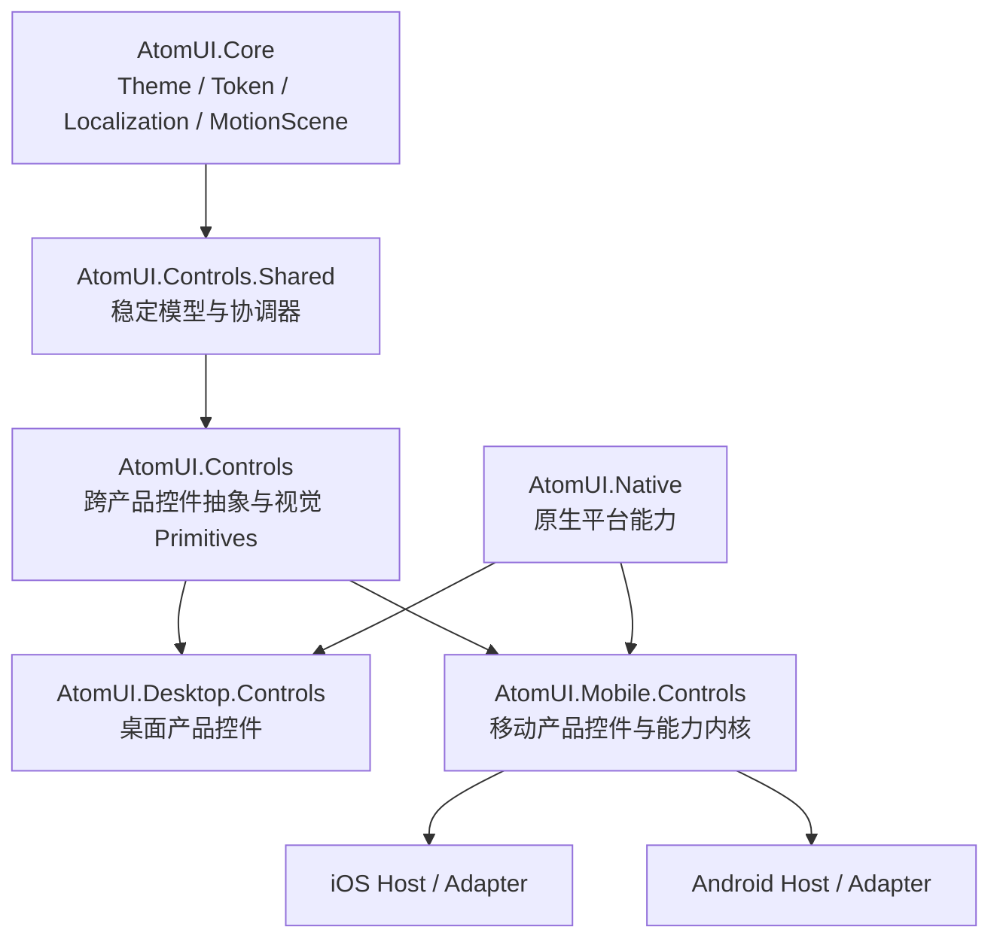

# AtomUI Mobile Controls 总体设计

## 文档状态

- 设计日期：2026-08-10
- 设计状态：已完成方案评审，等待书面规格复核
- 目标包：`AtomUI.Mobile.Controls`
- 首个实现平台：iOS
- 架构支持平台：iOS、Android
- 上游调研基线：ant-design-mobile `5.42.4-alpha.0`

本文是移动控件体系的总体设计，不是 82 个控件的逐项 API 规格。实现必须拆成 Foundation 和四个组件波次；
每个波次在进入实施计划前，还要为其中 API 或交互复杂的控件族补充独立设计。

## 背景

AtomUI 已经形成 `AtomUI.Core`、`AtomUI.Controls.Shared`、`AtomUI.Controls` 和
`AtomUI.Desktop.Controls` 的分层。移动端不能通过给桌面控件增加 `MobileMode`、散布平台判断或直接移植
React/CSS 实现来扩展，否则会同时破坏桌面 API、移动交互语义、测试边界和长期可维护性。

本设计引入与 `AtomUI.Desktop.Controls` 平行的 `AtomUI.Mobile.Controls` 产品包，在复用 AtomUI 稳定基础设施的
前提下，以原生 Avalonia 控件、移动运行时能力和 iOS/Android 平台适配器复现 ant-design-mobile 的产品能力。

## 目标

1. 覆盖 ant-design-mobile 当前 83 个默认组件导出的产品职责。
2. 提供一个独立的 `AtomUI.Mobile.Controls` NuGet 包和对应注册入口。
3. 首先完成 iOS 体验，同时从 Foundation 开始保持 Android 可编译、可测试、可接入。
4. 复用 AtomUI 已有 Theme、Token、Localization、MotionScene、共享模型和通用控件抽象。
5. 在移动语义明显不同处设计符合 .NET、Avalonia 和触控应用习惯的独立 API。
6. 保持 AOT、trimming、生命周期和无障碍能力为首要设计约束。

## 非目标

- 不复制 React component tree、DOM、Portal、CSS variable 或 hook API。
- 不要求 Mobile 与 Desktop 控件继承同一个具体 `Control` 基类。
- 不让 `AtomUI.Mobile.Controls` 依赖 `AtomUI.Desktop.Controls`。
- 不在现有桌面控件中增加 `MobileMode` 或 iOS/Android 条件分支。
- 不重新实现一套替代 Avalonia `Page` 和 `NavigationPage` 的路由框架。
- 不在本总体设计中冻结所有控件的最终属性名、事件名和 Token 数值。

## “完整复现”的验收含义

完整复现指可验证的产品体验等价，而不是实现代码或 API 字面一致。

| 维度 | 验收要求 |
| --- | --- |
| 能力覆盖 | 82 个组件能力均有 AtomUI Mobile 对应物；`ConfigProvider` 职责被 AtomUI 现有系统完整承接 |
| 行为 | 受控状态、选择、手势、遮罩、关闭、导航、异步动作和错误恢复与上游语义等价 |
| 视觉 | 浅色、深色、字号缩放、横竖屏、Safe Area 和键盘场景具有受控视觉基线 |
| 平台 | iOS 和 Android 的返回、系统栏、输入法、生命周期、触控尺寸和无障碍行为正确 |
| API | 使用 Avalonia 属性、事件、命令、`DataTemplate`、`ItemsSource`、`Task` 和 `CancellationToken` 表达相同职责 |
| 工程 | AOT/trim 可发布，资源与订阅有确定释放点，核心手势和滚动路径满足性能门槛 |

## 上游源码评估

### 导出面

调研基线包含 83 个默认组件导出。其中 82 个是可见控件或控件族，另一个是 `ConfigProvider`。本设计不创建
React 式 `ConfigProvider` 复制品，而是把它的职责映射到 AtomUI 的启动注册、Localization、
`ThemeConfigProvider`、Control 属性和主题资源。

### 可借鉴的部分

- 组件功能边界、交互状态、受控与非受控行为。
- Popup、Mask、Dialog、Toast 等能力共享统一覆盖层生命周期的思路。
- Picker、Cascader、Form、选择器和列表类控件对模型与视觉层解耦的思路。
- 方向锁定、速度、边界回弹、snap point 和嵌套滚动 handoff 等手势语义。
- 组件级 CSS variable 所表达的可定制视觉职责。
- Demo、测试场景和异常状态，可作为兼容清单的输入。

### 不能直接借鉴的部分

- DOM Portal、`document.body`、CSS stacking context 和浏览器 scroll lock。
- React hook、Context、ref、`children`、render function 和命令式 React render。
- CSS variable 的运行时级联方式和 Less 文件组织。
- `rc-field-form` 的 React 数据流与生命周期。
- 浏览器 touch event、passive listener 和 viewport 实现。

这些内容必须分别映射到 Avalonia VisualRoot、OverlayLayer、StyledProperty、RoutedEvent、Command、
`DataTemplate`、AtomUI Token、Form 协调器和平台能力契约。

## 架构决策

采用“能力内核 + 平行产品包”架构。



主依赖方向固定为：

```text
AtomUI.Core
  -> AtomUI.Controls.Shared
    -> AtomUI.Controls
      -> AtomUI.Desktop.Controls
      -> AtomUI.Mobile.Controls
```

`AtomUI.Native` 是正交的平台能力层，可以被 Desktop 和 Mobile 产品包使用，但不拥有 Control 行为、主题策略或
平台默认视觉。Mobile 永远不能引用 Desktop。

## 模块职责

| 模块 | 移动端职责 | 禁止承担的职责 |
| --- | --- | --- |
| `AtomUI.Core` | Theme、Token、Localization、MotionScene、资源和运行时基础设施 | 移动控件、导航策略、手势产品语义 |
| `AtomUI.Controls.Shared` | 跨产品稳定的数据模型、集合视图、Form/Selection 等协调器 | 具体移动视觉树和平台 API |
| `AtomUI.Controls` | 真正跨产品的抽象控件、输入/选择基础契约、通用 Primitives | 为复用而加入移动特例 |
| `AtomUI.Desktop.Controls` | 保持现有桌面产品行为 | 被 Mobile 引用或承载移动模式 |
| `AtomUI.Mobile.Controls` | 移动控件、Viewport、Overlay、Gesture、移动主题和平台能力消费 | 桌面窗口行为和散落的平台判断 |
| `AtomUI.Native` | 必要的原生桥接和可释放平台 hook | Control 策略、Token 和组件默认值 |

只有同时满足以下条件的实现才允许下沉：

1. 至少两个产品包真实需要。
2. 语义在 Desktop 与 Mobile 间稳定一致。
3. 不需要平台判断或产品特有视觉状态。
4. 下沉后能降低实际重复，而不是只减少文件数量。

## 包、命名空间与宿主

### 产品包

- 项目和 NuGet 包名使用 `AtomUI.Mobile.Controls`。
- 公共 CLR namespace 使用 `AtomUI.Mobile.Controls` 及其子 namespace。
- 通用抽象继续位于 `AtomUI.Controls`，不把移动类型放入通用 namespace。
- Mobile 与 Desktop 产品包在应用组合层互相独立；共享业务库只依赖 `AtomUI.Controls` 或更低层。
- XAML 继续使用 AtomUI 统一 XML namespace，具体程序集注册由 Generator 和启动注册确定。

### 目标框架

移动产品包使用共享源码加隔离平台适配器的多目标结构。公共 API 在 iOS 与 Android 目标上必须一致；平台目录只实现
内部能力契约。具体 TFM 列表由仓库的集中构建属性管理，并在 Foundation 计划中结合已安装 Avalonia 和 .NET Mobile
workload 固化，不能由单个项目私自改变生产框架基线。

### Gallery

移动 Gallery 分为产品中立展示主体和平台宿主：

- Mobile Gallery 主体保存页面、示例、API 表、Token 表和兼容状态。
- iOS Host 只负责 iOS 生命周期、启动、签名和平台 adapter 注册。
- Android Host 只负责 Android 生命周期、启动和平台 adapter 注册。
- Desktop Gallery 不承载移动控件的最终验收，最多作为 Headless 或开发辅助入口。

## 启动与平台能力

新增与 Desktop 对称的 `UseMobileControls(...)` 注册入口。它负责：

1. 注册 Mobile Control descriptor、Token、主题资产和本地化资源。
2. 注册每个 `TopLevel` 的 Mobile runtime scope 工厂和释放回调。
3. 连接当前宿主提供的平台 adapter。
4. 校验缺失或重复 adapter，并在启动阶段明确失败。

平台差异集中在内部 capability contract 中，至少覆盖：

- Safe Area、系统栏和可用 viewport。
- Input pane/IME occlusion。
- 系统返回和导航手势。
- Haptic 能力。
- 平台触控尺寸和交互 profile。
- 应用前后台与 host detach 通知。
- Reduce Motion、字体缩放和无障碍环境信息。

iOS、Android 和 Headless test adapter 实现相同契约。Control 只消费能力，不读取 OS 名称，也不使用散落的条件编译。

## Mobile Runtime

### MobileViewportContext

每个 `TopLevel` 恰好拥有一个 `MobileViewportContext`。它聚合：

- Safe Area insets。
- System bar insets。
- Input pane occlusion。
- 可用内容区域。
- 横竖屏和 display scale。
- 字体缩放、Reduce Motion 与相关平台 profile。

上下文在 UI thread 上合并平台事件，并保证新值在下一次有效布局前可见。它是运行时状态，不是 Token。
`SafeArea`、Popup、Picker、NumberKeyboard、导航和滚动控件必须读取同一个 context，不能各自订阅平台事件。

`TopLevel` detach 时，context 必须解除平台事件、取消待处理更新并释放 owner 引用。

### Navigation

导航建立在 Avalonia 的 `Page`、`NavigationPage`、`TabbedPage` 和 `DrawerPage` 上，不创建第二套路由系统。

- `NavBar`、`TabBar`、`Tabs`、`SideBar` 和移动页面 shell 只投射导航状态与交互。
- Overlay 总是先于页面栈处理返回。
- iOS edge swipe、Android system back 和应用命令进入同一导航事务。
- 导航事务只有未提交和已提交两个稳定结果；动画取消不能产生半入栈页面或重复 pop。
- 页面离开、host detach 和应用恢复必须有确定的焦点与资源清理语义。

### MobileOverlayManager

每个 `TopLevel` 恰好拥有一个 `MobileOverlayManager`。Mask、Popup、CenterPopup、Dialog、Modal、Toast、
ActionSheet、Popover、ImageViewer、Picker 等共享同一 session 基础设施。

统一状态机为：

```text
Created -> Opening -> Open -> ClosePending -> Closing -> Closed
```

约束如下：

- 声明式 `IsOpen` 和静态 `ShowAsync` API 创建同一种 session。
- session 统一管理 z-order、mask、focus、back、viewport、动画和释放。
- 同一 session 只允许一次终态通知；Close、遮罩、返回、手势和取消竞争必须幂等。
- 静态 API 返回强类型结果和关闭原因，不依赖全局 singleton 或 React 式 render hook。
- Overlay 内容可以有独立 `DataTemplate`，但不能绕过 session 生命周期直接挂到 VisualRoot。
- `TopLevel` 销毁时所有 session 以 `HostDetached` 结束。

### MobileGestureCoordinator

每个活动指针链路由 `MobileGestureCoordinator` 仲裁。它统一处理：

- 水平/垂直方向锁定。
- 子控件与父 ScrollViewer 的 nested-scroll handoff。
- 位移、速度、取消和 commit threshold。
- rubberband、overscroll 和 snap point。
- 多指场景与手势所有权转移。
- Reduce Motion 下的降级行为。

控件提供可测试的 gesture policy 和状态模型；Coordinator 决定所有权与输入流。Swiper、SwipeAction、
FloatingPanel、PullToRefresh、ImageViewer 等不得各自复制一套方向锁定和速度算法。

动画使用现有 MotionScene 与 Avalonia composition 能力。若后续引入第三方手势或 spring 库，只能替换
Coordinator 内部算法，不得成为公共 API。

## 状态与数据流

### Avalonia 状态模型

React 的 controlled/uncontrolled props 映射为 Avalonia 的属性系统：

- 当前值使用 `StyledProperty` 或 `DirectProperty`。
- 用户变化通过 RoutedEvent、普通事件或 Command 暴露。
- 双向同步遵循 Avalonia binding priority，不额外发明 `defaultXxx`/`onXxxChange` 成对模式。
- Items 使用 `ItemsSource`、`DataTemplate` 和容器生成，而不是 render function。
- 异步命令使用 `Task`、`CancellationToken` 和显式 load/error state。
- 输入验证继续以 `DataValidationErrors` 为最高优先级，Form 只做协调和投射。

### 共享模型

Form、Picker、Cascader、Selection、Upload、Calendar 和虚拟列表优先把稳定、无视觉的部分放入 coordinator/model。
Mobile Control 负责触控交互、模板、viewport 和 overlay。Desktop 只有在契约真实一致时才复用这些模型，不为追求
继承关系强迫两个产品使用同一具体 Control。

## Theme、Token 与 Localization

### Token 分层

1. 颜色、字体、间距、圆角和 motion 首先复用现有 Global Token。
2. 单个移动控件的差异进入 Mobile Control Own Token。
3. 只有至少三个移动控件共享同一语义，且应用级覆盖有明确价值时，才新增 Global Alias Token。
4. Safe Area、键盘遮挡、方向、选择、焦点、打开状态和 gesture progress 永远不是 Token。
5. 平台触控尺寸和 capability 由 platform profile 提供；视觉主题只消费已解析的资源或状态。

不复制上游 CSS variable 名称。上游变量只用于理解可定制职责，AtomUI Token 名称必须表达稳定语义。

### ConfigProvider 映射

不新增 `ConfigProvider` 同名控件：

| 上游职责 | AtomUI 承接位置 |
| --- | --- |
| locale | AtomUI Localization 与语言包 |
| 全局主题变量 | Global Token、Theme Algorithm、`ThemeConfigProvider` |
| 局部主题作用域 | `ThemeConfigProvider` 与资源作用域 |
| 组件默认配置 | `UseMobileControls` options、Control 属性或主题资源 |
| icon / empty render 替换 | Icon package、`DataTemplate`、ControlTheme 和语义资源 |
| 命令式默认配置 | 应用启动注册，不提供可变全局静态字典 |

### Localization

- Mobile 包拥有自己的 localization catalog 和默认语言资源。
- 日期、日历、Picker、Form、上传与错误状态复用现有 snapshot 和 fallback 体系。
- 不在 Control 内缓存失效的字符串，也不使用运行时程序集扫描发现语言资源。
- iOS 与 Android 使用相同文本契约；平台 adapter 只提供系统能力，不提供产品文案。

## API 复用规则

### Tier 1：继承现有抽象

当公共属性、状态机、表单语义和可访问性契约真正一致时，Mobile Control 可以继承 `AtomUI.Controls` 中的抽象。
候选包括 Avatar、Badge、Checkbox、Radio、Rate、Progress、Result、Segmented、Switch、Tag 等。

继承不代表复用 Desktop 模板。Mobile 必须拥有自己的 ControlTheme、Token 和触控状态。

### Tier 2：复用模型，Control 独立

当数据和协调逻辑一致、视觉和交互不同，复用 model/coordinator，Mobile Control 独立实现。候选包括 Form、List、
Picker、Cascader、Calendar、Upload、Selector 和虚拟列表。

### Tier 3：独立 Mobile API

移动语义占主导时设计独立 API。包括 ActionSheet、NavBar、TabBar、Popup、SafeArea、SwipeAction、
FloatingPanel、NumberKeyboard 和 PullToRefresh 等。

### React API 映射原则

| React / Web 形态 | AtomUI Mobile 形态 |
| --- | --- |
| `children` | `Content`、`ItemsSource`、`DataTemplate` |
| render prop | 强类型 template、selector 或 factory |
| `visible` + callback | `IsOpen` + opening/closing/closed lifecycle |
| ref imperative method | 明确的 Control 方法或服务 API |
| Promise show API | `Task<TResult>` + `CancellationToken` |
| Portal container | TopLevel-scoped Overlay session |
| CSS class / variable | ControlTheme、pseudo-class、Semantic Part、Token |
| touch event hook | Gesture policy + `MobileGestureCoordinator` |

## 组件实施波次

83 个上游默认组件导出由 82 个 Mobile 控件能力和 `ConfigProvider` 职责映射组成。

### Foundation

不计入控件数量：

- `AtomUI.Mobile.Controls` 项目、包和启动注册。
- Mobile Gallery 主体、iOS Host、Android Host。
- Platform capability contract 与三种 adapter。
- `MobileViewportContext`。
- `MobileOverlayManager` 与 session 状态机。
- `MobileGestureCoordinator`。
- Mobile Token、Theme、Localization 和 Generator 接入。
- Headless、visual、platform、AOT 和性能测试底座。
- 组件兼容清单与公共 API 基线机制。

### Wave 1：基础、布局与展示，25 个

AutoCenter、Avatar、Badge、Button、Card、Divider、DotLoading、Ellipsis、Empty、ErrorBlock、Footer、Grid、
Image、List、Loading、NoticeBar、ProgressBar、ProgressCircle、Result、SafeArea、Skeleton、Space、SpinLoading、Tag、
WaterMark。

### Wave 2：Overlay 与导航，18 个

ActionSheet、CapsuleTabs、CenterPopup、Collapse、Dialog、Dropdown、JumboTabs、Mask、Modal、NavBar、
PageIndicator、Popover、Popup、SideBar、Steps、TabBar、Tabs、Toast。

### Wave 3：表单、输入与选择，24 个

CascadePicker、CascadePickerView、Cascader、CascaderView、CheckList、Checkbox、DatePicker、DatePickerView、
Form、Input、NumberKeyboard、PasscodeInput、Picker、PickerView、Radio、Rate、SearchBar、Segmented、Selector、
Slider、Stepper、Switch、TextArea、VirtualInput。

### Wave 4：复杂手势与数据，15 个

Calendar、CalendarPicker、CalendarPickerView、FloatingBubble、FloatingPanel、ImageUploader、ImageViewer、IndexBar、
InfiniteScroll、PullToRefresh、ResultPage、ScrollMask、SwipeAction、Swiper、TreeSelect。

每个波次必须满足自身出口条件后才能进入下一波。不能以“已有同名 Desktop Control”为理由跳过移动交互、主题、
无障碍或平台验收。

## 异常、取消与生命周期

### Overlay 关闭

- 多次 Close、返回键、遮罩点击和手势竞争只产生一个终态和一次完成通知。
- 打开前收到取消时不挂载视觉树。
- Opening 或 Open 状态收到外部取消时，经过 `ClosePending -> Closing -> Closed` 完成清理。
- 调用方 `CancellationToken` 取消时，`ShowAsync` 在 session 完成清理后以 canceled Task 结束；声明式 Control
  通过 `ExternalCancellation` 关闭原因暴露同一终态。
- 用户选择、主动关闭和 `HostDetached` 返回强类型结果及对应关闭原因，不与调用方取消混为一类。
- Host detach 统一使用 `HostDetached` 原因，不伪装成用户取消。

### 手势取消

- 系统取消、父级夺取或 pointer capture 丢失时回到最近稳定 snap point。
- 取消不能触发选择、删除、刷新、页面提交或导航完成。
- 手势结束后必须释放 capture、animation owner 和临时订阅。

### 异步动作

- Dialog、ActionSheet、Form 和 Upload 提交期间默认阻止重复提交。
- session lifetime 提供取消作用域。
- 业务错误保留输入和当前视觉上下文，进入可重试状态，不吞异常、不自动关闭。
- 加载错误与 Avalonia validation error 分离；输入验证继续通过 `DataValidationErrors` 投射。

### 前后台和恢复

- 进入后台时暂停动效和 transient timeout。
- 恢复时先刷新 viewport、insets 和 input pane，再恢复可见 session。
- 不因恢复重复 push 页面、重复完成 Task 或重复触发 opened event。
- Android Activity 重建和 iOS host 重建必须通过同一 session/navigation 恢复契约验证。

## 测试与质量门禁

### 五层测试

| 层级 | 核心覆盖 |
| --- | --- |
| Contract | Public API snapshot、Token key、pseudo-class、TemplatePart、Semantic Part、event 和关闭原因 |
| Headless | 状态机、属性优先级、选择模型、导航事务、手势仲裁、资源释放 |
| Visual | 双主题、字号缩放、紧凑/宽屏、横竖屏、键盘、Safe Area 黄金截图 |
| Platform | Simulator/Emulator 持续回归，iOS/Android 真机触摸、IME、生命周期验收 |
| Release | iOS AOT 与 Android Release trim/AOT 真实发布和启动 |

### 双平台节奏

| 阶段 | iOS | Android |
| --- | --- | --- |
| 每次 PR | compile、Headless、Simulator smoke | compile、Headless、Emulator smoke |
| 每个波次 | Simulator 全量、真机验收 | Emulator 全量、真机验收 |
| 发布候选 | AOT 包、VoiceOver、旋转、后台恢复 | Release AOT/trim、TalkBack、Activity 重建 |

iOS 可以先发布控件实现，但 Android adapter、编译与自动化从 Foundation 开始存在。公共 API 只有在两个平台的
对应波次验收同时存在后才能标记稳定。

### 无障碍

- AutomationPeer 的 role、name、value、state 和 action 完整。
- VoiceOver 与 TalkBack 的阅读顺序、焦点圈闭、返回/escape 和 modal 语义通过真机验收。
- 支持系统字号缩放，不允许文本截断、按钮内容重叠或焦点目标消失。
- 平台 profile 提供 iOS 44 pt、Android 48 dp 的最小触控目标策略；Control 不直接判断平台。

### IME 与输入

至少覆盖英文、中文和日文组合输入，以及 emoji、secure input、return action、selection、焦点切换和键盘反复
显示/隐藏。Input、TextArea、SearchBar、PasscodeInput、VirtualInput 和 NumberKeyboard 必须共享明确的
IME ownership 与 viewport 更新规则。

### Viewport 与布局

覆盖刘海、圆角、系统栏、横竖屏、键盘、iPad 多任务和 Android multi-window。平台状态变化必须在下一次有效布局前
统一进入 `MobileViewportContext`，不能由各控件以延迟或轮询方式修补。

### 内存与资源

- Overlay、Picker、ImageViewer 和虚拟列表执行 1,000 次压力循环后，不保留 session、owner、template part 或页面。
- `OnApplyTemplate`、detach、owner 变更、container recycle 和 host detach 均有对应释放验证。
- 非 Visual `AvaloniaObject` 需要动态资源时遵循 scoped resource host 规范。
- 不允许 static event、全局 singleton 或计时器持有 `TopLevel` 和 Control。

### 性能

- drag、scroll、pinch 和 animation sampling 热路径不产生逐帧托管分配。
- 基线 60 Hz 设备的标准交互场景中，稳定阶段 p95 frame time 不超过 16.7 ms。
- 标准场景不允许出现超过 50 ms 的主线程停顿；发生时必须保留 trace 并归因。
- 每个波次建立包体、启动、布局和分配基线，后续变更超过 5% 必须解释并评审。

### AOT 与 trimming

- 内置注册使用显式 descriptor 或 Source Generator，不扫描程序集。
- 不新增 ReflectionBinding、字符串成员访问或动态 factory。
- analyzer 通过不能替代真实 iOS/Android Release publish。
- adapter、Token、Localization、ControlTheme 和 DataTemplate 必须在裁剪后仍可发现。

## 单组件完成定义

一个组件只有同时满足以下条件才可以在兼容清单中标记为完成：

1. Public API 和与上游能力的映射已评审。
2. Contract 与 Headless tests 通过。
3. 浅色、深色、字号缩放和关键状态视觉基线通过。
4. 触摸、手势、键盘和返回行为通过对应场景验证。
5. AutomationPeer 和屏幕阅读器验收通过。
6. iOS 与 Android 对应波次的平台验证均存在。
7. AOT/trim、资源释放和性能门禁通过。
8. Gallery ShowCase、API、Token 和控件文档同步完成。

## 风险与应对

| 风险 | 应对 |
| --- | --- |
| Web 与 retained-mode 原生渲染差异 | 使用逐组件“语义 + 视觉 + 手势”兼容清单和黄金场景定义等价，不做源码形态映射 |
| 嵌套滚动与手势冲突 | 统一进入 `MobileGestureCoordinator`，建立嵌套 ScrollViewer、边界和取消专用夹具 |
| Overlay、键盘和 Safe Area 互相影响 | 每 TopLevel 单一 ViewportContext 和 OverlayManager，禁止组件私有订阅 |
| iOS-first 导致 Android 漂移 | Foundation 即落地 Android adapter、CI 编译和 Emulator smoke，每波次双平台真机签收 |
| 共享层被移动语义污染 | 依赖图与 API review 阻止 Mobile -> Desktop；下沉必须满足四项稳定性条件 |
| AOT、裁剪和动态资源失败 | 显式注册/Generator、scoped resource host、真实发布产物验收 |
| 83 个导出导致范围失控 | 冻结兼容清单和波次出口条件，上游变化进入独立差异记录 |
| 无障碍后补成本过高 | AutomationPeer、触控目标和屏幕阅读器场景进入单组件完成定义 |
| 静态 Overlay API 泄露 TopLevel | session 绑定 TopLevel scope，HostDetached 统一取消，禁止进程级可变 host singleton |

## 实施拆分

本设计是总架构，不能直接生成一个覆盖全部 82 个控件的单一实施计划。后续顺序固定为：

1. 为 Foundation 编写详细实施计划并完成基础设施。
2. 为 Wave 1 的基础/布局/展示控件补充必要的控件族设计，再编写计划。
3. 为 Wave 2 的 Overlay/导航控件补充公共结果、关闭原因和导航 API 设计，再编写计划。
4. 为 Wave 3 的 Form/Input/Selection 控件补充数据、验证和 IME 设计，再编写计划。
5. 为 Wave 4 的复杂手势/数据控件补充手势状态机、虚拟化、缓存和性能预算设计，再编写计划。

每一步只在上一阶段的出口条件满足后开始。下一份实施计划仅覆盖 Foundation。

## Foundation 计划边界

下一阶段允许规划：

- 新项目、解决方案和集中构建属性接入。
- `UseMobileControls` 与 Generator 注册。
- 平台 capability contract 和 Headless/iOS/Android adapter 骨架。
- Viewport、Overlay session、GestureCoordinator 的最小可测试内核。
- Mobile Gallery 与两个平台 host 骨架。
- Token、Localization、AOT 和测试基础设施。
- 一个最小垂直切片，用于证明 Viewport、Overlay、Theme 和双平台 host 能协同工作。

下一阶段不允许直接批量实现 Wave 1-4 控件，也不冻结尚未经过控件族设计的复杂 Public API。

## 最终架构不变量

1. `AtomUI.Mobile.Controls` 不依赖 `AtomUI.Desktop.Controls`。
2. 控件内部不出现散落的 iOS/Android 判断。
3. 每个 `TopLevel` 只有一个 ViewportContext 和 OverlayManager。
4. 声明式与静态 Overlay API 共享同一 session 状态机。
5. Navigation 建立在 Avalonia Page 体系上。
6. 运行时 viewport、keyboard、selection 和 open state 不是 Token。
7. 共享层只接收跨产品稳定契约，不接收移动产品特例。
8. Android 支持从 Foundation 开始验证，不作为 iOS 完成后的补丁。
9. 组件完成以双平台、无障碍、AOT、生命周期和性能证据为准。
10. 82 个控件能力加 `ConfigProvider` 职责映射共同构成 83 个上游导出的覆盖范围。
